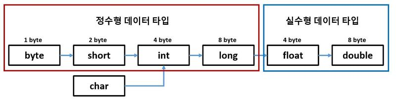
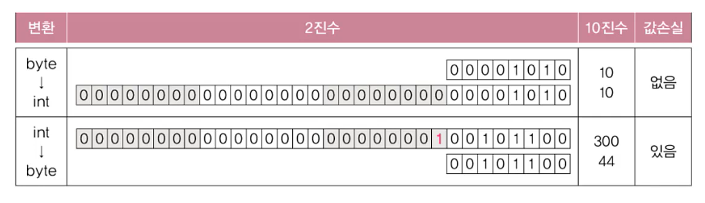

# **Operator**

<br>

## 08. 자동 형변환
```
기존의 값을 최대한 보존할 수 있는 타입으로 자동 형변환 된다.
```
- 경우에 따라 편의상의 이유로 형변환을 생략할 수 있다.  
   **컴파일러**가 생략된 형변환을 **자동**적으로 추가  
   
   ```
   float f = 1234;
   # float f = (float)1234; → (float) 생략
   ```  
   ```f```는 ```int```타입의 상수이고, 이 값을 저장하려는 변수의 타입은 ```float```

- 변수가 저장할 수 있는 값의 범위보다 **더 큰 값을 저장**하려는 경우에 형변환을 생략하면 <span style='color : red'>**에러**</span> 발생
  ```
  byte b = 1000; # byte 범위 : -128 ~ 127
  ```
  > incompatible types:   
   possible lossy conversion form int to byte  
   큰 타입에서 작은 타입으로의 형변환은 **값 손실이 발생**할 수 있음
- **명시적으로 형변환** 할 경우, 의도적인 것으로 간주해 컴파일러가 에러를 발생시키지 않음  
  ```
  byte b = (byte)1000; // 값 손실이 발생
                       // 변수 b에 -24가 저장됨
  ```
- 표현범위가 좁은 타입에서 넓은 타입으로 형변환하는 경우, 값 손실이 없어 <span style='color : blue'>**표현범위가 더 넓은 쪽으로 형변환**</span>
  <center> 
    
  </center>  

    ```
    byte → int : 생략 가능
    byte b = 10;
    int i = b;

    int → byte : 생략 불가
    int i2 = 300;
    byte b2 = (byte)i2;
    ```
  <center> 
    
  </center>  

- 리터럴의 값이 우변의 타입 범위보다 작을 때, 자동 형변환이 가능. (변수는 불가)
  ```
  byte b = 100;
  byte b = (byte)100;

  int i = 100;
  byte b = i;       // error
  byte b = (byte)i;

  byte b = 1000;    // error
  byte b = (byte)1000;
  ```

<br>
<hr>
<br>

## 09. 사칙 연산자
- ```+```, ```-```, ```*```, ```/```
   ```
   int / int
   → int  // 소수점 이하는 버려진다

   int / float
   → float / float
   → float
   ```
- Ex3_6
    ```
    class Ex3_6 {
        public static viod main(String[]args){
            int a = 10;
            int b = 4;

            System.out.prinf("%d + %d = %d%n", a, b, a+b);  
            System.out.prinf("%d - %d = %d%n", a, b, a-b); 
            System.out.prinf("%d * %d = %d%n", a, b, a*b); 
            System.out.prinf("%d / %d = %d%n", a, b, a/b); 
            System.out.prinf("%d / %f = %f%n", a, (float)b, a+(float)b); 
        }
    }
    ```

  - Ex3_6 Result
    ```
    10 + 4 = 14
    10 - 4 = 6
    10 * 4 = 40
    10 / 4 = 2
    10 / 4.000000 = 2.500000
    ```


## 10. 산술 변환
```
연산 전에 피연산자의 타입을 일치시키는 것
```
- 연산 전에 피연산자 **타입의 일치**를 위해 자동 형변환 되는 것  
  이항 연산에서만 아니라 단항 연산에서도 일어남  
  1. 두 피연산자의 타입을 길게 일치(보다 큰 타입으로 일치)
        ```
        long + int     → long + long     → long
        float + int    → float + float   → float
        double + float → double + double → double
        ```
        > 피연산자의 **값손실을 최소화**
  2. 피연산자의 타입이 ```int```보다 작은 타입이면 ```int```로 변환
        ```
        byte + short → int + int → int
        char + short → int + int → int
        ```
        > 연산 중 **오버플로우가 발생**할 가능성이 높기 때문

- 연산결과의 타입은 피연산자의 타입과 일치
  ```
  5 / 2 → 2  // int / int → int
  ```
  ```
  5 / (float)2     // int / (float)int
  → 5 / 2.0f       // int / float
  → 5.0f / 2.0f    // float / float
  → 2.5f           // float
  ```

- Ex3_7
    ```
    class Ex3_7 {
        public static viod main(String[]args){
            
            System.out.prinln(5/2);  
            System.out.prinln(5/(float)2); 
        }
    }
    ```

  - Ex3_7 Result
    ```
    2
    2.5
    ```
- 큰 자료형의 값을 작은 자료형의 변수에 저장하려면 명시적으로 형변환 연산자를 사용해서 변환해줘야 함
- Ex3_8
    ```
    class Ex3_8 {
        public static viod main(String[]args){
            
            byte a = 10;
            byte b = 30;
            byte c = (byte)(a * b);
            System.out.println(c)
        }
    }
    ```
  - Ex3_8 Result
    ```
    44
    ```
- Ex3_9
    ```
    class Ex3_9 {
        public static viod main(String[]args){
            
            int a = 1_000_000;
            int b = 2_000_000;

            long c = a + b;
            long d = (long)a + b;
            System.out.println(c)
            System.out.println(d)
        }
    }
    ```
  - Ex3_9 Result
    ```
    -1454759936
    2000000000000
    ```
- Ex3_10
    ```
    class Ex3_10 {
        public static viod main(String[]args){
            
            long a =  1_000_000 * 1_000_000;
            long b =  1_000_000 * 1_000_000L;
            
            System.out.println("a="+a)
            System.out.println("b="+b)
        }
    }
    ```
  - Ex3_10 Result
    ```
    a=-727379968
    b=1000000000000
    ```

<br>
<hr>
<br>

Java의 정석 기초편 | 남궁성 | 도우출판