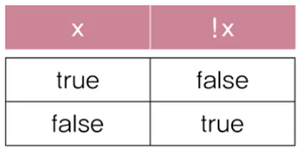

# **Operator**

<br>

## 11. Math.round()로 반올림하기

>실수를 소수점 첫째자리에서 반올림한 정수를 반환

- ```
    Math.round(pi * 1000) / 1000.0
    → Math.round(3.141592 * 1000) / 1000.0
    → Math.round(3141.592) / 1000.0
    → 3142 / 1000.0
    → 3.142

    3142 / 1000 → 3  // int / int → int

    3142 / 1000.0       // int / double
     → 3142.0 / 1000.0  // double / double
     → 3.142            // double 
  ```
- Ex3_11
    ```
    class Ex3_11 {
        public static viod main(String[]args){
            
            double pi = 3.141592;
            double shortpi = Math.round(pi * 1000) / 1000.0;
            System.out.println(shortpi)

            System.out.println((int)(pi*1000));
            System.out.println((int)(pi*1000)/1000);
            System.out.println((int)(pi*1000)/1000.0);
        }
    }
    ```

  - Ex3_11 Result
    ```
    3.142
    3141
    3
    3.141
    ```

## 12. 나머지 연산자 
>오른쪽 피연산자로 나누고 남은 나머지를 반환

- Ex3_12
    ```
    class Ex3_12 {
        public static viod main(String[]args){
            
            int x = 10;
            int y = 8;

            System.out.println("%d을 %d로 나누면, %n", x, y);
            System.out.println("몫은 %d이고, 나머지는 %d입니다.%n", x, y, x%y);
        }
    }
    ```

  - Ex3_12 Result
    ```
    10을 8로 나누면,
    몫은 1이고, 나머지는 2입니다.
    ```

- Ex3_13
    ```
    class Ex3_13 {
        public static viod main(String[]args){
            
            System.out.println(-10%8);
            System.out.println(10%-8);
            System.out.println(-10%-8);
        }
    }
    ```

  - Ex3_13 Result
    ```
    -2
    2
    -2
    ```

<br>
<hr>
<br>

## 13. 비교 연산자
>두 피연산자를 비교해서 true 또는 false를 반환

- 대소비교 연산자 : ```< > <= >=```
    <center> 
      
    </center>
- 등가비교 연산자 : ```== !=```
    <center> 
      
    </center>
  
    

## 14. 문자열의 비교
>문자열 비교에는 == 대신 equals()를 사용

- Ex3_14
    ```
    class Ex3_14 {
        public static viod main(String[]args){
            
            String str1 = "abc";
            String str2 = new String("abc");

            System.out.printf("\"abc\"==\"abc\" ? %b%n", "abc"=="abc");
            System.out.printf(" str1==\"abc\" ? %b%n",    str1=="abc");
            System.out.printf(" str2==\"abc\" ? %b%n",    str2=="abc");
            System.out.printf("str1.equals(\"abc\") ? %b%n", str1.equals("abc"));
            System.out.printf("str2.equals(\"abc\") ? %b%n", str2.equals("abc")); 
            System.out.printf("str2.equals(\"ABC\") ? %b%n", str2.equals("ABC"));
            System.out.printf("str2.equalsIgnoreCase(\"ABC\") ? %b%n", str2.equalsIgnoreCase("ABC"));
        }
    }
    ```

  - Ex3_14 Result
    ```
     "abc"=="abc" ? true
      str1=="abc" ? true
      str2=="abc" ? false
    str1.equals("abc") ? true
    str2.equals("abc") ? true
    str2.equals("ABC") ? false
    str2.equalsIgnoreCase("ABC") ? true
    ```

<br>
<hr>
<br>

## 15. 논리 연산자 && ||
```
조건식을 연결할 때 사용하는 연산자
```
- ```||```(OR결합)  : 피연산자 중 어느 한 쪽이 true이면 true  
 ```&&```(AND결합) : 피연산자 양쪽 모두 true여야 true  

    <center> 
      
    </center>

- Ex3_15
    ```
    import java.util.Scanner;

    class Ex3_15 {
        public static viod main(String[]args){
            
            Scanner scanner = new Scanner(System.in);
            char ch = ' ';

            System.out.printf("문자를 하나 입력하세요.>");

            String input = scanner.nextLine();
            ch = input.charAt(0);

            if('0' <= ch && ch <= '9') {
                System.out.printf("입력하신 문자는 숫자입니다.%n");
            }

            if(('a' <= ch && ch <= 'z') || ('A'<= ch && ch <= 'Z')) {
                System.out.printf("입력하신 문자는 영문자입니다.%n");
        }
    }
    ```

  - Ex3_15 Result
    ```
    문자를 하나 입력하세요.>7
    입력하신 문자는 숫자입니다.
    ```
    ```
    문자를 하나 입력하세요.>a
    입력하신 문자는 영문자입니다.
    ```

## 16. 논리 부정 연산자 !
```
true를 false로, false는 true로 바꿈
```

<center> 
    
</center>

- Ex3_16
    ```
    class Ex3_16 {
        public static viod main(String[]args){
            
            boolean b = true; 
            char ch = 'C';
            
            System.out.printf("b=%b%n", b);
            System.out.printf("!b=%b%n", !b);
            System.out.printf("!!b=%b%n", !!b);
            System.out.printf("!!!b=%b%n", !!!b);
            System.out.println();

            System.out.printf("ch=%c%n", ch);
            System.out.printf("ch < 'a' || ch > 'z'=%b%n", ch < 'a' || ch > 'z');
            System.out.printf("!('a'<=ch && ch<='z')=%b%n", !('a'<= ch && ch<='z'));
            System.out.printf("  'a'<=ch && ch<='z' =%b%n", 'a'<=ch && ch<='z');
            }
    }
    ```

  - Ex3_16 Result
    ```
    b=true
    !b=false
    !!b=true
    !!!b=false

    ch=C
    ch < 'a' || ch > 'z'=true
    !('a'<=ch && ch<='z')=true
      'a'<=ch && ch<='z' =false
    ```

<br>
<hr>
<br>

## 17. 조건 연산자


## 18. 대입 연산자


## 19. 복합 대입 연산자


<br>
<hr>
<br>

Java의 정석 기초편 | 남궁성 | 도우출판