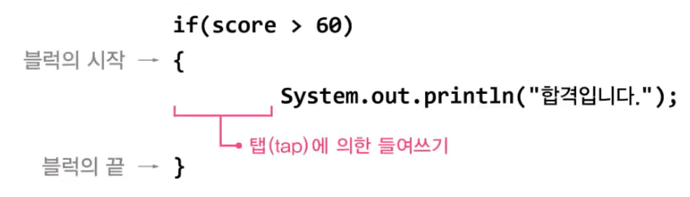

# **if, switch, for, while, statement**
  
<br>
    
    제어문(flow control statement)
    - 조건문 : 조건을 만족할 때만 {}를 수행(0~1) 
    - 반복문 : 조건을 만족하는 동안 {}를 수행(0~n)
     
## 01. if문
> 조건식이 true일 때, ```{}```안의 문장들을 수행
```
if (조건식) {
    // 조건식이 true일 때 수행될 문장
}
```
- Ex4_1
    ```
    class Ex4_1 {
        public static viod main(String[]args){
            int score = 80;

            if (score > 60) {
                System.out.println("합격입니다.")
            }
        }
    }
    ```

  - Ex4_1 Result
    ```
    합격입니다.
    ```

## 02. 조건식의 다양한 예

<center> 
    
</center>

- Ex4_2
    ```
    class Ex4_2 {
        public static viod main(String[]args){
            int x = 0;
            System.out.printf("x=%d 일 때, 참인 것은%n", x);

            if(x==0) System.out.println("x==0");
            if(x!=0) System.out.println("x!=0");
            if(!(x==0)) System.out.println("!(x==0)");
            if(!(x!=0)) System.out.println("!(x!=0)");

            x = 1;
            System.out.printf("x=%d 일 때, 참인 것은%n", x);

            if(x==0) System.out.println("x==0");
            if(x!=0) System.out.println("x!=0");
            if(!(x==0)) System.out.println("!(x==0)");
            if(!(x!=0)) System.out.println("!(x!=0)");
        }
    }
    ```

  - Ex4_2 Result
    ```
    x=0 일 때, 참인 것은 x==0
    !(x!=0)
    x=1 일 때, 참인 것은 x==0
    !(x==0)
    ```

## 03. 블럭 ```{}```

> 여러 문장을 하나로 묶어주는 것

<center> 
    
</center>  

- 블럭 내의 문장이 하나인 경우 ```{}``` 를 생략할 수 있음  
  ```
  if (score > 60)
    System.out.println("합격")  // if문에 속한 문장
    System.out.println("탈락")  // if문에 속하지 않은 문장
  ```

## 04. if-else문

> 둘 중의 하나 - 조건식이 참일 때와 거짓일 때로 나눠서 처리
```
if (조건식) {
    // 조건식이 true일 때 수행될 문장
} else {
    // 조건식이 false일 때 수행될 문장
}
```
- Ex4_3
    ```
    import java.util.Scanner;

    class Ex4_3 {
        public static viod main(String[]args){
            System.out.print("숫자를 하나 입력하세요.>");
            Scanner scanner = new Scanner(System.in);
            int input = scanner.nextInt(); 
            // 화면을 통해 입력받은 숫자를 input에 저장

            if(input==0) {
                System.out.println("입력하신 숫자는 0입니다.");	
            } else { // input!=0인 경우
                System.out.println("입력하신 숫자는 0이 아닙니다.");
            }
        }
    }
    ```

  - Ex4_3 Result
    ```
    숫자를 하나 입력하세요.>5
    입력하신 숫자는 0이 아닙니다.
    ```
    ```
    숫자를 하나 입력하세요.>0
    입력하신 숫자는 0입니다.
    ```

<br>
<hr>
<br>

## 05. if-else if문
> 여러 개 중의 하나 - 여러 개의 조건식을 포함한 조건식
```
if (조건식1) {
    // 조건식1의 연산 결과가 true일 때 수행될 문장
} else if (조건식2) {
    // 조건식2의 연산 결과가 true일 때 수행될 문장
} else if (조건식3) {  // 여러 개의 else if 사용가능
    // 조건식3의 연산 결과가 true일 때 수행될 문장
} else {  // 마지막은 보통 else블럭으로 끝나며, 생략가능
    // 위의 어느 조건식도 만족하지 않을 때 수행될 문장
}
```

## 06. if-else if문 예제
- Ex4_4
    ```
    import java.util.Scanner;

    class Ex4_4 {
        public static viod main(String[]args){
            int score  = 0;   // 점수를 저장하기 위한 변수
            char grade =' ';  // 학점을 저장하기 위한 변수. 공백으로 초기화한다.

            System.out.print("점수를 입력하세요.>");
            Scanner scanner = new Scanner(System.in);
            score = scanner.nextInt(); // 화면을 통해 입력받은 숫자를 score에 저장

            if (score >= 90) {         // score가 90점 보다 같거나 크면 A학점
                grade = 'A';             
            } else if (score >=80) {   // score가 80점 보다 같거나 크면 B학점 
                grade = 'B'; 
            } else if (score >=70) {   // score가 70점 보다 같거나 크면 C학점 
                grade = 'C'; 
            } else {                   // 나머지는 D학점
                grade = 'D'; 
            }
            System.out.println("당신의 학점은 "+ grade +"입니다.");
        }
    }
    ```

  - Ex4_4 Result
    ```
    점수를 입력하세요.>70
    당신의 학점은 C입니다.
    ```
    ```
    점수를 입력하세요.>63
    당신의 학점은 D입니다.
    ```

## 07. 중첩 if문
> if문 안의 if, 중첩횟수는 제약 없음
```
if (조건식1) {
    // 조건식1의 연산결과가 true일 때 수행될 문장
    if (조건식2) {
        // 조건식1과 조건식2가 모두 true 일 때 수행될 문장
    } else {
        // 조건식1이 true, 조건식2가 false일 때 수행될 문장
    }
} else {
    조건식1이 false일 때 수행되는 문장
}
```
- 괄호가 생략되었을 때 ```else {}```는 가까운 ```if```문에 속한 것으로 간주되기 때문에 생략에 주의해야함


## 08. 중첩 if문 예제
- Ex4_5
    ```
    import java.util.Scanner;

    class Ex4_5 {
        public static viod main(String[]args){
            int  score = 0;
            char grade = ' ', opt = '0';

            System.out.print("점수를 입력해주세요.>");

            Scanner scanner = new Scanner(System.in);
            score = scanner.nextInt(); // 화면을 통해 입력받은 점수를 score에 저장

            System.out.printf("당신의 점수는 %d입니다.%n", score);

            if (score >= 90) {           // score가 90점 보다 같거나 크면 A학점(grade)
                grade = 'A';
                if (score >= 98) {        // 90점 이상 중에서도 98점 이상은 A+
                    opt = '+';	
                } else if (score < 94) {  // 90점 이상 94점 미만은 A-
                    opt = '-';
                }
            } else if (score >= 80){     // score가 80점 보다 같거나 크면 B학점(grade)
                grade = 'B';
                if (score >= 88) {
                    opt = '+';
                } else if (score < 84)	{
                    opt = '-';
                }
            } else {                     // 나머지는 C학점(grade)
                grade = 'C';
            }	
            System.out.printf("당신의 학점은 %c%c입니다.%n", grade, opt);
        }
    }
    ```

  - Ex4_5 Result
    ```
    점수를 입력하세요.>81
    당신의 점수는 81입니다.
    당신의 학점은 B-입니다.
    ```
    ```
    점수를 입력하세요.>85
    당신의 점수는 85입니다.
    당신의 학점은 B0입니다.
    ```
    ```
    점수를 입력하세요.>100
    당신의 점수는 100입니다.
    당신의 학점은 A+입니다.
    ```

<br>
<hr>
<br>

## 09. switch문
> 처리해야 하는 겅우의 수가 많을 때 유용한 조건문
- 단 하나의 조건식으로 많은 경우의 수 처리 가능
- 표현 간결
- 제약조건이 있어 경우의 수가 많아도 어쩔 수 없이 if문으로 작성해야 하는 경우가 있음  
  1. 조건식을 계산
  2. 조건식의 결과와 일치하는 case문으로 이동
  3. 이후의 문장들을 수행
  4. break문이나 switch문의 끝을 만나면 switch문 전체를 탈출
<center> 
    
</center>   


## 10. switch문의 제약조건
1. switch문의 조건식 결과는 **정수** 또는 **문자열**이어야 함
2. case문의 값은 정수 상수(문자 포함), 문자열만 가능, 중복되지 않아야 함  
   (변수는 안됨)

   ```
   public static viod main(String[]args){
       int num, result;
       final int ONE = 1;
        ...
       switch(result) {
           case '1':    // 문자 리터럴
           case ONE:    // 정수 상수
           case "YES":  // 문자열 리터럴(JDK 1.7부터 허용)
           case num:    // error : 변수 불가
           case 1.0:    // error : 실수 불가
                ...
       } 
   }
   ```

## 11. switch문의 제약조건 예제
- Ex4_6
    ```
    import java.util.Scanner;

    class Ex4_6 {
        public static viod main(String[]args){
            System.out.print("현재 월을 입력하세요.>");

            Scanner scanner = new Scanner(System.in);
            int month = scanner.nextInt();  // 화면을 통해 입력받은 숫자를 month에 저장

            switch(month) {
                case 3: 
                case 4: 
                case 5:
                    System.out.println("현재의 계절은 봄입니다.");
                    break;
                case 6: case 7: case 8:
                    System.out.println("현재의 계절은 여름입니다.");
                    break;
                case 9: case 10: case 11:
                    System.out.println("현재의 계절은 가을입니다.");
                    break;
                default:
        //		case 12:	case 1: case 2:
                    System.out.println("현재의 계절은 겨울입니다.");
        }
    }
    ```

  - Ex4_6 Result
    ```
    현재 월을 입력하세요.>3
    현재의 계절은 봄입니다.
    ```

<br>
<hr>
<br>

## 12. 임의의 정수만들기 Math.random()
> ```Math.random()``` : 0.0과 1.0사이의 임의의 ```double```값 반환
- 0.0 <= ```Math.random()``` < 1.0  
  1. 각 변에 3을 곱함
        ```
        0.0 * 3 <= Math.random() * 3 < 1.0 * 3
            0.0 <= Math.random() * 3 < 3.0
        ```
  2. 각 변을 ```int```형으로 변환
        ```
        (int)0.0 <= (int)(Math.random() * 3) < (int)3.0
               0 <= (int)(Math.random() * 3) < 3
        ```
  3. 각 변에 1 더함
        ```
        0 + 1 <= (int)(Math.random() * 3) + 1 < 3 + 1
            1 <= (int)(Math.random() * 3) + 1 < 4
        ```

- Ex4_7
    ```
    class Ex4_7 {
        public static viod main(String[]args){

            int num = 0;

            // 괄호{} 안의 내용을 5번 반복한다.
            for (int i = 1; i <= 5; i++) {
                num = (int) (Math.random() * 6) + 1;
                System.out.println(num);
		    }
        }
    }
    ```

  - Ex4_7 Result
    ```
    6
    1
    1
    5
    2
    ```

<br>
<hr>
<br>

Java의 정석 기초편 | 남궁성 | 도우출판