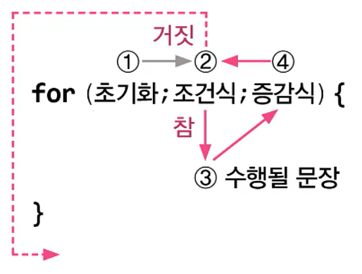
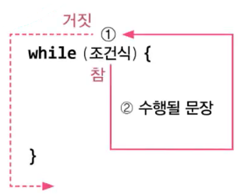
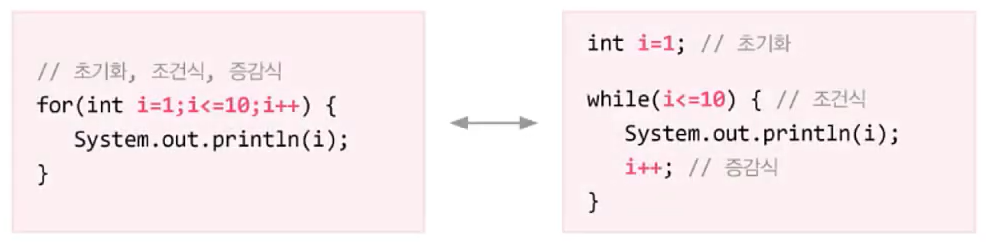

# **if, switch, for, while, statement**
  
<br>

## 13. for문
> 조건을 만족하는 동안 ```{}```을 반복 - 반복횟수를 알 때 적합
- for문의 구조와 수행순서
    ```
    for (초기화; 조건식; 증감식) {
        // 조건식이 true인 동안 수행될 문장
    }
    ```
<center> 
    
</center>

- Ex4_8
    ```
    class Ex4_8 {
        public static viod main(String[]args){
            for (int i = 1; i <= 3; i++) {
                System.out.println("Hello");
            }
        }
    }
    ```

  - Ex4_8 Result
    ```
    Hello
    Hello
    Hello
    ```
- 초기화
  - 반복문에 사용될 **변수를 초기화**하는 부분  
        ```for(int``` <span style="color : red">i=1</span>```; i<=10; i++) {...}```  
        ```for(int``` <span style="color : red">i=1, j=0</span>```; i<=10; i++) {...}```
- 조건식
  - 조건식이 **true인 동안 반복**을 계속함  
        ```for(int i = 1;``` <span style="color : red">i<=10</span>```; i++) {...}```  
  - ```{}``` 내의 문장이 한 번도 수행되지 않거나 무한루프에 빠질 수 있음

- 증감식
  - 반복문을 제어하는 **변수의 값**을 증가 또는 감소  
        ```for(int i = 1; i <= 10; ``` <span style="color : red">i++</span>```) {...}```  
        ```for(int i = 1; i ```<span style='color:red'>>=</span>```  10; ``` <span style="color : red">i++</span>```) {...}```  
        ```for(int i = 1; i <= 10; ``` <span style="color : red">i+=2</span>```) {...}```  
        ```for(int i = 1; i <= 10; ``` <span style="color : red">i*=3</span>```) {...}```  
- 초기화, 조건식, 증감식은 필요하지 않으면 생략할 수 있음  
  ```for(;;) {...}```

## 14. for문 예제
- Ex4_9
    ```
    class Ex4_9 {
        public static viod main(String[]args){
            for(int i=1;i<=5;i++)
                System.out.println(i); // i의 값을 출력한다.

            for(int i=1;i<=5;i++)
                System.out.print(i);   // print()를 쓰면 가로로 출력된다.

            System.out.println();
        }
    }
    ```

  - Ex4_9 Result
    ```
    1
    2
    3
    4
    5
    12345
    ```
- Ex4_10
    ```
    class Ex4_10 {
        public static viod main(String[]args){
            int sum = 0;	// 합계를 저장하기 위한 변수.

            for(int i=1; i <= 5; i++) {
                sum += i ;	// sum = sum + i;
                System.out.printf("1부터 %2d 까지의 합: %2d%n", i, sum);
            }
        }
    }
    ```

  - Ex4_10 Result
    ```
    1부터 1 까지의 합:  1
    1부터 2 까지의 합:  3
    1부터 3 까지의 합:  6
    1부터 4 까지의 합: 10
    1부터 5 까지의 합: 15
    ```

<br>
<hr>
<br>

## 15. 중첩 for문
> for문 내에 또 다른 for문을 포함시킬 수 있음
- 중첩 횟수는 거의 제한이 없다
    ```
    for (조건식1) {
        for (조건식2) {
        }
    }
    ```
- Ex4_11
    ```
    class Ex4_11 {
        public static viod main(String[]args){
            for(int i=1;i<=5;i++) {
                for(int j=1;j<=i;j++) {
                    System.out.print("*");
                }
                System.out.println();
            }
        }
    }
    ```

  - Ex4_11 Result
    ```
    *
    **
    ***
    ****
    *****
    ```

<br>
<hr>
<br>

## 16. while문
> 조건을 만족시키는 동안 ```{}```을 반복 - 반복횟수 **모를 때**

```
while (조건식) {
    // 조건식의 연산결과가 true인 동안, 반복될 문장
}
```

<center> 
    
</center>

- for문과 while문의 비교
        
    - 위의 두 코드는 완전히 동일
    - for문과 while문은 **항상** 서로 **변환 가능**

## 17. while문 예제 1
- Ex4_12
    ```
    class Ex4_12 {
        public static viod main(String[]args){
            int i= 5;

            while(i--!=0) {
                System.out.println(i + " - I can do it.");
		    }
        }
    }
    ```

  - Ex4_12 Result
    ```
    4 - I can do it.
    3 - I can do it.
    2 - I can do it.
    1 - I can do it.
    0 - I can do it.
    ```

- Ex4_13
    ```
    class Ex4_13 {
        public static viod main(String[]args){
            int sum = 0;
            int i = 0;
            // i를 1씩 증가시켜서 sum에 계속 더해나간다.
            while (sum <= 100) {
                System.out.printf("%d - %d%n", i, sum);
                sum += ++i;
            }
        }
    }
    ```

  - Ex4_13 Result
    ```
    0 - 0
    1 - 1
    2 - 3
    3 - 6
    4 - 10
    5 - 15
    6 - 21
    7 - 28
    8 - 36
    9 - 45
    10 - 55
    11 - 66
    12 - 78
    13 - 91
    ```

## 18. while문 예제 2
- Ex4_14
    ```
    import java.util.*;

    class Ex4_14 {
        public static viod main(String[]args){
            int num = 0, sum = 0;
            System.out.print("숫자를 입력하세요.(예:12345)>");

            Scanner scanner = new Scanner(System.in);
            String tmp = scanner.nextLine();  // 화면을 통해 입력받은 내용을 tmp에 저장
            num = Integer.parseInt(tmp);      // 입력받은 문자열(tmp)을 숫자로 변환

            while(num!=0) {    
                // num을 10으로 나눈 나머지를 sum에 더함
                sum += num%10; 	// sum = sum + num%10;
                System.out.printf("sum=%3d num=%d%n", sum, num);

                num /= 10;   // num = num / 10;  num을 10으로 나눈 값을 다시 num에 저장
            }

            System.out.println("각 자리수의 합:"+sum);
        }
    }
    ```

  - Ex4_14 Result
    ```
    숫자를 입력하세요.(예:12345)>12345
    sum=  5 num=12345
    sum=  9 num=1234
    sum= 12 num=123
    sum= 14 num=12
    sum= 15 num=1
    각 자리수의 합:15
    ```

## 18. do-while문
> ```{}```을 최소한 **한 번 이상 반복** - 사용자 입력받을 때 유용

```
do {
    // 조건식의 연산결과가 true일 때 수행할 문장
    // 처음 한 번은 무조건 실행
} while (조건식);
```

- Ex4_15
    ```
    class Ex4_15 {
        public static viod main(String[]args){
            int input  = 0, answer = 0;

            answer = (int)(Math.random() * 100) + 1; // 1~100 사이의 임의의 수를 저장
            Scanner scanner = new Scanner(System.in);

            do {
                System.out.print("1과 100사이의 정수를 입력하세요.>");
                input = scanner.nextInt();

                if(input > answer) {
                    System.out.println("더 작은 수로 다시 시도해보세요.");	
                } else if(input < answer) {
                    System.out.println("더 큰 수로 다시 시도해보세요.");			
                }
            } while(input!=answer);

            System.out.println("정답입니다.");
        }
    }
    ```

  - Ex4_15 Result
    ```
    1과 100사이의 정수를 입력하세요.>50
    더 작은 수로 다시 시도해보세요.
    1과 100사이의 정수를 입력하세요.>25
    더 작은 수로 다시 시도해보세요.
    1과 100사이의 정수를 입력하세요.>12
    더 큰 수로 다시 시도해보세요.
    1과 100사이의 정수를 입력하세요.>21
    정답입니다.
    ```

<br>
<hr>
<br>

## 20. break문
> 자신이 포함된 하나의 반복문을 벗어남

- Ex4_16
    ```
    class Ex4_16 {
        public static viod main(String[]args){
            nt sum = 0;
            int i   = 0;

            while(true) {
                if(sum > 100)
                    break;
                ++i;
                sum += i;
            } // end of while

            System.out.println("i=" + i);
            System.out.println("sum=" + sum);
        }
    }
    ```

  - Ex4_16 Result
    ```
    i=14
    sum=105
    ```
## 21. continue문
> 자신이 포함된 반복문의 끝으로 이동 - **다음 반복으로 넘어감**
> 전체 반복 중에서 특정 조건시 반복을 건너뛸 때 유용

- Ex4_17
    ```
    class Ex4_17 {
        public static viod main(String[]args){
            for(int i=0;i <= 10;i++) {
                if (i%3==0)
                    continue;
                System.out.println(i);
            }
        }
    }
    ```

  - Ex4_17 Result
    ```
    1
    2
    4
    5
    7
    8
    10
    ```

## 22. break문과 continue문 예제

- Ex4_18
    ```
    import java.util.*;

    class Ex4_18 {
        public static viod main(String[]args){
            int menu = 0;
            int num  = 0;

            Scanner scanner = new Scanner(System.in);

            while(true) {
                System.out.println("(1) square");
                System.out.println("(2) square root");
                System.out.println("(3) log");
                System.out.print("원하는 메뉴(1~3)를 선택하세요.(종료:0)>");

                String tmp = scanner.nextLine(); // 화면에서 입력받은 내용을 tmp에 저장
                menu = Integer.parseInt(tmp);    // 입력받은 문자열(tmp)을 숫자로 변환

                if(menu==0) {
                    System.out.println("프로그램을 종료합니다.");
                    break;
                } else if (!(1 <= menu && menu <= 3)) {
                    System.out.println("메뉴를 잘못 선택하셨습니다.(종료는 0)");
                    continue;		
                }
            System.out.println("선택하신 메뉴는 "+ menu +"번입니다.");
        }
    }
    ```

  - Ex4_18 Result
    ```
    (1) square
    (2) square root
    (3) log
    원하는 메뉴(1~3)를 선택하세요.(종료:0)>4
    메뉴를 잘못 선택하셨습니다.(종료는 0)
    (1) square
    (2) square root
    (3) log
    원하는 메뉴(1~3)를 선택하세요.(종료:0)>1
    선택하신 메뉴는 1번입니다.
    (1) square
    (2) square root
    (3) log
    원하는 메뉴(1~3)를 선택하세요.(종료:0)>0
    프로그램을 종료합니다.
    ```

## 23. 이름 붙은 반복문
> 반복문에 이름을 붙여서 하나 이상의 반복문을 벗어날 수 있음

- Ex4_19
    ```
    class Ex4_19 {
        public static viod main(String[]args){
            {
                // for문에 Loop1이라는 이름을 붙였다.
                Loop1 : for(int i=2;i <=9;i++) {	
                        for(int j=1;j <=9;j++) {
                            if(j==5)
                                break Loop1;
        //						break;
        //						continue Loop1;
        //						continue;
                            System.out.println(i+"*"+ j +"="+ i*j);
                        } // end of for i
                        System.out.println();
                    } // end of Loop1
        }
    }
    ```

  - Ex4_19 Result
    ```
    2*1=2
    2*2=4
    2*3=6
    2*4=8
    ```

## 24. 이름 붙은 반복문 예제

- Ex4_20
    ```
    import java.util.*;

    class Ex4_20 {
        public static viod main(String[]args){
            int menu = 0, num  = 0;
            Scanner scanner = new Scanner(System.in);

            outer:   // while문에 outer라는 이름을 붙인다. 
            while(true) {
                System.out.println("(1) square");
                System.out.println("(2) square root");
                System.out.println("(3) log");
                System.out.print("원하는 메뉴(1~3)를 선택하세요.(종료:0)>");

                String tmp = scanner.nextLine(); // 화면에서 입력받은 내용을 tmp에 저장
                menu = Integer.parseInt(tmp);    // 입력받은 문자열(tmp)을 숫자로 변환

                if(menu==0) {  
                    System.out.println("프로그램을 종료합니다.");
                    break;
                } else if (!(1<= menu && menu <= 3)) {
                    System.out.println("메뉴를 잘못 선택하셨습니다.(종료는 0)");
                    continue;		
                }

                for(;;) {
                System.out.print("계산할 값을 입력하세요.(계산 종료:0, 전체 종료:99)>");
                    tmp = scanner.nextLine();    // 화면에서 입력받은 내용을 tmp에 저장
                    num = Integer.parseInt(tmp); // 입력받은 문자열(tmp)을 숫자로 변환

                    if(num==0)  
                        break;        // 계산 종료. for문을 벗어난다.

                    if(num==99) 
                        break outer;  // 전체 종료. for문과 while문을 모두 벗어난다.

                    switch(menu) {
                        case 1: 
                            System.out.println("result="+ num*num);		
                            break;
                        case 2: 
                            System.out.println("result="+ Math.sqrt(num)); 
                            break;
                        case 3: 
                            System.out.println("result="+ Math.log(num));  
                            break;
                    } 
                } // for(;;)
            } // while의 끝
        }
    }
    ```

  - Ex4_20 Result
    ```
    (1) square
    (2) square root
    (3) log
    원하는 메뉴(1~3)를 선택하세요.(종료:0)>1
    계산할 값을 입력하세요.(계산 종료:0, 전체 종료:99)>2
    result=4
    계산할 값을 입력하세요.(계산 종료:0, 전체 종료:99)>3
    result=9
    계산할 값을 입력하세요.(계산 종료:0, 전체 종료:99)>0
    (1) square
    (2) square root
    (3) log
    원하는 메뉴(1~3)를 선택하세요.(종료:0)>2
    계산할 값을 입력하세요.(계산 종료:0, 전체 종료:99)>4
    result=2.0
    계산할 값을 입력하세요.(계산 종료:0, 전체 종료:99)>99
    ```

<br>
<hr>
<br>

Java의 정석 기초편 | 남궁성 | 도우출판