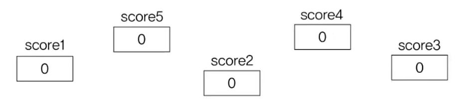
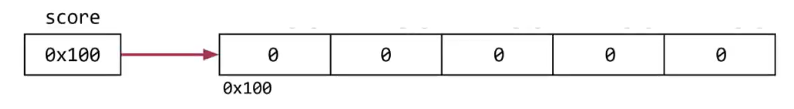
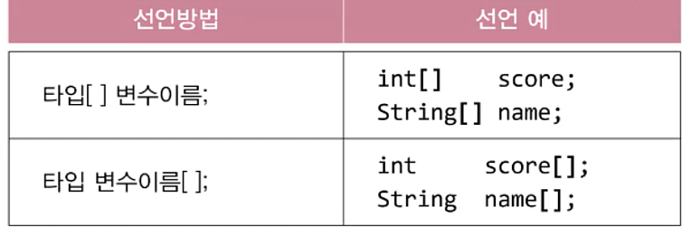
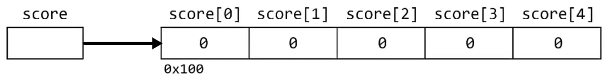
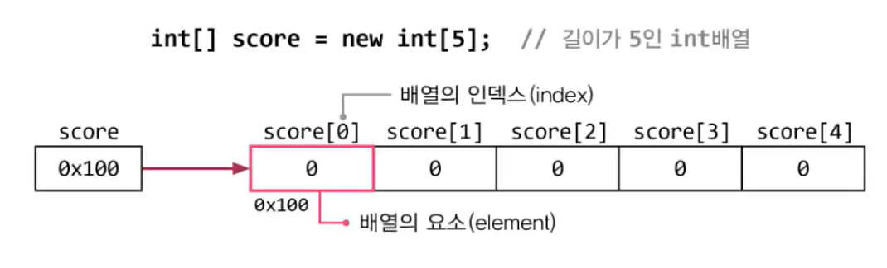

# **Array**
  
<br>

## 01. 배열이란?
> 배열은 같은 타입의 여러 변수를 하나의 묶음으로 다루는 것
- 배열을 사용하지 않고 변수를 저장하는 경우  
    ```int score1, score2, score3, score4, score5;```

    <center> 
      
    </center>
- 배열을 사용하고 변수를 저장하는 경우  
    ```int[] score = new int[5];  // score[0], score[2]...```

    <center> 
      
    </center>
    
    - 저장공간에 이름이 없음 (자동으로 0부터 인덱스가 붙음)
    - 배열을 다루기 위해 이름을 붙인 **참조변수**가 필요 
    - 각 **저장공간이 연속적**(붙어있음)

## 02. 배열의 선언과 생성
> 배열의 선언 - 배열을 다루기 위한 **참조변수의 선언**

- 원하는 타입의 변수를 선언하고 변수 또는 타입에 ```[]```를 붙임
    <center> 
      
    </center>
  
- 배열의 생성
    ```
    타입[] 변수이름;            // 배열을 선언(배열을 다루기 위한 참조변수 선언)
    변수이름 = new 타입[길이];  // 배열을 생성(실제 저장공간을 생성)
    ```
    ```
    int[] score;         // int타입의 배열을 다루기 위한 참조변수 score 선언
    score = new int[5];  // int타입의 값 5개를 저장할 수 있는 배열 생성
    ```
    <center> 
      
    </center>

## 03. 배열의 인덱스
> 배열의 인덱스 - 배열의 요소마다 붙여진 일련번호
- index의 범위 : **0 ~ '배열길이 - 1'**

    <center> 
      
    </center>

- [예제](#07-배열의-출력-예제)

## 07. 배열의 출력 예제

- Ex5_1
    ```
    import java.util.Arrays;
    class Ex5_1 {
        public static viod main(String[]args){
            int[] iArr1 = new int[10];
            int[] iArr2 = new int[10];
    //		int[] iArr3 = new int[]{100, 95, 80, 70, 60};
            int[] iArr3 = {100, 95, 80, 70, 60};
            char[] chArr = {'a', 'b', 'c', 'd'};

            for (int i=0; i < iArr1.length ; i++ ) {
                iArr1[i] = i + 1; // 1~10의 숫자를 순서대로 배열에 넣는다.
            }

            for (int i=0; i < iArr2.length ; i++ ) {
                iArr2[i] = (int)(Math.random()*10) + 1; // 1~10의 값을 배열에 저장
            }

            // 배열에 저장된 값들을 출력한다.
            for(int i=0; i < iArr1.length;i++) {
                System.out.print(iArr1[i]+",");	
            }
            System.out.println();

            System.out.println(Arrays.toString(iArr2));
            System.out.println(Arrays.toString(iArr3));
            System.out.println(Arrays.toString(chArr));
            System.out.println(iArr3);
            System.out.println(chArr);
        }
    }
    ```

  - Ex5_1 Result
    ```
    1,2,3,4,5,6,7,8,9,10
    [3, 4, 8, 10, 1, 10, 6, 2, 7, 1]
    [100, 95, 80, 70, 60]
    [a, b, c, d]
    [I@14318bb
    abcd
    ```


<br>
<hr>
<br>

Java의 정석 기초편 | 남궁성 | 도우출판