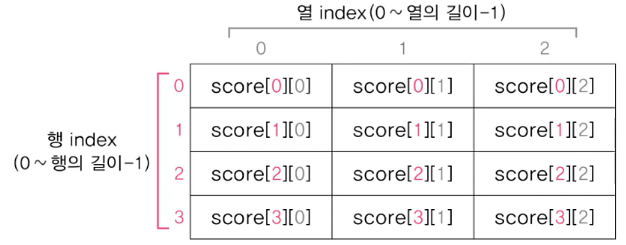
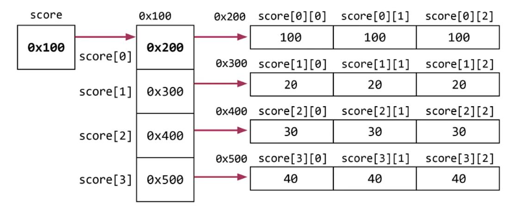

# **Array**
  
<br>

## 18. 2차원 배열의 선언
> 테이블 형태의 데이터를 저장하기 위한 배열

- 3차원 이상의 고차원 배열의 선언은 ```[]```의 개수를 차원의 수만큼 추가
| 선언 방법 | 선언 예|
|:---------:|:------:|
|<span style='color:blue'>타입[][] 변수이름;</span>|```int[][] score;```|
|타입 변수이름[][]; |```int score[][];```|
|타입[] 변수이름[]; |```int[] score[]```|

## 19. 2차원 배열의 인덱스
- ```int[][] score = new int[4][3]  // 4행 3열의 2차원 배열 score를 생성```

    <center> 
      
    </center>

## 20. 2차원 배열의 초기화
- 1차원 배열보다 ```{}```를 한 번 더 써서 행별로 구분
    ```
    int[][] arr = new int[][] {{1, 2, 3}, {4, 5, 6}};
    int[][] arr = {{1, 2, 3}, {4, 5, 6}};  // new int[][] 생략 
    ```
    ```
    int[][] arr = {
                      {1, 2, 3}, 
                      {4, 5, 6}
                  };
- example
    ```
    int[][] arr = {
                      {100, 100, 100},
                      {20, 20, 20},
                      {30, 30, 30},
                      {40, 40, 40}
                  };
    ```

    <center> 
      
    </center>

<br>
<hr>
<br>

## 21. 2차원 배열의 초기화 예제1    

- Ex5_8
    ```
    class Ex5_8 {
        public static viod main(String[]args){
            int[][] score = {
                    { 100, 100, 100 }
                    , { 20, 20, 20 }
                    , { 30, 30, 30 }
                    , { 40, 40, 40 }
            };
            int sum = 0;

            for (int i = 0; i < score.length; i++) {
                for (int j = 0; j < score[i].length; j++) {
                    System.out.printf("score[%d][%d]=%d%n", i, j, score[i][j]);

                    sum += score[i][j];
                }
            }

            System.out.println("sum=" + sum);
        }
    }
    ```

  - Ex5_8 Result
    ```
    score[0][0]=100
    score[0][1]=100
    score[0][2]=100
    score[1][0]=20
    score[1][1]=20
    score[1][2]=20
    score[2][0]=30
    score[2][1]=30
    score[2][2]=30
    score[3][0]=40
    score[3][1]=40
    score[3][2]=40
    sum=570
    ```

## 22. 2차원 배열의 초기화 예제2
- Ex5_9
    ```
    class Ex5_9 {
        public static viod main(String[]args){
            int[][] score = {
                                { 100, 100, 100}
                                , { 20, 20, 20}
                                , { 30, 30, 30}
                                , { 40, 40, 40}
                                , { 50, 50, 50}
                            };
            // 과목별 총점
            int korTotal = 0, engTotal = 0, mathTotal = 0;

            System.out.println("번호  국어  영어  수학  총점  평균 ");
            System.out.println("=============================");

            for(int i=0;i < score.length;i++) {
                int  sum = 0;      // 개인별 총점
                float avg = 0.0f;  // 개인별 평균

                korTotal  += score[i][0];
                engTotal  += score[i][1];
                mathTotal += score[i][2];
                System.out.printf("%3d", i+1);

                for(int j=0;j < score[i].length;j++) {
                    sum += score[i][j]; 
                    System.out.printf("%5d", score[i][j]);
                }

                avg = sum/(float)score[i].length;  // 평균계산
                System.out.printf("%5d %5.1f%n", sum, avg);
            }

            System.out.println("=============================");
            System.out.printf("총점:%3d %4d %4d%n", korTotal, engTotal, mathTotal);
        }
    }
    ```

  - Ex5_9 Result
    ```
    번호  국어  영어  수학  총점  평균 
    =============================
       1  100   100   100   300   100.0
       2   20    20    20    60    20.0
       3   30    30    20    90    30.0
       4   40    40    20   120    40.0
       5   50    50    20   150    50.0
    =============================
    총점: 240  240  240
    ```

## 23. 2차원 배열의 초기화 예제3
- Ex5_10
    ```
    import java.util.Scanner;

    class Ex5_10 {
        public static viod main(String[]args){
            String[][] words = {
                {"chair","의자"},      	// words[0][0], words[0][1]
                {"computer","컴퓨터"}, 	// words[1][0], words[1][1]
                {"integer","정수"}     	// words[2][0], words[2][1]
            };

            Scanner scanner = new Scanner(System.in);

            for(int i=0;i<words.length;i++) {
                System.out.printf("Q%d. %s의 뜻은?", i+1, words[i][0]);

                String tmp = scanner.nextLine();

                if(tmp.equals(words[i][1])) {
                    System.out.printf("정답입니다.%n%n");
                } else {
                System.out.printf("틀렸습니다. 정답은 %s입니다.%n%n",words[i][1]);
                }
            } // for
        }
    }
    ```

  - Ex5_10 Result
    ```
    Q1. chair의 뜻은?dmlwk
    틀렸습니다. 정답은 의자입니다.

    Q2. computer의 뜻은?컴퓨터
    정답입니다.

    Q2. integer의 뜻은?정수
    정답입니다.
    ```    

<br>
<hr>
<br>

## 24. Arrays로 배열 다루기
> Array클래스는 배열을 다루는데 유용한 메서드를 제공함
- **문자열의 비교와 출력 - ```equals()```, ```toString()```**
  - ```toString()```  
    : 배열의 모든 요소를 문자열로 편하게 출력 가능 (**일차원 배열**만 사용가능)
    - ```deepToString()``` : 다차원 배열에 사용
  - ```equals()```  
    : 두 배열에 저장된 모든 요소를 비교해 같으면 True, 다르면 False 반환 (**일차원 배열**)  
    -  ```deepEquals()```

- **배열의 복사 - ```copyOf()```, ```copyOfRange()```**
  - ```copyOf()```  
    : 배열 전체를 복사해서 새로운 배열을 반환
    - ```copyOfRange()``` : 배열의 일부 복사, 지정된 범위의 끝은 포함x
- **배열의 정렬 - ```sort()```**


<br>
<hr>
<br>

Java의 정석 기초편 | 남궁성 | 도우출판