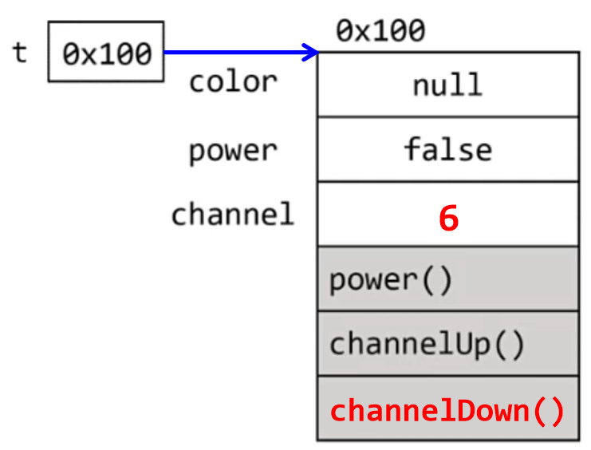
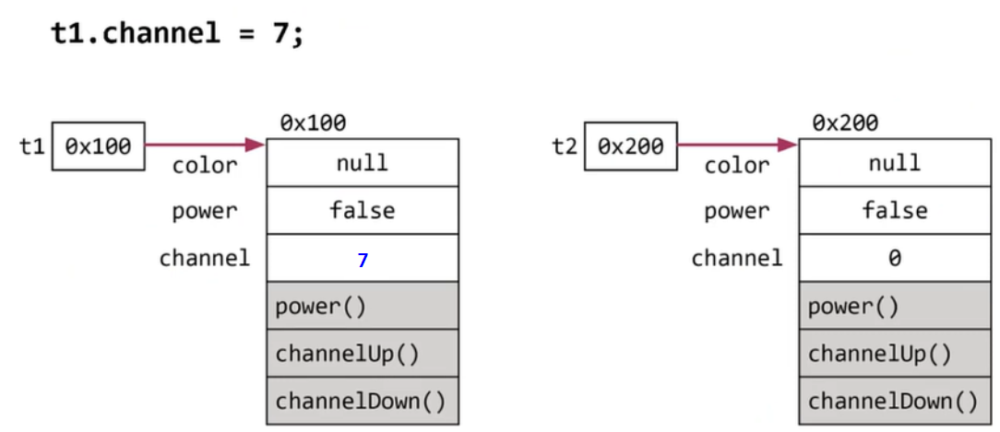

# **Object-oriented Programming 1**
  
<br>
    
## 01. 객체지향 언어
>객체지향 언어 = 프로그래밍 언어 + 객체지향개념(규칙)
- 80년대 초, 소프트웨어의 위기 : 빠른 변화를 못 쫓아감  
  해결책으로 객체지향 언어를 도입(절차적 → 객체지향)  
- 코드의 **재사용성**이 높고 **유지보수**가 용이, **중복 코드 제거**
- oop(Object-Oriented Programming)  
  1. 캡슐화
  2. 상속
  3. 추상화
  4. 다형성☆


<br>
<hr>
<br>

## 02. 클래스와 객체
- **클래스**
  - 정의 : 클래스란 <span style='color:blue'>객체를 정의</span>해 놓은 것
  - 용도 : 클래스는 객체를 <span style='color:blue'>생성</span>하는데 사용
- **객체**
  - 정의 : 실제로 존재하는 것. 사물 또는 개념
  - 용도 : 객체가 가지고 있는 기능과 속성에 따라 다름
  
    <center> 
      
    </center>


## 03. 객체의 구성요소 - 속성과 기능
  - 군사적 목적. 객체지향 개념도 다른 과학과 마찬가지로 군사적 목적으로 만들어짐.
  - 실제 세계를 어떻게 하면 컴퓨터 안으로 넣을까? 를 고민  
  - 미사일을 실제로 쏘는 것보다 컴퓨터 안에서 실험해 시행착오를 줄일 수 있기 때문에 실제 세계를 분석, 관찰
  - 하드웨어(hw) → 소프트웨어(sw)
  
    <center> 
      
    </center>
> 객체 = 속성(변수) + 기능(메서드)
- 객체는 속성과 기능, 두 종류의 구성요소로 이뤄짐.  
  속성과 기능의 집합 : 다수의 속성과 다수의 기능을 갖음  
  객체의 멤버(구성원, member) : 객체가 가지고 있는 속성과 기능
- 클래스 : 객체를 정의, 객체의 모든 속성과 기능이 정의되어 있음  
  클래스로부터 객체 생성 → 클래스에 정의된 속성과 기능르 가진 객체가 생성됨
<center> 
    
</center>


## 04. 객체와 인스턴스
> 객체 : 모든 인스턴스를 대표하는 일반적 용어
> 인스턴스 : 특정 클래스로부터 생성된 객체
- 인스턴스화(instantiate) : 클래스로부터 객체를 만드는 과정
- 인스턴스(instance) : 어떤 클래스로부터 만들어진 객체
  
    <center> 
      
    </center>
    <center float="left">
      
       
    </center>

<br>
<hr>
<br>

## 05. 한 파일에 여러 클래스 작성하기
- 하나의 소스파일에는 하나의 클래스만 작성하는 것이 바람직
- 소스파일의 이름은 ```public class```의 이름과 일치
- 하나의 소스파일에는 하나의 ```public class```만 허용
- 만일 소스파일 내에 ```public class```가 없다면, 소스파일의 이름은 소스파일 내의 어떤 클래스의 이름으로 해도 상관없음
<center> 
    
    
</center>

<br>
<hr>
<br>

## 06. 객체의 생성과 사용
> 인스턴스는 참조변수를 통해서만 다룰 수 있으며, 참조변수의 타입은 인스턴스의 타입과 일치해야 함
> 사용할 수 없는 객체는 GC가 메모리에서 제거
0. 클래스 작성
    ```
    class Tv{
        // Tv의 속성(멤버변수)
        String color;           // 색상 
        boolean power;         	// 전원상태(on/off) 
        int channel;           	// 채널 

        // Tv의 기능(메서드) 
        void power() { power = !power; }  // TV를 켜거나 끄는 기능
        void channelUp() {  ++channel; }  // TV의 채널을 높이는 기능
        void channelDown() { --channel; }  // TV의 채널을 낮추는 기능
    }
    ```
1. 객체의 생성
    ```
    클래스명 변수명;         // 클래스의 객체를 참조하기 위한 참조변수 선언
    변수명 = now 클래스명(); // 클래스의 객체를 생성 후, 객체의 주소를 참조변수에 저장
    ```
    ```
    Tv t;         
    t = new Tv();
    ```
    - ```Tv t;```  
        :  ```Tv```인스턴스를 참조하기 위한 ```Tv```클래스 타입의 **참조변수** ```t```를 선언.  
        메모리에 참조변수 ```t```를 위한 공간이 마련, 인스턴스가 생성되지 않아 이 참조변수로 할 수 있는 것은 없음
        <center> 
          
        </center>
    - ```t = new Tv();```  
        : 연산자 ```new```에 의해 ```Tv```클래스의 인스턴스가 메모리의 빈 공간에 생성  
        이때, 멤버변수는 각 자료형에 해당하는 기본값으로 초기화  
        대입연산자(```=```)에 의해 생성된 객체의 주소값이 참조변수 ```t```를 통해 ```Tv```인스턴스에 접근할 수 있음 (인스턴스를 다루기 위해 참조변수가 반드시 필요)

        <center> 
          
        </center>
2. 객체의 사용
   ```
   t.channel = 7;    
   t.channelDown();
   System.out.println("현재 채널은 " + t.channel + " 입니다."); 
   ```
    - ```t.channel = 7;```  
     :  ```Tv```인스턴스의 멤버변수 channel에 7을 저장  
     ```참조변수.멤버변수```로 인스턴스 멤버변수(속성)을 사용    

     <center> 
       
     </center>

    - ```t.channelDown();```  
     :  ```Tv```인스턴스의 메서드 ```channelDown();``` 호출  
     맴버변수 ```channel```에 저장되어 있는 값을 1 감소 
        ```
        void channelDown() { --channel; }
        ```   

     <center> 
       
     </center>
    
    - ```System.out.println("현재 채널은 " + t.channel + " 입니다.");```  
        : 참조변수 ```t```가 참조하고 있는 ```Tv```인스턴스의 멤버변수 ```channel```에 저장된 값 출력

- Ex6_1
    ```
    class Ex6_1 { 
        public static void main(String args[]) { 
            Tv t;                  7
            t = new Tv();         

            t.channel = 7;
            t.channelDown();      
            System.out.println("현재 채널은 " + t.channel + " 입니다."); 
        } 
    }

    class Tv {   
        String color;          
        boolean power;          
        int channel;           	

        // Tv의 기능(메서드) 
        void power()   { power = !power; }  
        void channelUp()   {  ++channel; }  
        void channelDown() { --channel; }   
    }
    ```

  - Ex6_1 Result
    ```
    현재 채널은 6 입니다.
    ```


## 07. 객체의 생성과 사용 예제

<center> 
    
    
    
</center>

- Ex6_2
    ```
    class Ex6_2 {
        public static void main(String args[]) {
            Tv t1 = new Tv();  // Tv t1; t1 = new Tv();를 한 문장으로 가능
            Tv t2 = new Tv();
            System.out.println("t1의 channel값은 " + t1.channel + "입니다.");
            System.out.println("t2의 channel값은 " + t2.channel + "입니다.");

            t1.channel = 7;    // channel 값을 7으로 한다.
            System.out.println("t1의 channel값을 7로 변경하였습니다.");

            System.out.println("t1의 channel값은 " + t1.channel + "입니다.");
            System.out.println("t2의 channel값은 " + t2.channel + "입니다.");
        }
    }
    ```

  - Ex6_2 Result
    ```
    t1의 channel값은 0입니다.
    t2의 channel값은 0입니다.
    t1의 channel값을 7로 변경하였습니다.
    t2의 channel값은 7입니다.
    t2의 channel값은 0입니다.
    ```

<br>
<hr>
<br>

## 08. 객체배열
> 객체배열 = 참조변수 배열
- 객체를 배열로 다루는 것으로 객체 배열 안에 객체의 주소가 저장됨
- 참조변수들을 하나로 묶은 **참조변수 배열**
    <center> 
      
      
    </center>

    ```
    Tv[] tvArr = new Tv[3]  // 참조변수 배열(객체배열) 생성

    // 객체를 생성해서 배열의 각 요소에 저장
    tvArr[0] = new Tv();
    tvArr[1] = new Tv();
    tvArr[2] = new Tv();
    ```
    ```
    // 배열의 초기화 블럭 사용
    Tv[] tvArr = { new Tv(), new Tv(), new Tv() };
    ```
    ```
    // 객체수가 많은 경우 for문 이용
    Tv[] tvArr = new Tv[100];
    for (int i=0; i<tvArr.length; i++) {
        tvArr[i] = new Tv();
    }
    ```

<br>
<hr>
<br>

## 09. 클래스의 정의(1) - 데이터와 함수의 결합
> 클래스 = 데이터 + 함수
- 클래스 : 속성과 기능으로 정의, 데이터 + 함수, 사용자 정의
- 프로그래밍 언어에서 데이터 처리를 위한 데이터 저장형태의 발전 과정
  1. 변수 : 하나의 데이터를 저장할 수 있는 공간
    <center> 
      
    </center>
  2. 배열 : <span style='color:blue'>같은 종류</span>의 여러 데이터를 하나의 집합으로 저장할 수 있는 공간
    <center> 
      
    </center>
  3. 구조체 : 서로 관련된 여러 데이터를 <span style='color:blue'>종류에 관계없이</span> 하나의 집합으로 저장할 수 있는 공간
    <center> 
      
    </center>
  4. 클래스 : 데이터와 함수의 결합(구조체 + 함수)
    <center> 
      
    </center>

- 자바와 같은 객체지향언어에서 변수(데이터)와 함수를 하나의 클래스에 정의하여 서로 관계가 깊은 변수와 함수를 함께 다룰 수 있게 했음
- 클래스 : 서루 관련된 변수들을 정의하고 이들에 대한 작업을 수행하는 함수들을 함께 정의
  - 자바에서는 ```String```이라는 클래스로 문자를 다룸


## 10. 클래스의 정의(2) - 사용자 정의 타입
> 사용자 정의 타입 - 원하는 타입을 직접 만들 수 있음
- 사용자 정의 타입 : 프로그래머가 서로 관련된 변수들을 묶어서 하나의 타입으로 새로 추가하는 것 (참조형의 개수가 정해져 있지 않음)
- 객체지향언어에서는 **클래스**가 곧 **사용자 정의 타입**

<br>
<hr>
<br>

## 11. 선언위치에 따른 변수의 종류
> 클래스 변수, 인스턴스 변수, 지역변수
<center> 
    
</center>

- 클래스 영역에는 선언문만 가능(변수 선언, 메서드 선언 및 정의), 순서는 상관 없음
- 인스턴스 변수
  - instance variable (iv)
  - **클래스 영역**에서 선언, **인스턴스 생성할 때 만들어짐**
  - 인스턴스 변수의 값을 읽어오거나 저장하려면 먼저 생성해야 함
  - 인스턴스마다 별도의 저장공간을 가지므로 서로 다른 값을 가질 수 있음
  - 인스턴스마다 고유한 상태를 유지해야하는 속성의 경우에 선언
- 클래스 변수
  - class variable (cv)
  - 인스턴스 변수 앞에 ```static```을 붙이기만 하면 됨
  - **인스턴스를 생성하지 않고** 언제라도 바로 사용할 수 있다는 특징이 있으며, ```클래스이름.클래스 변수```와 같은 형식으로 사용됨
  - 모든 인스턴스가 공통된 저장공간(변수)를 공유
  - 한 클래스의 모든 인스턴스들이 공통적인 값을 유지해야하는 속성의 경우에 선언
    - cpu가 있는데, 가지고 있는 파일들은 ssd, hdd에 xxx.class로 저장되어 있음, cpu와의 속도차이 때문에 바로 못읽어 중간에 ram을 두었음(메모리), 파일을 읽으려면 메모리에 파일을 올리는 로딩을 해야함. 메모리에 .class 파일이 로딩되어야 cpu가 읽을 수 있음 cpu는 메모리하고만 작업함, 작업이 끝나면 메모리에서 디스크에 저장하는 것이 save. 모든 작업을 하려면 파일이 메모리에 올라가야함. 클래스는 메모리에 올라가면서 자동으로 만들어짐, 객체생성 안해도 됨
- 지역변수
  - local variable (lv)
  - 메서드 내에 선언되어 메서드 내에서만 사용 가능
  - 메서드가 종료되면 소멸되어 사용할 수 없게 됨
  - for문/while문의 불럭 내에 선언된 지역변수는, 지역변수가 선언된 ```{}```내에서만 사용 가능

<center> 
    
</center>

<br>
<hr>
<br>

## 12. 클래스 변수와 인스턴스 변수
> 인스턴스 변수는 인스턴스가 생성될 때마다 생성되므로 인스턴스마다 각기 다른 값을 유지할 수 있지만, 클래스 변수는 모든 인스턴스가 하나의 저장공간을 공유하므로, 항상 공통된 값을 가짐
- 예시) 카드게임
    <center> 
      
      
    </center>

## 13. 클래스 변수와 인스턴스 변수 예제
- [flash : MemberVar.exe](https://github.com/castello/javajungsuk_basic/tree/master/flash)
- Ex6_3
    ```
    class Ex6_3 {
        public static void main(String args[]) {
            System.out.println("Card.width = " + Card.width);
            System.out.println("Card.height = " + Card.height);

            Card c1 = new Card();
            c1.kind = "Heart";
            c1.number = 7;

            Card c2 = new Card();
            c2.kind = "Spade";
            c2.number = 4;

            System.out.println("c1은 " + c1.kind + ", " + c1.number + "이며, 크기는 (" + c1.width + ", " + c1.height + ")");
            System.out.println("c2는 " + c2.kind + ", " + c2.number + "이며, 크기는 (" + c2.width + ", " + c2.height + ")");
            System.out.println("c1의 width와 height를 각각 50, 80으로 변경합니다.");
            c1.width = 50;
            c1.height = 80;

            System.out.println("c1은 " + c1.kind + ", " + c1.number + "이며, 크기는 (" + c1.width + ", " + c1.height + ")");
            System.out.println("c2는 " + c2.kind + ", " + c2.number + "이며, 크기는 (" + c2.width + ", " + c2.height + ")");
        }
    }

    class Card {
        String kind;
        int number;
        static int width = 100;
        static int height = 250;
    }
    ```

  - Ex6_3 Result
    ```
    Card.width = 100
    Card.height = 250
    c1는 heart, 7이며, 크기는 (100,250)
    c2는 spade, 4이며, 크기는 (100,250)
    c1의 width와 height를 각각 50, 80으로 변경합니다
    c1는 heart, 7이며, 크기는 (50, 80)
    c2는 spade, 4이며, 크기는 (50, 80)
    ```

<br>
<hr>
<br>

Java의 정석 기초편 | 남궁성 | 도우출판