# **Object-oriented Programming 1**
  
<br>
    
## 14. 메서드란?
- 메서드
  - 특정 작업을 수행하는 단위로 문장들을 하나로 묶은 것
  - 값(입력)을 받아서 처리하고, 결과를 반환
    - 객체지향개념에서 함수를 의미
    - 클래스 안에 반드시 있어야 함 (함수는 클래스에 독립적)

    <center>
      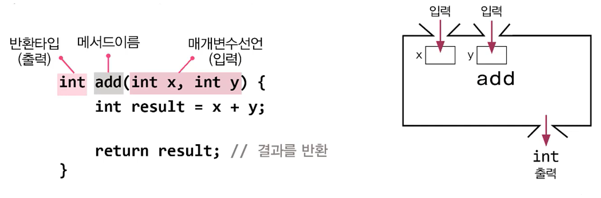
    </center>

- 메서드의 장점
  - 코드의 **중복**을 줄일 수 있음
  - 코드의 **관리**가 쉬움
  - 코드를 **재사용** 할 수 있음
  - 코드가 **간결**해서 이해하기 쉬움  
  
    <center>
      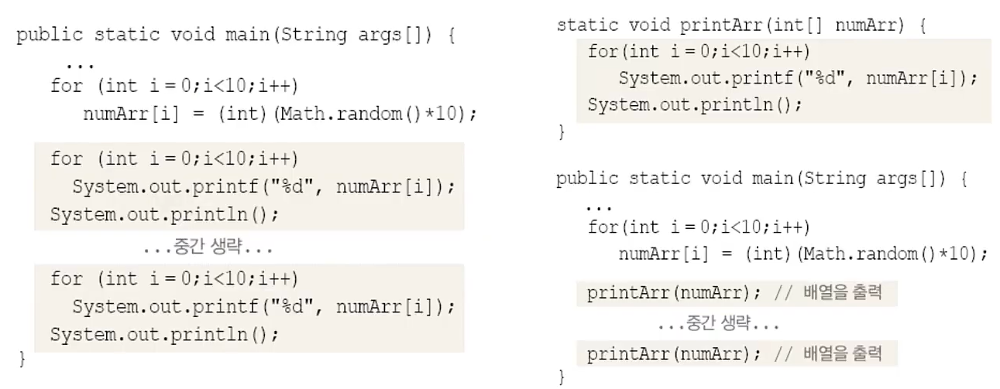
    </center>
- 메서드의 작성
  - 반복적으로 수행되는 여러 문장을 메서드로 작성
  - 하나의 메서드는 한 가지 기능만 수행하도록 작성

- 메서드 = 선언부(header) + 구현부(body)
  ```
  반환타입(작업결과타입) 메서드이름 (작업에 필요한 값, 매개변수 목록) {
      // 메서드 호출시 수행될 코드
  }
  ```
    <center>
      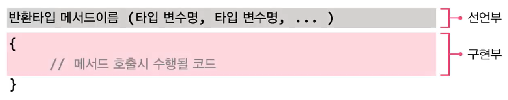
    </center>

  - 입력은 0 ~ n개까지 가능하나, 출력은 0 ~ 1 (배열을 이용하거나 객체를 이용)
  - 반환타입이 없다면 ```void```
  
## 15. 메서드의 선언부
> ```메서드 이름```, ```매개변수 선언```, ```반환타입```으로 구성
<center>
    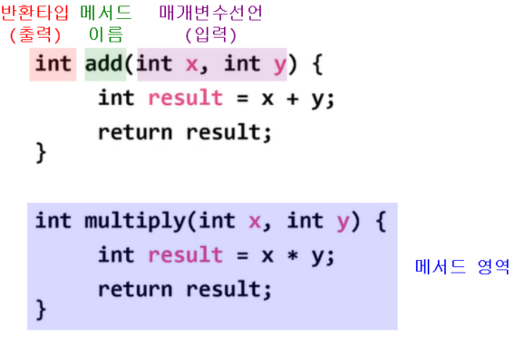
</center

   

- 매개변수 선언(parameter declaration)
  - 일반적인 변수선언과 달리 두 변수의 타입이 같아도 변수의 타입을 생략할 수 없음
- 반환타입 (return type)
  - 메서드의 작업수행 결과(출력)인 ```반환값```의 타입을 적음
  - 반환값이 없는 경우 ```void```
  
## 16. 메서드의 구현부
- return문
  - 메서드 반환타입이 ```void```가 아닌 경우, 구현부```{}``` 안에 ```return 반환값;```이 반드시 포함되어야 함
  - 작업을 수행한 결과인 반환값을 호출한 메서드로 전달
  - 이 값의 타입은 **반환타입과 일치하거나 적어도 자동 형변환이 가능**한 것이어야 함

- 지역변수(lv) : 메서드 내에 선언된 변수
    - 겹치지 않는 메서드는 매개변수 이름이 동일해도 괜찮음
    - 매개변수도 지역변수

<center>
    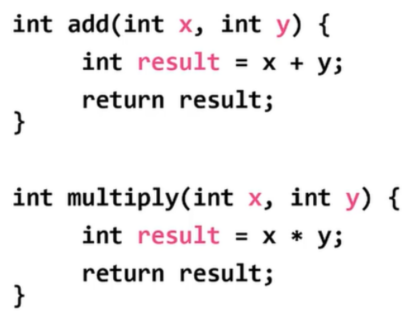
</center>
<br>
<hr>
<br>

## 17. 메서드의 호출
> 메서드를 호출해야 구현부```{}```의 문장들이 수행됨
- 메서드 호출 방법 : ```메서드이름(값1, 값2, ...);```
    ```
    print99danAll(); // void print99danAll() 호출
                     // 구구단을 출력하는 것이기에 입력값 필요 x
    
    int result = add(3, 5); // int add(int x, int y)를 호출
                            // 결과를 result에 저장
    ```
    <center>
      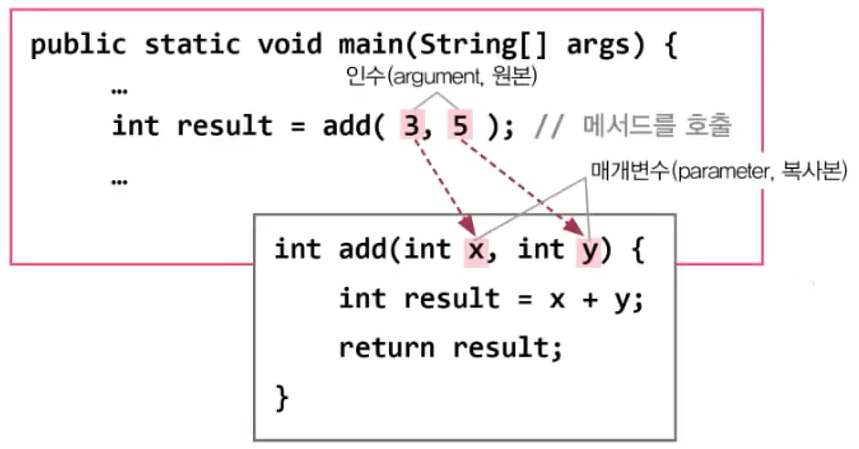
    </center>

## 18. 메서드의 실행 흐름
<center>
    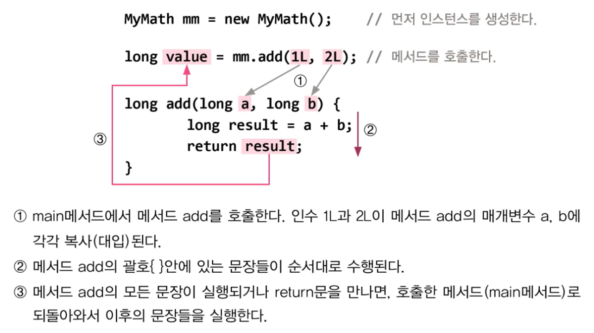
</center>


## 19. 메서드의 실행 흐름 예제
- Ex6_4
    ```
    class Ex6_4 {
        public static void main(String args[]) {
            MyMath mm = new MyMath();
            long result1 = mm.add(5L, 3L);  // add메서드 호출
            long result2 = mm.subtract(5L, 3L);
            long result3 = mm.multiply(5L, 3L);
            double result4 = mm.divide(5L, 3L);

            System.out.println("add(5L, 3L) = " + result1);
            System.out.println("subtract(5L, 3L) = " + result2);
            System.out.println("multiply(5L, 3L) = " + result3);
            System.out.println("divide(5L, 3L) = " + result4);
        }
    }

    class MyMath {
        long add(long a, long b) {
            long result = a + b;
            return result;  // 호출한 곳으로 돌아감
        //	return a + b;	// 위의 두 줄을 이와 같이 한 줄로 간단히 할 수 있다.
        }
        long subtract(long a, long b) { return a - b; }
        long multiply(long a, long b) { return a * b; }
        double divide(double a, double b) {
            return a / b;
        }
    }
    ```

  - Ex6_4 Result
    ```
    add(5L, 3L) = 8
    subtract(5L, 3L) = 2
    multiply(5L, 3L) = 15
    divide(5L, 3L) = 1.6666666666666667
    ```
<br>
<hr>
<br>

## 20. return문
> 실행 중인 메서드를 종료하고 호출한 곳을 되돌아감
- 원래는 반환값의 유무에 관계없이 모든 메서드에는 적어도 1개의 ```retrun```문이 있어야 함
  - 반환값이 ```void```인 경우, 컴파일러가 메서드의 마지막에 ```return;```을 자동 추가

<center>
    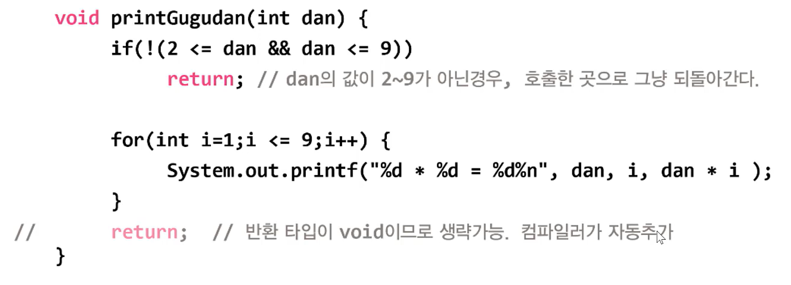
</center>

- 반환타입이 ```void```가 아닌 경우(반환값이 있는 경우), ```retrun```문이 없으면 컴파일 에러가 발생 
  - Error : missing return statement
- ```if```문 조건식의 결과에 따라 ```retrun```문이 실행되지 않을 수도 있기 때문에 ```else```문을 추가해 결과값을 반환해야 함

## 21. 반환값
- 메서드의 반환타입이 ```void```가 아닐 때  
  
<center>
    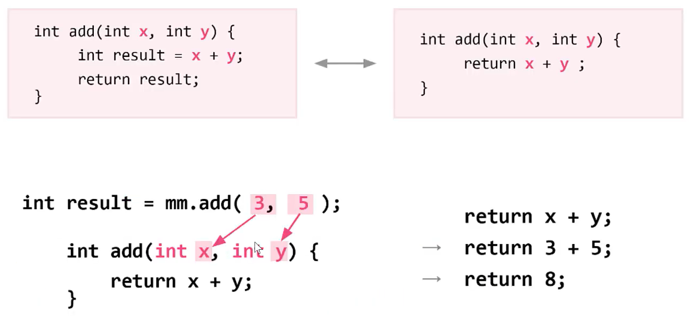
</center>
<br>
<hr>
<br>

## 22. 호출스택(call stack)
> 스택(stack) : 밑이 막힌 상자, 위에 차곡차곡 쌓임

- 넣을 때  

    <center>
    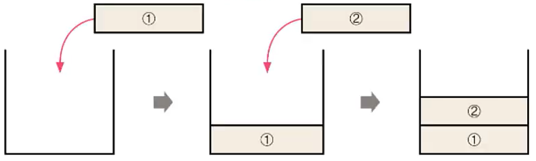
    </center>

- 꺼낼 때  

    <center>
    
    </center>

- 불가  

    <center>
    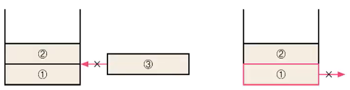
    </center>

- 메서드의 작업에 필요한 메모리 공간을 제공
- 메서드가 호출되면 호출스택에 메모리 할당, 종료되면 해제

    <center>
    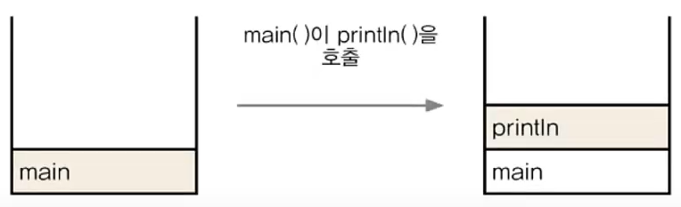
    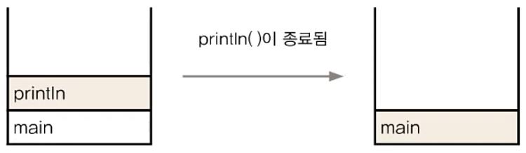
    </center>

- 아래 있는 메서드가 위의 메서드를 호출한 것
- 맨 위의 메서드 하나만 실행, 나머지는 대기

- Ex6_5
    ```
    class Ex6_5 {
        public static void main(String args[]) {
            System.out.println("Hello");
        }
    }
    ```
    <center>
    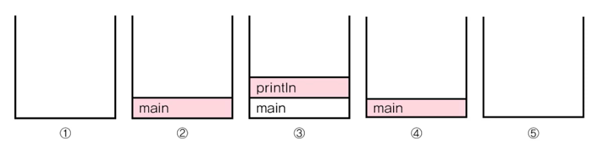
    </center>

  - Ex6_5 Result
    ```
    Hello
    ```
<br>
<hr>
<br>

## 23. 기본형 매개변수 ☆
> <span style='color:red'>기본형 매개변수 - 변수의 값을 읽기만 할 수 있다 (only read)</span>  
> 참조형 매개변수 - 변수의 값을 읽고 변경할 수 있다 (read & write)
- flash
  - [PrimitiveParam.exe](https://github.com/castello/javajungsuk_basic/tree/master/flash)
  - [ReferenceParam.exe](https://github.com/castello/javajungsuk_basic/tree/master/flash)

- Ex6_6
    ```
    class Data { int x; }

    class Ex6_6 {
        public static void main(String[] args) {
            Data d = new Data();
            d.x = 10;
            System.out.println("main() : x = " + d.x);

            change(d.x);
            System.out.println("After change(d.x)");
            System.out.println("main() : x = " + d.x);
        }

        static void change(int x) {  // 기본형 매개변수
            x = 1000;
            System.out.println("change() : x = " + x);
        }
    }
    ```
  - Ex6_6 Result
    ```
    main() : x = 10
    change() : x = 1000
    After change(d.x)
    main() : x = 10
    ```


<br>
<hr>
<br>

## 24. 참조형 매개변수 ☆
> 기본형 매개변수 - 변수의 값을 읽기만 할 수 있다 (only read)   
> <span style='color:red'>참조형 매개변수 - 변수의 값을 읽고 변경할 수 있다 (read & write)</span> 
- flash
  - [PrimitiveParam.exe](https://github.com/castello/javajungsuk_basic/tree/master/flash)
  - [ReferenceParam.exe](https://github.com/castello/javajungsuk_basic/tree/master/flash)
  
- Ex6_7
    ```
    class Data2 { int x; }

    class Ex6_7 {
        public static void main(String[] args) {
            Data2 d = new Data2();
            d.x = 10;
            System.out.println("main() : x = " + d.x);

            change(d);
            System.out.println("After change(d)");
            System.out.println("main() : x = " + d.x);
        }

        static void change(Data2 d) { // ÂüÁ¶Çü ¸Å°³º¯¼ö
            d.x = 1000;
            System.out.println("change() : x = " + d.x);
        }
    }
    ```
  - Ex6_7 Result
    ```
    main() : x = 10
    change() : x = 1000
    After change(d)
    main() : x = 10
    ```
## 25. 참조형 반환타입 ☆
> 반환하는 값의 타입이 참조형, 모든 참조형 타입의 값은 객체의 주소이므로 그저 정수값이 반환되는 것
- Ex6_8
    ```
    class Data3 { int x; }

    class Ex6_8 {
        public static void main(String[] args) {
            Data3 d = new Data3();
            d.x = 10;

            Data3 d2 = copy(d); 
            System.out.println("d.x ="+d.x);
            System.out.println("d2.x="+d2.x);
        }

        static Data3 copy(Data3 d) {
            Data3 tmp = new Data3();    // 새로운 객체 tmp를 생성한다.

            tmp.x = d.x;  // d.x의 값을 tmp.x에 복사한다.

            return tmp;   // 복사한 객체의 주소를 반환한다.
        }
    }
    ```
  - Ex6_8 Result
    ```
    d.x =10
    d2.x=10
    ```
<br>
<hr>
<br>

## 26. static 메서드와 인스턴스 메서드
> 메서드 앞에 ```static```이 붙어있으면 클래스메서드(iv 사용x), 붙어있지 않으면 인스턴스메서드(iv 사용)  
  
<center>
    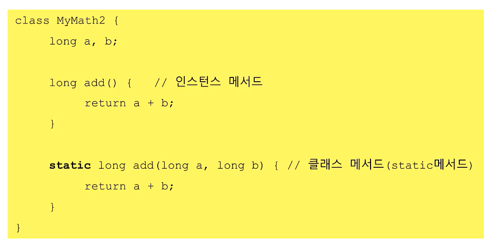
</center>

- 인스턴스 메서드
  - 인스턴스 생성 후, ```참조변수.메서드이름()```으로 호출
  - 인스턴스 멤버(iv, im)와 관련된 작업을 하는 메서드
  - 메서드 내에서 인스턴스변수 사용 가능
- static 메서드(클래스 메서드)
  - 객체생성없이  ```클래스이름.메서드이름()```으로 호출
  - 인스턴스 멤버(iv, im)와 관련없는 작업을 하는 메서드
  - 메서드 내에서 인스턴스변수 사용 불가

<center>
    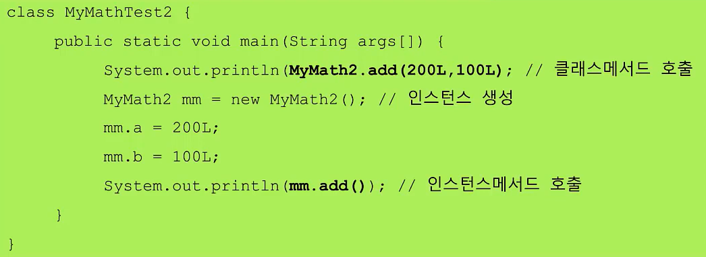
</center>


  
## 27. static 메서드와 인스턴스 메서드 예제

- Ex6_9
    ```
    class MyMath2 {
        long a, b;

        // 인스턴스 변수 a, b만을 잉요해서 작업하므로 매개변수가 필요없다.
        long add()		{ return a + b; }  // a, b는 인스턴스 변수
        long subtract() { return a - b; }
        long multiply() { return a * b; }
        double divide() { return a / b; }

        // 인스턴스 변수와 관계없이 매개변수만으로 작업이 가능하다.
        static long   add(long a, long b)		 { return a + b; }  // a, b는 지역변수
        static long   subtract(long a, long b)   { return a - b; }
        static long   multiply(long a, long b)   { return a * b; }
        static double divide(long a, long b) { return a / (double)b; }
        
    }


    class Ex6_9 {
        public static void main(String args[]) {
            // 클래스 메서드 호출. 인스턴스 생성없이 호출가능
            System.out.println(MyMath2.add(200L, 100L));
            System.out.println(MyMath2.subtract(200L, 100L));
            System.out.println(MyMath2.multiply(200L, 100L));
            System.out.println(MyMath2.divide(200L, 100L));

            MyMath2 mm = new MyMath2(); // 인스턴스를 생성
            mm.a = 200L;
            mm.b = 100L;
            // 인스턴스 메서드는 객체생성 후에만 호출이 가능함.
            System.out.println(mm.add());
            System.out.println(mm.subtract());
            System.out.println(mm.multiply());
            System.out.println(mm.divide());
      }
    }
    ```
  - Ex6_9 Result
    ```
    300
    100
    20000
    2.0
    300
    100
    20000
    2.0
    ```

## 28. static을 언제 붙여야 할까?
> 클래스의 멤버변수 중 모든 인스턴스에 공통된 값을 유지해야 하는 것이 있는지 살펴보고 있으면 ```static```을 붙임  
> 작성한 메서드 중에서 인스턴스 변수나 인스턴스 메서드를 사용하지 않는 메서드에 ```static```을 붙일 것을 고려함


1. 속성(멤버 변수) 중에서 공통 속성에 static을 붙임  
   
<center>
    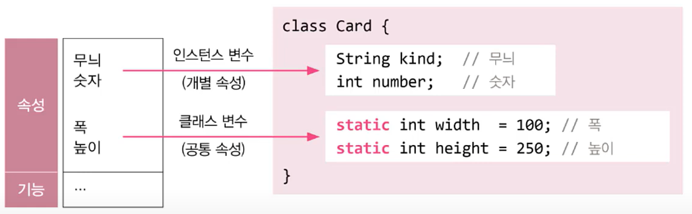
</center>  

2. 클래스 변수(static 변수)는 인스턴스를 생성하지 않아도 사용할 수 있음
3. 클래스 변수(static 변수)는 인스턴스 변수를 사용할 수 없음

4. 인스턴스 멤버(iv, im)을 사용하지 않는 메서드에 static을 붙임  

<center>
    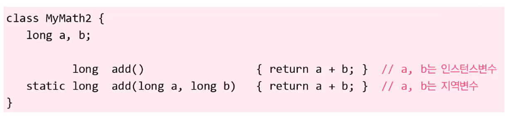
</center>   


## 29. 메서드 간의 호출과 참조
> 같은 클래스에 속한 멤버들 간에는 별도의 인스턴스를 생성하지 않고도 서로 참조 또는 호출이 가능  
> 단, 클래스 멤버가 인스턴스 멤버를 참조 또는 호출하고자 하는 경우에는 인스턴스 생성  
> **인스턴스 멤버가 존재하는 시점에 클래스 멤버는 항상 존재하지만, 클래스멤버가 존재하는 시점에 인스턴스 멤버가 존재하지 않을 수도 있기 때문**

- static 메서드는 인스턴스 변수(iv)를 사용할 수 없음
    <center>
      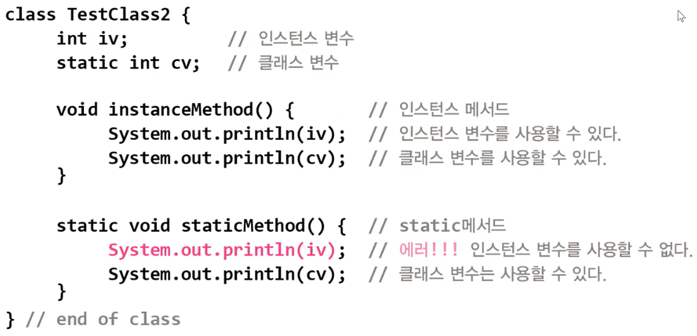
    </center>  
- static 메서드는 인스턴스 메서드(im)를 사용할 수 없음
    <center>
      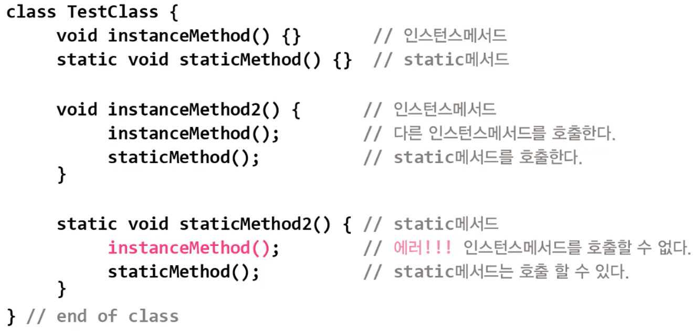
    </center>  
<br>
<hr>
<br>

Java의 정석 기초편 | 남궁성 | 도우출판