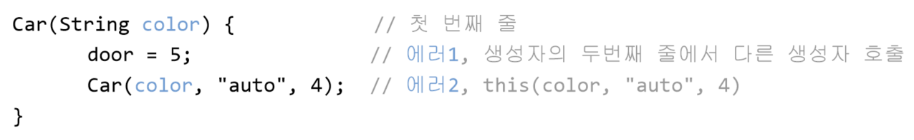

# **Object-oriented Programming 1**
  
<br>

[[자바의 정석 - 기초편] ch6-30,31 오버로딩](https://www.youtube.com/watch?v=2rDeHSO4bdw&list=PLW2UjW795-f5JPTsYHGAawAck9cQRw5TD&index=16)     

## 30. 오버로딩(overloading)
> 한 클래스 안에 같은 이름의 메서드 여러 개 정의하는 것 (과적하다)

- Ex) ```println()``` : 매개변수가 전부 다름
    <center>
      
    </center>

- 오버로딩이 성립하기 위한 조건
  1. 메서드 이름이 같아야 함
  2. 매개변수의 개수 또는 타입이 달라야 함
  3. **반환 타입은 관계 없음**
     
  - ```
    int add(int a, int b) { return a+b; }
    int add(int x, int y) { return x+y; }
    // 매개변수의 이름만 다를 뿐 매개변수의 타입이 같기 때문에 오버로딩이 성립되지 않음
    // 메서드 중복 정의
    // 컴파일러 에러 : add(int, int) is already defined
    ```

  - ```
    int add(int a, int b) { return a+b; }
    long add(int a, int b) { return (long)(a+b); }
    // 리턴타입만 다른 경우. 매개변수의 타입과 개수가 일치하기 때문에 오버로딩이 성립되지 않음
    // 컴파일러 에러 : add(int, int) is already defined
    ```

  - ```
    long add(int a, long b) { return a+b; }
    long add(long a, int b) { return a+b; }
    // 타입이 달라 호출 시 매개변수의 값에 의해 호출될 메서드가 구분될 수 있으므로 오버로딩으로 간주
    // add(3, 3L);의 경우 첫번째가 호출됨
    // add(3, 3)의 경우 둘 다 해당되므로 에러 (ambiguous)
    ```

## 31. 오버로딩(overloading) 예제
> 오버로딩의 올바른 예 : 매개변수는 다르지만 **같은 의미**의 기능 수행
- Java에는 **메서드 오버로딩**만 존재
  - 연산자 오버로딩  ex) ```+``` : 부호, 덧셈, 문자열 결합
- 메서드 이름 : 대부분 동사(```println```, ```round```, ```random```, ect. ), 작업을 수행하는 것이기 때문
  - 메서드 이름이 동일 = 하는 작업이 동일

- Ex6_10
    ```
    class Ex6_10 {
      public static void main(String args[]) {
        MyMath3 mm = new MyMath3();
        System.out.println("mm.add(3, 3) 결과:"    + mm.add(3,3));
        System.out.println("mm.add(3L, 3) 결과: "  + mm.add(3L,3));
        System.out.println("mm.add(3, 3L) 결과: "  + mm.add(3,3L));
        System.out.println("mm.add(3L, 3L) 결과: " + mm.add(3L,3L));

        int[] a = {100, 200, 300};
        System.out.println("mm.add(a) 결과: " + mm.add(a));
      }
    }

    class MyMath3 {
      int add(int a, int b) {
        System.out.print("int add(int a, int b) - ");
        return a+b;
      }
      
      long add(int a, long b) {
        System.out.print("long add(int a, long b) - ");
        return a+b;
      }
      
      long add(long a, int b) {
        System.out.print("long add(long a, int b) - ");
        return a+b;
      }

      long add(long a, long b) {
        System.out.print("long add(long a, long b) - ");
        return a+b;
      }

      int add(int[] a) {		// 배열의 모든 요소의 합을 결과로 돌려준다.
        System.out.print("int add(int[] a) - ");
        int result = 0;
        for(int i=0; i < a.length;i++) 
          result += a[i];
        
        return result;
      }
    }
    ```
  - Ex6_10 Result
    ```

    ```

<br>
<hr>
<br>

[[자바의 정석 - 기초편] ch6-32~35 생성자, 기본 생성자](https://www.youtube.com/watch?v=HXh2ZSgg-oQ&list=PLW2UjW795-f5JPTsYHGAawAck9cQRw5TD&index=17) 

## 32. 생성자(constructor)
> 인스턴스가 생성될 때마다 호출되는 **인스턴스 초기화 메서드**   

- 인스턴스 생성시 수행할 작업에 사용 (iv 초기화 메서드)
  ```
  Time t = new Time();  // 기본생성자는 컴파일러가 만들어주기도 함
  t.hour = 12;
  t.minute = 34;
  t.second = 56;
  ```
  <center>
    
  </center>
  
  ```
  Time t = new Time(12, 34, 56);  // Time(12, 34, 56) : 생성자 호출
                                  // 생성자를 추가해야 이렇게 사용 가능
  ```
  - 연산자 ```new```가 인스턴스를 생성 (생성자가 인스턴스 생성하는 것 x)  
- 생성자 조건
    ```
      클래스이름(타입변수명, 타입변수명, ... ) {
        // 인스턴스 생성 시 수행될 코드
        // 주로 인스턴스 변수의 초기화 코드
      }
    ```
  1. 생성자의 이름은 클래스의 이름과 같아야 함   
  2. 생성자는 리턴값이 없음 (void 안붙임)
  3. 모든 클래스는 반드시 생성자를 가져야 함
   
    <center>
      
    </center>

- 단순히 인스턴스 변수들의 초기화에 사용되는 메서드


## 33. 기본 생성자(default constructor)
> 매개변수가 없는 생성자  
> 생성자가 하나도 없을 때만, 컴파일러가 자동 추가
- 컴파일 할 때, 소스파일(```*.java```)의 클래스에 생성자가 하나도 정의되지 않은 경우, 컴파일러는 자동적으로 아래와 같은 기본 생성자(```Point(){}```)를 추가하여 컴파일
  ```
  클래스이름(){}  // 기본 생성자
  Point(){}       // Point 클래스의 기본 생성자
                  // 직접 작성해야 하는 부분
  ```
  - 컴파일러가 제공하는 기본생성자가 있기에 클래스에 생성자를 정의하지 않고도 인스턴스 생성 가능

- Ex6_11
    ```
    class Data_1 {  // 생성자가 하나도 없음
                    // 컴파일러가 기본 생성자 자동 추가
      int value;
    }

    class Data_2 { 
      int value;

      Data_2(int x) {   // 매개변수가 있는 생성자.
        value = x;
      }
    }

    class Ex6_11 {
      public static void main(String[] args) {
        Data_1 d1 = new Data_1();
        Data_2 d2 = new Data_2(); // compile error발생
                                  // 기본 생성자 호출
                                  // Data_2 생성자가 없음
      }
    }
    ```
  - Ex6_11 Result
    ```

    ```

## 34. 매개변수가 있는 생성자
```
class Car {
	String color;     // 색상
	String gearType;  // 변속기 종류 : auto, manual
	int door;         // 문의 개수

	Car() {}                          // 기본 생성자
	Car(String c, String g, int d) {  // 매개변수 있는 생성자
		color = c;
		gearType = g;
		door = d;
	}
}
```
- iv 초기화
  ```
  Car c = new Car();
  c.color = "white";
  c.gearType = "auto";
  c.door = 4;

  → Car c = new Car("white", "auto", 4);
  ```
- 참조변수 ```c``` 생성  
   → ```new``` 연산자가 객체 생성  
  → 생성자 호출 (객체 초기화)  
  → 대입연산자가 객체 주소(```new``` 연산자의 반환값)를 참조변수```c```에 저장

  <center>
      
  </center>


## 35. 매개변수가 있는 생성자 예제
- 생성자를 활용하면 보다 간결하고 직관적인 객체지향적 코드를 작성할 수 있음
- 인스턴스를 생성할 때는 다음의 2가지 사항을 결정해야 함
  - 클래스 : 어떤 클래스의 인스턴스를 생성할 것인가?
  - 생성자 : 선택한 클래스의 어떤 생성자로 인스턴스를 생성할 것인가?

- Ex6_12
    ```
    class Car {
      String color;		// 색상
      String gearType;	// 변속기 종류 - auto(자동), manual(수동)
      int door;			// 문의 개수

      Car() {}

      Car(String c, String g, int d) {
        color = c;
        gearType = g;
        door = d;
      }
    }

    class Ex6_12 {
      public static void main(String[] args) {
        Car c1 = new Car();
        c1.color    = "white";
        c1.gearType = "auto";
        c1.door = 4;

        Car c2 = new Car("white", "auto", 4);

        System.out.println("c1의 color=" + c1.color + ", gearType=" + c1.gearType+ ", door="+c1.door);
        System.out.println("c2의 color=" + c2.color + ", gearType=" + c2.gearType+ ", door="+c2.door);
      }
    }
    ```
  - Ex6_12 Result
    ```

    ```


<br>
<hr>
<br>

[[자바의 정석 - 기초편] ch6-36,37 생성자 this(), 참조변수 this](https://www.youtube.com/watch?v=LqCkLdlcC7M&list=PLW2UjW795-f5JPTsYHGAawAck9cQRw5TD&index=18) 


## 36. 생성자에서 다른 생성자 호출하기 -  ```this()```
> 생성자에서 다른 생성자 호출할 때 사용 (코드 중복 제거)
- 생성자의 이름으로 클래스이름 대신 ```this``` 사용
- 한 생성자에서 **다른 생성자 호출**시, 반드시 **첫 줄**에서만 사용가능

  <center>
      
  </center>
- Ex6_13
    ```
    class Car2 {
      String color;		  // 색상
      String gearType;	// 변속기 종류 - auto(자동), manual(수동)
      int door;			    // 문의 개수

      Car2() {
        this("white", "auto", 4);
      }

      Car2(String color) {
        this(color, "auto", 4);
      }

      Car2(String color, String gearType, int door) {
        this.color = color;
        this.gearType = gearType;
        this.door = door;
      }
    }
    class Ex6_13 {
      public static void main(String[] args) {
        Car2 c1 = new Car2();	
        Car2 c2 = new Car2("blue");

        System.out.println("c1의 color=" + c1.color + ", gearType=" + c1.gearType+ ", door="+c1.door);
        System.out.println("c2의 color=" + c2.color + ", gearType=" + c2.gearType+ ", door="+c2.door);
      }
    }
    ```
  - Ex6_13 Result
    ```

    ```
- 매개변수를 아무것도 지정해주지 않으면 default 값으로 초기화
  <center>
      
  </center>

  - 같은 클래스 내의 생성자들은 일반적으로 서로 관계가 깊은 경우가 많아 이처럼 서로 호출하도록 하여 유기적으로 연결해주면 더 좋은 코드를 얻을 수 있음
  - 수정이 필요한 경우에 보다 적은 코드만을 변경하면 되므로 유지보수가 쉬워짐 


## 37. 객체 자신을 가리키는 참조변수  -  ```this```
> 인스턴스 자신을 가리키는 참조변수, 인스턴스 주소가 저장되어 있음    
> 모든 인스턴스메서드에 지역변수로 숨겨진 채로 존재

- **인스턴스 메서드(생성자 포함)** 에서 사용 가능 (클래스(static) 메서드에서 사용 불가)
- 지역변수(lv)와 인스턴스 변수(iv)를 구별할 때 사용
    
  <center>
      
  </center>

  - iv : ```참조변수.변수이름```, 같은 클래스에서는 ```참조변수``` 생략 가능

- 참조변수 ```this```와 생성자 ```this()```
  - ```this``` : 인스턴스 자신을 가리키는 **참조변수**, 인스턴스 주소 저장  
    모든 인스턴스메서드에 지역변수로 숨겨진 채로 존재 (선언 없이 사용 가능)
  - ```this()```, ```this(매개변수)``` : **생성자**, 같은 클래스의 다른 생성자를 호출할 때 사용  
    클래스 이름 대신 사용

    <center>
      
    </center>

<br>
<hr>
<br>

[[자바의 정석 - 기초편] ch6-38~41 변수의초기화, 멤버변수의 초기화](https://www.youtube.com/watch?v=ayRKMT6x-ms&list=PLW2UjW795-f5JPTsYHGAawAck9cQRw5TD&index=19)

## 38. 변수의 초기화
> 지역변수는 **수동 초기화** 해야함 (사용 전, 반드시)

- 변수의 초기화 : 변수를 선언하고 처음으로 값을 저장하는 것
  
  <center>
    
  </center>

  - ```i```값을 알 수 없어 에러 발생
  - 메모리 재사용이 빈번하기 때문
  - 0으로 초기화 하는 것은 성능이 떨어지기 때문에 새로운 값으로 덮어쓰는 방식
- 멤버변수(iv, cv)는 자동 초기화
<!-- - 인스턴스 변수는 자동초기화 (타입에 따라 다름) -->
- 멤버변수(인스턴스, 클래스)와 배열의 초기화는 선택이지만, **지역변수의 초기화는 필수**
- 각 타입의 기본값(default value)
    |자료형|기본값|
    |:---:|:---:|
    |boolean|false|
    |char|'\u0000'|
    |byte, short, int|0|
    |long|0L|
    |float|0.0f|
    |double|0.0d or 0.0|
    |참조형|null|
  
## 39. 멤버변수의 초기화
1. 명시적 초기화(```=```) : 선언 시, 대입연산자를 이용한 **간단초기화**
   
    ```
    class Car {
      int door = 4;             // 기본형 변수의 초기화
      Engine e = new Engine();  // 참조형 변수의 초기화
      // ...
    }
    ``` 
     - 참조형 변수 : null(default), 객체주소  
        null값은 초기화가 아니므로 객체를 만들어 넣어줘야 함
2. 초기화 블럭 : **복잡초기화**
     - 인스턴스(iv) 초기화 블럭 : ```{}```, 인스턴스 변수가 생성될 때마다 초기화
     - 클래스(cv) 초기화 블럭 : ```static{}```, 클래스가 처음 로딩될 때(메모리에 올라갈 때) 단 한 번 초기화
3. 생성자 : iv초기화, **복잡초기화**
    ```
    Car(String color, String gearType, int door) { // 매개변수 있는 생성자
      this.color = color;
      this.gearType = gearType;
      this.door = door;
    }
    ```

- cv, iv 초기화의 종류 
  - 자동초기화 : 자동으로 0
  - 간단초기화 : ```=```
  - 복잡초기화 : ```{}```(iv, 거의 안씀), ```static{}```(cv), 생성자(iv)
  
    <center>
      
    </center>
- 초기화 시첨

  ```
  class InitTest {
    static int cv = 1;  // 명시적 초기화
    int iv = 1;         // 명시적 초기화

    static { cv = 2; }  // 클래스 초기화 블럭
    { iv = 2; }         // 인스턴스 초기화 블럭

    InitTest() {  // 생성자
      iv = 3;
    }
  }
  ```

  <center>
    
  </center>


  - 초기화 순서
    - cv → iv
    - 자동 → 간단 → 복잡
  
## 40. 멤버변수의 초기화 예제1
- Ex6_14
    ```
    class Ex6_14 {
      static {
        System.out.println("static { }");
      }

      {
        System.out.println("{ }");
      }

      public Ex6_14() {
        System.out.println("ťýźşŔÚ");
      }

      public static void main(String args[]) {
        System.out.println("Ex6_14 bt = new Ex6_14(); ");
        Ex6_14 bt = new Ex6_14();

        System.out.println("Ex6_14 bt2 = new Ex6_14(); ");
        Ex6_14 bt2 = new Ex6_14();
      }
    }
    ```
  - Ex6_14 Result
    ```

    ```
## 41. 멤버변수의 초기화 예제2
- Ex6_15
    ```
    class Ex6_15 {
      static int[] arr = new int[10];

      static {
        for(int i=0;i<arr.length;i++) {
          // 1과 10사이의 임의의 값을 배열 arr에 저장한다.
          arr[i] = (int)(Math.random()*10) + 1;
        }
      }

      public static void main(String args[]) {
        for(int i=0; i<arr.length;i++)
          System.out.println("arr["+i+"] :" + arr[i]);
      }
    }
    ```
  - Ex6_15 Result
    ```

    ```

<br>
<hr>
<br>

Java의 정석 기초편 | 남궁성 | 도우출판