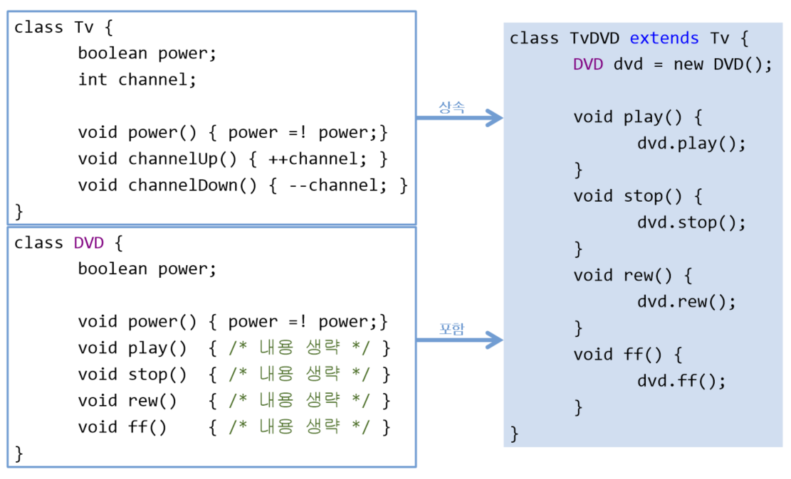

# **Object-oriented Programming 2**
  
<br>

[[자바의 정석 - 기초편] ch7-1,2 상속](https://www.youtube.com/watch?v=Pgutf0G3nE4&list=PLW2UjW795-f5JPTsYHGAawAck9cQRw5TD&index=20)

## 01. 상속
> inheritance    
> 기존의 클래스로 새로운 클래스를 작성하는 것(코드의 재사용)  
> 두 클래스를 부모와 자식으로 관계를 맺어주는 것

- ```
  class 자식클래스 extends 부모클래스 {
    // ...
  }
  ```
  <center>
    
  </center>
  
  - ```Child```와 ```Parent```는 상속관계
    
- 자손은 조상의 모든 멤버를 상속받음 **(생성자, 초기화블럭 제외)**
  <center>
    
  </center>
- 자손의 멤버 개수는 조상보다 적을 수 없음 **(같거나 많음)**
  <center>
    
  </center>

  - 자손(```Child```)클래스는 조상(```Parent```)의 멤버를 모두 상속받기에 자동적으로 ```age```라는 멤버변수가 추가된 것과 같은 효과를 얻음
- 자손의 변경은 조상에 영향을 미치지 않음
  <center>
    
  </center>

- 상속에 상속을 거듭할수록 상속받는 클래스의 멤버 개수는 점점 늘어남  
  상속받음 = 조상클래스를 확장(extend)
- example
  <center>
    
  </center>

  - 상속 받은 것과 받지 않은 것 똑같이 객체가 생성됨  
    ```
    Point3D p = new Point3D();
    ```
      <center>
      
      </center>

## 02. 상속 예제
- Ex7_1
    ```
    class Tv {
      boolean power; // 전원상태(on/off)
      int channel;	// 채널

      void power()       {   power = !power; }
      void channelUp()   {   ++channel;      }
      void channelDown() {   --channel;      }
    }

    class SmartTv extends Tv {  // CaptionTv는 Tv에 캡션(자막)을 보여주는 기능을 추가
      boolean caption;     // 캡션상태(on/off)
      void displayCaption(String text) {
        if (caption) {   // 캡션 상태가 on(true)일 때만 text를 보여 준다.
          System.out.println(text);
        }
      }
    }

    class Ex7_1 {
      public static void main(String args[]) {
        SmartTv stv = new SmartTv();
        stv.channel = 10;			// 조상 클래스로부터 상속받은 멤버
        stv.channelUp();			// 조상 클래스로부터 상속받은 멤버
        System.out.println(stv.channel);
        stv.displayCaption("Hello, World");
        stv.caption = true;	// 캡션(자막) 기능을 켠다.	       
        stv.displayCaption("Hello, World");
      }
    }
    ```
  - Ex7_1 Result
    ```

    ```


<br>
<hr>
<br>

[[자바의 정석 - 기초편] ch7-3,4 클래스 간의 관계, 상속과 포함](https://www.youtube.com/watch?v=ukxiyoDaSXk&list=PLW2UjW795-f5JPTsYHGAawAck9cQRw5TD&index=21)


## 03. 포함 관계
> composite : 클래스 멤버로 참조변수를 선언하는 것
- 클래스의 관계 : 상속, 포함

  <center>
    
  </center>  

  <center>
    
  </center> 

- 작은 단위의 클래스를 만들고, 이들을 조합해서 클래스를 만듦 (복잡도가 줄어듦)
  ```
  class Car {
    Engine e = new Engine();  // 엔진
    Door[] d = new Door[4];   // 문, 문의 개수를 4로 가정하고 배열로 처리
  }
  ```

  - 단위별로 여러 개의 클래스를 작성한 다음, 이 단위 클래스들을 포함관계로 재사용하면 보다 간결하고 손쉽게 클래스를 작성할 수 있음

## 04. 클래스 간의 관계 결정하기
> 상속관계 : ~는 ~이다 (is - a)    
> 포함관계 : ~은 ~을 가지고 있다 (has - a) 90%
- 90%가 포함, 상속은 제약이 많기 때문에 꼭 필요할 때만 사용

  <center>
    
  </center> 
<br>
<hr>
<br>

[[자바의 정석 - 기초편] ch7-5,6 단일상속, Object클래스](https://www.youtube.com/watch?v=-2QDwrc1j38&list=PLW2UjW795-f5JPTsYHGAawAck9cQRw5TD&index=22)

## 05. 단일 상속(Single Inheritance)
> Java는 **단일상속**만 허용한다 (C++은 다중상속 허용)

```
class TvDVD extends TV, DVD {  // error. 조상흔 하나만 허용
  // ...
}
```
- 만약 다중상속을 허용해서 ```TvDVD```클래스가 ```Tv```클래스와 ```DVD``` 클래스를 모두 조상으로 하여 두 클래스의 멤버를 상속 받는다고 가정

  <center>
    
  </center>   

  - ```Tv```클래스와 ```DVD``` 클래스 모두 ```void power{}```라는 인스턴스 메서드가 있다면 선언부가 같은 두 메서드를 구별할 수 없어 **충돌**하게 됨
  - Java는 다중상속의 문제점을 해결하기 위해 다중상속의 장점을 포기하고 단일상속만 허용
  - 인터페이스를 이용하면 충돌문제를 해결하며 다중상속같은 효과를 얻을 수 있음 
- 비중이 높은 클래스 하나만 <span style='color:blue'>상속관계</span>, 나머지는 <span style='color:purple'>포함관계</span>

  <center>
    
  </center> 

  - ```DVD``` 객체를 만들어 메서드를 호출해 사용

## 06. Object 클래스 - 모든 클래스의 조상
>  모든 클래스 **상속계층도의 최상위**에 있는 조상클래스
- 부모가 없는 클래스는 자동적으로 ```Object```클래스를 상속받음 

  <center>
    
  </center> 

  - 컴파일러가 ```extends Objects``` 자동 추가
- 모든 클래스는 Object클래스에 정의된 11개의 메서드를 상속받음
  - ```toString()```, ```equals(Object obj)```, ```hashCode()```, ... (9장)


<br>
<hr>
<br>

[[자바의 정석 - 기초편] ch7-7~9 오버라이딩](https://www.youtube.com/watch?v=0xzi_FQm0ek&list=PLW2UjW795-f5JPTsYHGAawAck9cQRw5TD&index=23)

## 07. 오버라이딩(overriding)
> 상속받은 조상의 메서드를 자신에 맞게 변경하는 것

- 구현부만 변경 가능 (선언부 변경 불가)

  <center>
    
  </center> 

## 08. 오버라이딩의 조건 ☆
1. 선언부가 조상 클래스의 메서드와 일치
    - 선언부 : 반환타입, 메서드 이름, 매개변수 목록
2. 접근 제어자를 조상 클래스의 메서드보다 좁은 범위로 변경 불가
    - 접근 제어자 : ```public```, ```protected```, ```(default)```, ```private```
3. [예외](../Java_Lecture/Chapter08_1119.md) 는 조상 클래스의 메서드보다 많이 선언할 수 없음

## 09. 오버로딩 vs. 오버라이딩
> overloading : 기존에 없는 새로운 메서드를 정의하는 것 (new)  
> overriding : 상속받은 메서드의 내용을 변경하는 것 (change, modify)

```
class Parent {
  void ParentMethod() {}
}

class Child extends Parent {
  void parentMethod() {}       // 오버로딩
  void perentMethod(int i) {}  // 오버라이딩

  void childMethod() {}       // 메서드 정의
  void childMethod(int i) {}  // 오버로딩
  void childMethod() {}       // error : 중복정의
                              // already defined in Child
}
```

<br>
<hr>
<br>

[[자바의 정석 - 기초편] ch7-10,11 참조변수 super, 생성자 super()](https://www.youtube.com/watch?v=XT9KmsEk9f8&list=PLW2UjW795-f5JPTsYHGAawAck9cQRw5TD&index=24)

## 10. 참조변수 ```super```
> 객체 자신을 가리키는 참조변수, 인스턴스 메서드(생성자) 내에만 존재  
> **조상의 멤버**를 **자신의 멤버**와 구별할 때 사용
- [```this```](../Java_Lecture/Chapter06_3041.md)와 유사, ```static```메서드 내에서 사용 불가
- Ex7_2
    ```
    class Ex7_2 {
      public static void main(String args[]) {
        Child c = new Child();
        c.method();
      }
    }

    class Parent { int x=10; }  // super.x

    class Child extends Parent {
      int x=20;                 // this.x

      void method() {
        System.out.println("x=" + x);
        System.out.println("this.x=" + this.x);
        System.out.println("super.x="+ super.x);
      }
    }
    ```
  - Ex7_2 Result
    ```

    ```

- Ex7_3
    ```
    class Ex7_3 {
      public static void main(String args[]) {
        Child2 c = new Child2();
        c.method();
      }
    }

    class Parent2 { int x=10; }  // super.x와 this.x 둘 다 가능

    class Child2 extends Parent2 {
      void method() {
        System.out.println("x=" + x);
        System.out.println("this.x=" + this.x);
        System.out.println("super.x="+ super.x);
      }
    }
    ```
  - Ex7_3 Result
    ```

    ```
- 모든 인스턴스 메서드에는 ```this```와 ```super```가 지역변수로 존재, 자신이 속한 인스턴스의 주소가 자동으로 저장됨

## 11. ```super()``` - 조상의 생성자
> 조상의 생성자를 호출할 때 사용  
> 조상의 멤버는 조상의 생성자를 호출해서 초기화
- [```this()```](../Java_Lecture/Chapter06_3041.md)와 유사

  <center>
    
  </center> 

- **생성자의 첫 줄에는 반드시 생성자(```this``` or ```super```)를 호출** ☆
  - 그렇지 않으면 컴파일러가 생성자의 첫 줄에 ```super();``` 삽입

    <center>
      
    </center>

- [example : PointTest](././../src/PointTest.java)
  ```
  public class PointTest {
    public static void main(String args[]) {
        Point3D p3 = new Point3D(1,2,3);
    }
  }

  class Point {
      int x;
      int y;

      Point (int x, int y) {
          this.x = x;
          this.y = y;
      }

      String getLocation() {
          return "x : " + x + "y : " + y;
      }
  }

  class Point3D extends Point {
      int z;

      Point3D(int x, int y, int z) {
          this.x = x;
          this.y = y;
          this.z = z;
      }

      String getLocation() {  // 오버라이딩
          return "x : " + x + "y : " + y + "z : " + z;
      }

  }
  ```
  - 컴파일 에러가 아니라 ```java.lang.noclassdeffounderror```  
    컴파일 시점에 존재했던 클래스가 런타임에 존재하지 않으면 발생하는 에러  
    [stackoverflow](https://stackoverflow.com/questions/34413/why-am-i-getting-a-noclassdeffounderror-in-java)

    <center>
      
    </center>

- Ex7_4
    ```
    public class Ex7_4 {
      public static void main(String[] args) {
        Point3D p = new Point3D(1, 2, 3);
        System.out.println("x=" + p.x + ",y=" + p.y + ",z=" + p.z);
      }
    }

    class Point {
      int x, y;

      Point(int x, int y) {
        this.x = x;
        this.y = y;
      }
    }

    class Point3D extends Point {
      int z;

      Point3D(int x, int y, int z) {
        super(x, y); // Point(int x, int y)¸¦ È£Ãâ
        this.z = z;
      }
    }
    ```
  - Ex7_4 Result
    ```

    ```

<br>
<hr>
<br>

[[자바의 정석 - 기초편] ch7-12~14 패키지, 클래스 패스](https://www.youtube.com/watch?v=hcHJgmX8VlA&list=PLW2UjW795-f5JPTsYHGAawAck9cQRw5TD&index=25)

## 12. 패키지(package)
> 서로 관련된 클래스의 묶음 (Java8 기준 약 4000개 클래스)
- 클래스는 클래스 파일(```*.class```), 패키지는 폴더. 하위 패키지는 하위 폴더
- 클래스의 실제 이름(full name)은 패키지를 포함 (java.lang.String)
- rt.jar는 클래스들을 압축한 파일 (JDK설치경로\jre\lib에 위치)
  - rt : runtime, 실행중을 의미
  - jar : 클래스 파일 묶음
  <center>
      
  </center>
  
  - Java9부터 없어짐 (module 개념)

## 13. 패키지의 선언
- 패키지는 소스파일의 첫 번째 문장으로 단 한 번 선언  
- 같은 소스 파일의 클래스들은 모두 같은 패키지에 속함
- 패키지 선언이 없으면 이름없는(unnamed) 패키지에 속함
- [Ex7_5](././../src/PackageTest.java)
    ```
    package  com.chap7.example;

    public class PackageTest {
      public static void main(String[] args) {
        System.out.println("Hello World!");
      }
    }
    ```
  - Ex7_5 Result
      <center>
        
      </center>

## 14. 클래스 패스(classpath)
- 클래스 파일(```*.class```)의 위치를 알려주는 경로
- 환경변수 classpath로 관리, 경로간의 구분자는 ```;```
- classpath(환경변수)에 패키지의 루트를 등록해줘야 함

<br>
<hr>
<br>

Java의 정석 기초편 | 남궁성 | 도우출판
