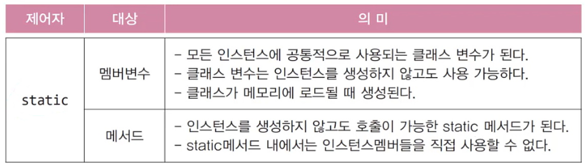
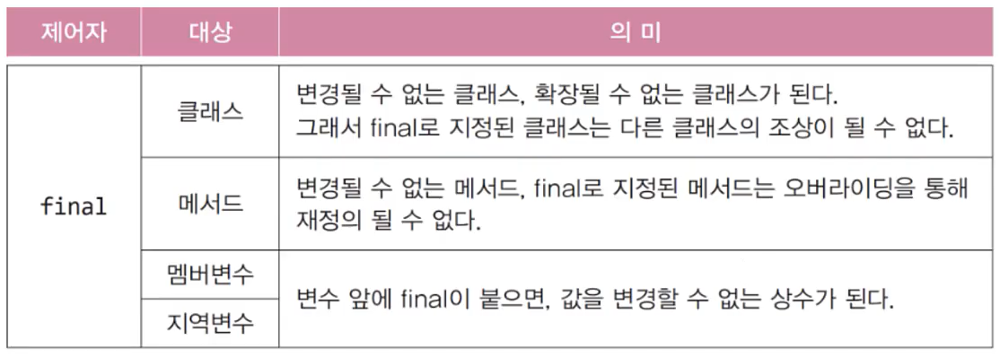
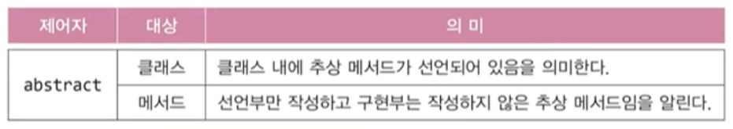
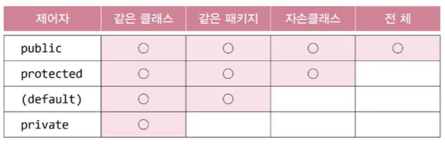

# **Object-oriented Programming 2**
  
<br>

[[자바의 정석 - 기초편] ch7-15, 16 import문, static import문](https://www.youtube.com/watch?v=BS1Pxm5XVNM&list=PLW2UjW795-f5JPTsYHGAawAck9cQRw5TD&index=26)

## 15. import 문
> 클래스를 사용할 때 패키지이름을 생략할 수 있음
- 컴파일러에게 클래스가 속한 패키지를 알려줌
- ```java.lang```패키지의 클래스는 import하지 않고도 사용할 수 있음
- import문을 선언하는 방법
    ```
    import 패키지명.클래스명;
    import 패키지명.*
    ```
- import문은 패키지문과 클래스선언의 사이에 선언

- import문은 컴파일 시에 처리되므로 프로그램의 성능에 영향 없음
    ```
    import java.util.Calendar;
    import java.util.Date;
    import java.util.ArrayList;
    ```
    ```
    import java.util.*
    ```
- 다음 두 코드는 서로 의미가 다름
    ```
    import java.util.*;
    import java.text.*;  // 모든 클래스
    ```
    ```
    import java.*;      // java 패키지의 모든 클래스 (패키지는 포함x)
    ```
- 이름이 같은 클래스가 속한 두 패키지를 import 할 때는 클래스 앞에 패키지 명을 붙여줘야 함


## 16. static import 문
> static멤버를 사용할 때 클래스 이름을 생략할 수 있게 해줌

```
import static java.lang.Integer.*;   // Integer클래스의 모든 static 메서드
import static java.lang.Math.random; // Math.random()만, 괄호 안붙임
import static java.lang.System.out;  // System.out을 out만으로 참조 가능
```
- 예제 7-6
  


<br>
<hr>
<br>

[]()


## 17. 제어자(modifier)
> 클래스와 클래스의 멤버(멤버변수, 메서드)에 부가적인 의미 부여
- 접근 제어자 : public, protected, (default), private
- 그 외 : static, fianl, abstract, native, ...
- 하나의 대상에 여러 제어자를 같이 사용 가능 (접근 제어자는 하나만)


## 18. ```static``` - 클래스의, 공통적인
<center>
    
</center>

- static 메서드는 객체 생성없이 사용 가능
  - 객체를 필요로 하는 iv, iv 메서드 사용 불가


## 19. ```final``` - 마지막의, 변경될 수 없는
<center>
    
</center>

## 20. ```abstract``` - 추상의 미완성의
<center>
    
</center>

- 추상메서드 = 미완성메서드 = 인스턴스 생성 불가
- 추상 클래스를 상속받아서 완전한 클래스를 만든 후, 객채 생성 가능


<br>
<hr>
<br>

[]()


## 21. 접근 제어자 (access modifier)
> private : **같은 클래스** 내에서만 접근 가능  
> (default) : **같은 패키지** 내에서만 접근 가능  
> protected : **같은 패키지** 내에서, 그리고 **다른 패키지의 자손클래스**에서 접근 가능  
> public : **접근 제한이 전혀 없음**  

<center>
    
</center>

- public > protected > (default) > private


<br>
<hr>
<br>

[]()


## 22. 캡슐화와 접근 제어자
- 접근 제어자를 사용하는 이유
  - 외부로부터 데이터를 보호하기 위해서
  - 접근 제어자를 private로 하여 외부에서 직접 접근하지 못하도록 함
    - 메서드를 통한 간접 접근 허용


<br>
<hr>
<br>

[]()


## 23. 다형성(polymorphism) - 중요
> 여러 가지 형태를 가질 수 있는 능력
- **조상 타입 참조변수로 자손 타입 객체를 다루는 것**

- 객체와 참조변수의 타입이 일치할 때와 일치하지 않을 때의 차이?
    ```
    SmartTv s = new SmartTv(); // 참조변수와 인스턴스 타입이 일치
    Tv t = new SmartTv();      // 조상타입 참조변수로 자손타입 인스턴스 참조
    ```
  - 스마트티비 리모콘으로 스마트티비(인스턴스)를 보는 것
  - 리모콘의 버튼(멤버) 개수 : 7개 (5개는 티비, 2개는 스마트티비)
  - 스마트티비 리모콘으로 7개를 모두 사용 가능 (모든 기능 사용 가능)
  - 그런데, 티비리모콘(조상타입 참조변수)으로 스마트티비를 작동시키려면?
  - 티비 리모콘 버튼 개수 : 5개
  - 사용할 수 있는 스마트티비(자손타입) 인스턴스는 5개밖에 없음


- 자손 타입의 참조변수로 조상 타입의 객체를 가리킬 수 없음
    ```
    Tv t = new SmartTv();
    SmartTv s = new Tv();   // 에러
    ```
    - 기능이 7개인데 버튼이 5개인 것은 가능
    - 버튼이 7개인데 기능이 5개인 것은 불가능 (없는 것 호출해서 error)

- 참조변수의 타입은 인스턴스의 타입과 반드시 일치하지 않아도 됨
- 참조변수가 조상타입일 때 자손타입일 때의 차이는 사용할 수 있는 멤버의 갯수
- 자손 타입의 참조변수로 조상타입의 객체를 가리킬 수 없음


<br>
<hr>
<br>

[]()


## 24. 참조변수의 형변환
> 사용할 수 있는 멤버의 갯수를 조절하는 것
- 기본형의 형변환은 값이 바뀜
- **조상 자손 관계의 참조변수는 서로 형변환 가능**
  
## 25. 참조변수의 형변환 예제
- 예제 7_7
- 실제 인스턴스가 무엇인지가 중요


<br>
<hr>
<br>

[]()


## 26. instanceof 연산자
> 참조변수의 형변환 가능여부 확인에 사용, 가능하면 ture 반환
- 형변환 전에 반드시 ```instanceof```로 확인
  - 형변환 하는 이유는 인스턴스의 원래 기능을 모두 사용하기 위해
  - Car 타입의 리모콘인 c로는 water()를 호출할 수 없으니
  - 리모콘을 FireEngine타입으로 바꿔서 water() 호출


- 참조변수를 변경함으로써 사용할 수 있는 멤버의 갯수를 조절하기 위해 참조변수의 형변환을 함
- 참조변수를 형변환하기 전에 형변환 가능 여부를 확인할 때 ```instanceof``` 연산자 사용


<br>
<hr>
<br>

[]()


## 27. 매개변수의 다형성
> 참조형 매개변수는 메서드 호출 시, <span style='color:red'>자신과 같은 타입 또는 자손 타입</span>의 인스턴스를 넘겨줄 수 있음
- 다형성의 장점 : **다형적 매개변수**, 하나의 배열로 여러 종류 객체 다루기
- 다형성 
  - 조상타입의 참조변수로 자손객체 다루기
  - 참조변수의 형변환 - 리모콘 변경(사용 가능한 맴버 갯수 조절)
  - instanceof : 형변환 가능여부 확인

## 28. 매개변수의 다형성 예제
- 예제 7_8


## 29. 여러 종류의 객체 배열로 다루기
> 조상타입의 배열에 자손들의 객체를 담을 수 있음
- 다형성의 장점 : 다형적 매개변수, **하나의 배열로 여러 종류 객체 다루기**
  
## 30. 여러 종류의 객체 배열로 다루기 예제
- 예제 7_9


<br>
<hr>
<br>

Java의 정석 기초편 | 남궁성 | 도우출판