# **Object-oriented Programming 2**
  
<br>

[[자바의 정석 - 기초편] ch7-15, 16 import문, static import문](https://www.youtube.com/watch?v=BS1Pxm5XVNM&list=PLW2UjW795-f5JPTsYHGAawAck9cQRw5TD&index=26)

## 15. import 문
> 클래스를 사용할 때 패키지이름을 생략할 수 있음
- 컴파일러에게 클래스가 속한 패키지를 알려줌
  
  <center>
    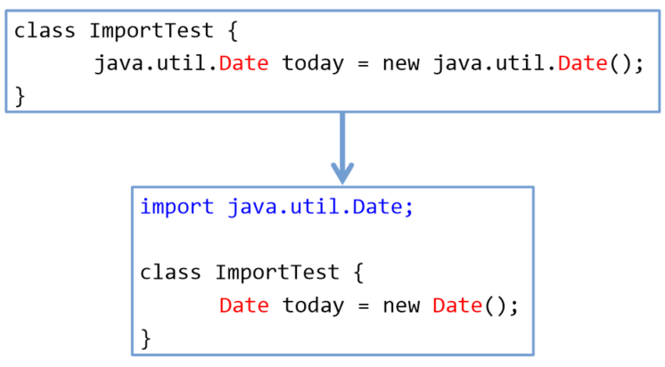
  </center>
  
  - IntelliJ 단축키 : ```Ctrl``` + ```Alt``` + ```o```
      <center>
        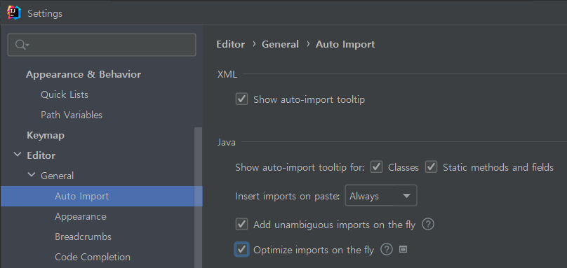
      </center>
- ```java.lang```패키지의 클래스는 ```import```하지 않고도 사용할 수 있음
  - ```String```, ```Object```, ```System```, ```Thread```, ...
    
    ```
    import java.lang.*;  // 생략 가능
    
    class ImportTest2 {
      public static void main(String[] args) {
        System.out.println("Hello World!");
      }
    }
    ``` 
- import문을 선언하는 방법
  - ```*``` : 패키지에 있는 모든 클래스
  
    ```
    import 패키지명.클래스명;
    or
    import 패키지명.*
    ```
- import문은 패키지문과 클래스선언의 사이에 선언
  <center>
    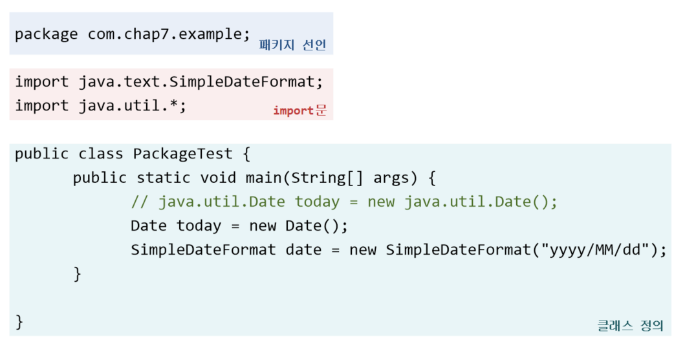
  </center>

- import문은 컴파일 시에 처리되므로 프로그램의 성능에 영향없음
    ```
    import java.util.Calendar;
    import java.util.Date;
    import java.util.ArrayList;
    ```
    ```
    import java.util.*
    ```
- 다음 두 코드는 서로 의미가 다름
    ```
    import java.util.*;
    import java.text.*;  // 모든 클래스
    ```
    ```
    import java.*;      // java 패키지의 모든 클래스 (패키지는 포함x)
    ```
- 이름이 같은 클래스가 속한 두 패키지를 import 할 때는 클래스 앞에 패키지 명을 붙여줘야 함
  ```
  import java.sql.*;   // java.sql.Date
  import java.util.*;  // java.util.Date
                       // 클래스 이름 동일
  
  class ImportTest {
    public static void main(String[] args) {
      java.util.Date today = new java.util.Date();
    }
  }
  ``` 

## 16. static import 문
> static멤버를 사용할 때 클래스 이름을 생략할 수 있게 해줌

```
import static java.lang.Integer.*;   // Integer클래스의 모든 static 메서드
import static java.lang.Math.random; // Math.random()만, 괄호 안붙임
import static java.lang.System.out;  // System.out을 out만으로 참조 가능
```
```
System.out.println(Math.random()); // Math 생략 가능
→ out.println(random());
```
- Ex7_6
    ```
    import static java.lang.System.out;
    import static java.lang.Math.*;

    class Ex7_6 {
      public static void main(String[] args) {	
        // System.out.println(Math.random());
        out.println(random());

        // System.out.println("Math.PI :"+Math.PI);
        out.println("Math.PI :" + PI);
      }
    }
    ```
  - Ex7_6 Result
    ```

    ```
  


<br>
<hr>
<br>

[[자바의정석 - 기초편 ] ch7-17~20 제어자, static, final, abstract](https://www.youtube.com/watch?v=Hmu7YH8AXmI&list=PLW2UjW795-f5JPTsYHGAawAck9cQRw5TD&index=27)


## 17. 제어자(modifier)
> 클래스와 클래스의 멤버(멤버변수, 메서드)에 부가적인 의미 부여 (형용사)
- 접근 제어자 : ```public```, ```protected```, ```(default)```, ```private```
- 그 외 : **```static```, ```fianl```, ```abstract```**, ```native```, ```transient```, ```synchronized```, ```volatile```, ```strictfp``` 
- 하나의 대상에 여러 제어자를 같이 사용 가능 (**접근 제어자는 하나**만)
    ```
    public class ModifierTest{
      public static final int WIDTH = 200;
      public static void main(String[] args) {
        System.out.println("WIDTH = " + WIDTH);
      }
    }
    ```
    - 접근 제어자를 가장 왼쪽에 


## 18. ```static``` - 클래스의, 공통적인
<center>
    
</center>

<center>
    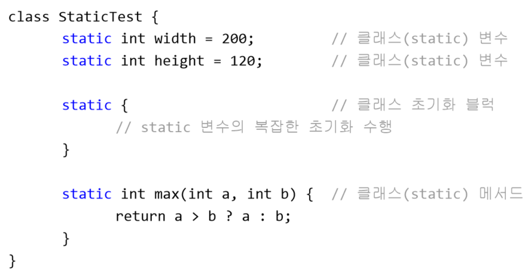
</center>

- static 메서드는 객체 생성없이 사용 가능 : 객체를 필요로 하는 iv, im 사용 불가


## 19. ```final``` - 마지막의, 변경될 수 없는
<center>
    
</center>

<center>
    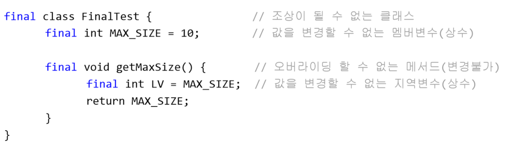
</center>

- 상속계층도의 최하위 클래스 
  - ```String``` : 보안 때문. 비밀번호의 경우 문자열로 저장이 가능한데, 상속이 가능하면 자손에서 조상멤버로 접근할 수 있기 때문
  - ```Math``` : ```Static``` 메서드 집합이므로


## 20. ```abstract``` - 추상의 미완성의
<center>
    
</center>

<center>
    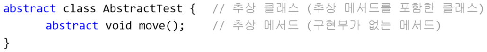
</center>

- 추상메서드 = 미완성메서드 = 인스턴스 생성 불가
  
    ```
    AbstractTest a = new AbstractTest();  // error
                                          // 추상 클래스의 인스턴스 생성 불가
    ```
- 추상 클래스를 상속받아서 완전한(구상)클래스를 만든 후, 객채 생성 가능


<br>
<hr>
<br>

[[자바의 정석 - 기초편] ch7-21 접근제어자](https://www.youtube.com/watch?v=Qm08p4Vk2sw&list=PLW2UjW795-f5JPTsYHGAawAck9cQRw5TD&index=28)


## 21. 접근 제어자 (access modifier)
> ```private``` : **같은 클래스** 내에서만 접근 가능  
> ```(default)``` : **같은 패키지** 내에서만 접근 가능  
> ```protected``` : **같은 패키지** 내에서, 그리고 **다른 패키지의 자손클래스**에서 접근 가능  
> ```public``` : **접근 제한이 전혀 없음**  

- ```public``` > ```protected``` > ```(default)``` > ```private```
    
    <center>
      
    </center>

    <center>
      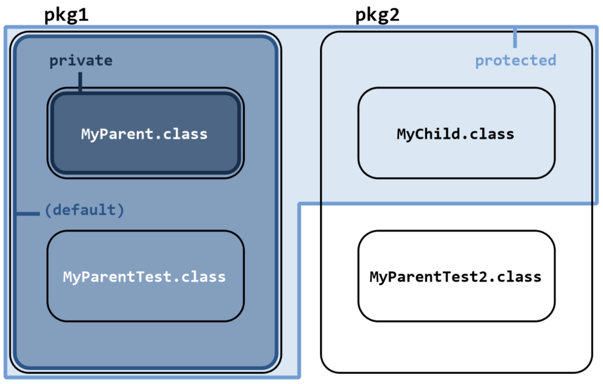
    </center>

- [example 1 : MyParent](././../src/pkg1/MyParent.java)
    <center>
      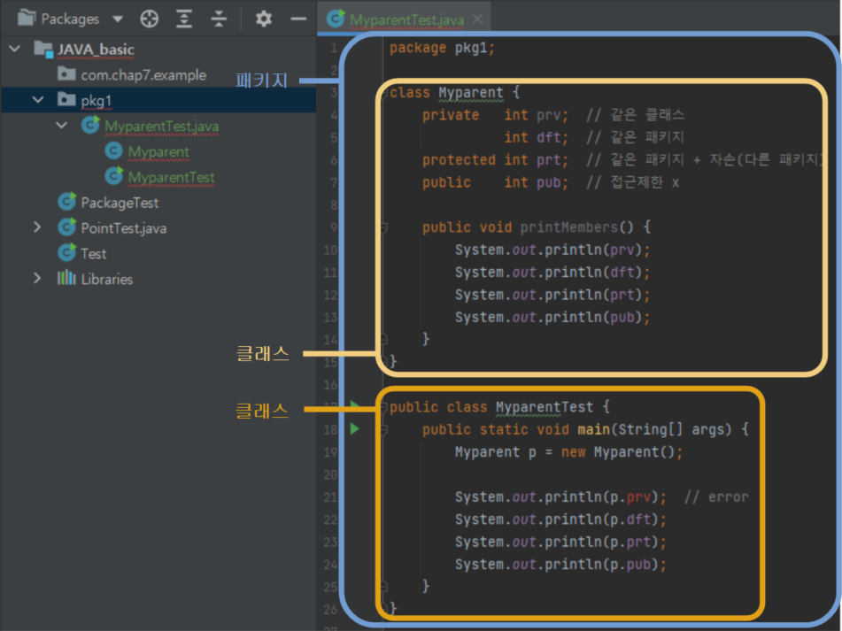
    </center>

- [example 2 : MyParentTest2](././../src/pkg2/MyParentTest2.java)
    <center>
      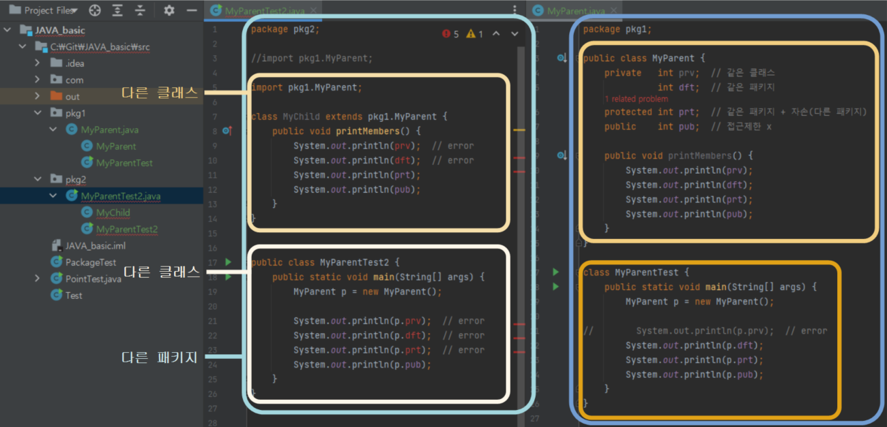
    </center>

<br>
<hr>
<br>

[[자바의 정석 - 기초편] ch7-22 캡슐화](https://www.youtube.com/watch?v=3NuVD8eOMfc&list=PLW2UjW795-f5JPTsYHGAawAck9cQRw5TD&index=29)


## 22. 캡슐화와 접근 제어자
- 접근 제어자를 사용하는 이유
  - 외부로부터 **데이터를 보호**하기 위해서

      <center>
        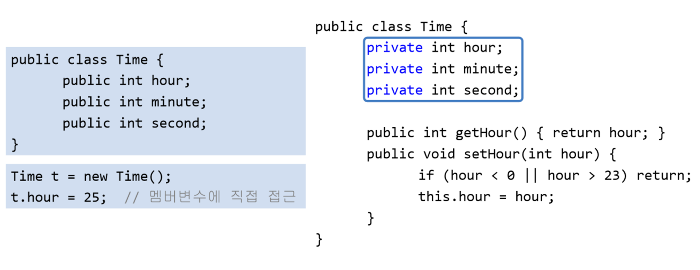
      </center>

    - 접근 제어자를 private로 하여 외부에서 직접 접근하지 못하도록 함
    - 메서드를 통한 간접 접근 허용
  - 외부에는 불필요한, 내부적으로만 사용되는, 부분을 감추기 위해서


<br>
<hr>
<br>

[[자바의 정석 - 기초편] ch7-23 다형성](https://www.youtube.com/watch?v=fw7Nm_li0pE&list=PLW2UjW795-f5JPTsYHGAawAck9cQRw5TD&index=30)


## 23. 다형성(polymorphism) ☆☆☆
> **조상 타입 참조변수로 자손 타입 객체를 다루는 것**

- 여러 가지 형태를 가질 수 있는 능력

    <center>
      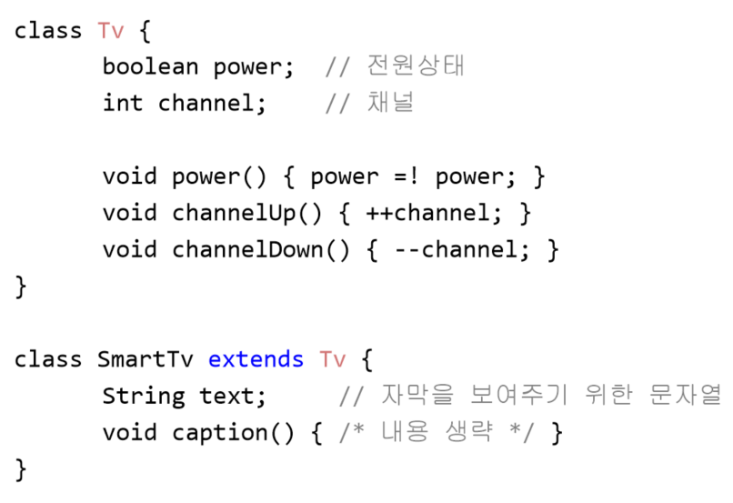
    </center>
    <center>
      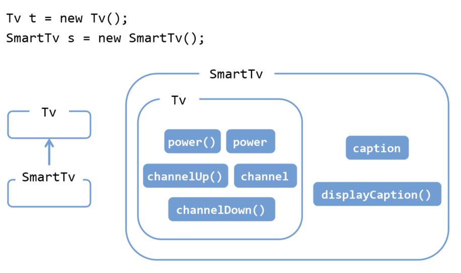
    </center>

    - 지금까지 참조변수와 인스턴스 타입이 일치했음
    - 다형성은 불일치해도 ok
  
      ```
      Tv t = new SmartTv();  // 타입 불일치
      ```

- 객체와 참조변수의 타입이 일치할 때와 일치하지 않을 때의 차이?
    ```
    SmartTv s = new SmartTv(); // 참조변수와 인스턴스 타입이 일치
    Tv t = new SmartTv();      // 조상타입 참조변수로 자손타입 인스턴스 참조
    ```
    <center>
      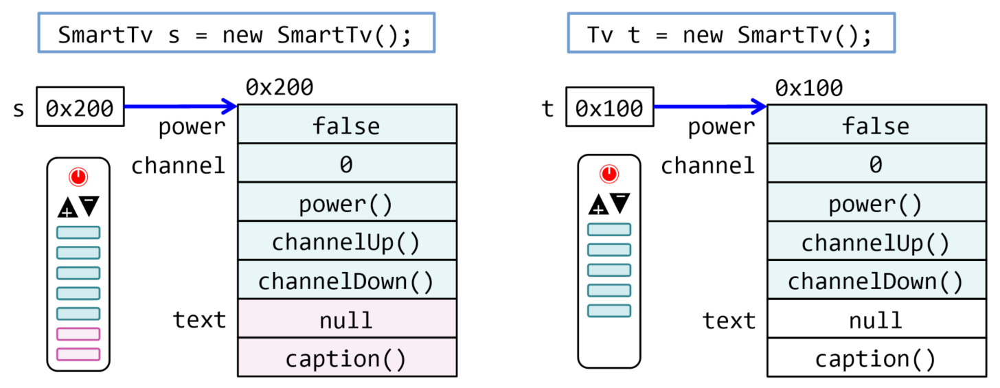
    </center>

  - 스마트티비 리모콘으로 스마트티비(인스턴스)를 보는 것
  - 리모콘의 버튼(멤버) 개수 : 7개 (5개는 티비, 2개는 스마트티비)
  - 스마트티비 리모콘으로 7개를 모두 사용 가능 (모든 기능 사용 가능)
  - 그런데, 티비리모콘(조상타입 참조변수)으로 스마트티비를 작동시키려면?
  - 티비 리모콘 버튼 개수 : 5개
  - 사용할 수 있는 스마트티비(자손타입) 인스턴스는 5개밖에 없음


- 자손 타입의 참조변수로 조상 타입의 객체를 가리킬 수 없음
    ```
    Tv t = new SmartTv();
    SmartTv s = new Tv();   // 에러
    ```
    <center>
      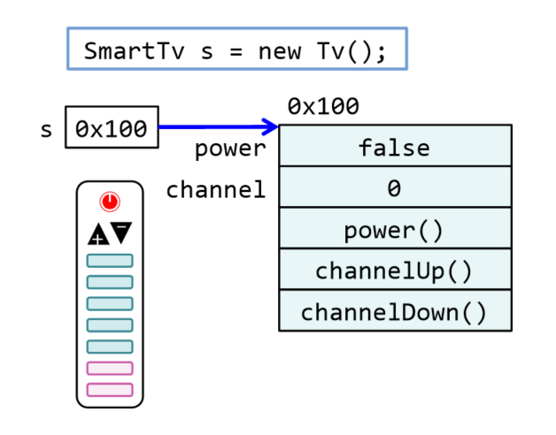
    </center>

    - 기능이 7개인데 버튼이 5개인 것은 가능
    - 버튼이 7개인데 기능이 5개인 것은 불가능 (없는 것 호출해서 error)

- 참조변수의 타입은 인스턴스의 타입과 반드시 일치하지 않아도 됨
- 참조변수가 조상타입일 때 자손타입일 때의 차이는 사용할 수 있는 멤버의 개수
- 자손 타입의 참조변수로 조상타입의 객체를 가리킬 수 없음


<br>
<hr>
<br>

[[자바의 정석 - 기초편] ch7-24,25 참조변수의형변환(1)](https://www.youtube.com/watch?v=XP8zpt-yFZs&list=PLW2UjW795-f5JPTsYHGAawAck9cQRw5TD&index=31)  
[[자바의 정석 - 기초편] ch7-24,25 참조변수의형변환(2)](https://www.youtube.com/watch?v=3lSPC37IaNQ&list=PLW2UjW795-f5JPTsYHGAawAck9cQRw5TD&index=32)


## 24. 참조변수의 형변환
> 사용할 수 있는 멤버의 개수를 조절하는 것
- 기본형의 형변환은 값이 바뀜
- **조상 자손 관계의 참조변수는 서로 형변환 가능**

    ```
    class Car {}
    class FireEngine extends Car {}
    class Ambulance  extends Car {}
    ```

    <center>
      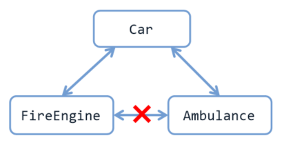
    </center>

    ```
     class Car {
      String color;
      int door;

      void drive() {  // 운전하는 기능
        System.out.println("drive, Brrrr~");
      }

      void stop() {   // 멈추는 기능	
        System.out.println("stop!!!");	
      }
    }

    class FireEngine extends Car {  // 소방차
      void water() {	           // 물을 뿌리는 기능
        System.out.println("water!!!");
      }
    }
    ```
    
    ```
    FireEngine f = new FireEngine();

    Car c = (Car)f;                 // 조상인 Car타입으로 형변환 (생략가능)
    FireEngine f2 = (FireEngine)c;  // 자손인 FireEngine타입으로 형변환 (생략불가)
    Ambulance a = (Ambulance)f;     // error
                                    // 상속관계가 아닌 클래스 간의 형변환 불가
    ```
    <center>
      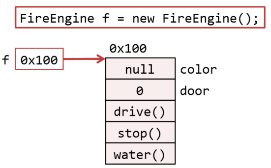
      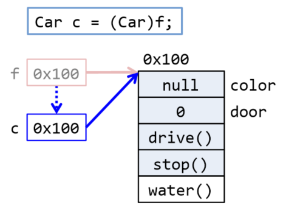
      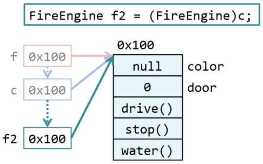
    </center>

## 25. 참조변수의 형변환 예제
- Ex7_7
    ```
    class Ex7_7 {
      public static void main(String args[]) {
        Car car = null;
        FireEngine fe = new FireEngine();
        FireEngine fe2 = null;

        fe.water();
        car = fe;    // car = (Car)fe;에서 형변환이 생략됨
    //		car.water();
        fe2 = (FireEngine)car; // 자손타입 ← 조상타입. 형변환 생략 불가
        fe2.water();
      }
    }

    class Car {
      String color;
      int door;

      void drive() { 	// 운전하는 기능
        System.out.println("drive, Brrrr~");
      }

      void stop() {  	// 멈추는 기능	
        System.out.println("stop!!!");	
      }
    }

    class FireEngine extends Car {	// 소방차
      void water() {	// 물을 뿌리는 기능
        System.out.println("water!!!");
      }
    }
    ```
  - Ex7_7 Result
    ```

    ```
- 실제 인스턴스가 무엇인지가 중요


<br>
<hr>
<br>

[[자바의 정석 - 기초편] ch7-26 instanceof 연산자](https://www.youtube.com/watch?v=YvCgrZQU4EM&list=PLW2UjW795-f5JPTsYHGAawAck9cQRw5TD&index=33)


## 26. instanceof 연산자
> 참조변수의 형변환 가능여부 확인에 사용, 가능하면 ture 반환
- 형변환 전에 반드시 ```instanceof```로 확인
  - 형변환 하는 이유는 인스턴스의 원래 기능을 모두 사용하기 위해
  - Car 타입의 리모콘인 c로는 water()를 호출할 수 없으니
  - 리모콘을 FireEngine타입으로 바꿔서 water() 호출


- 참조변수를 변경함으로써 사용할 수 있는 멤버의 개수를 조절하기 위해 참조변수의 형변환을 함
- 참조변수를 형변환하기 전에 형변환 가능 여부를 확인할 때 ```instanceof``` 연산자 사용


<br>
<hr>
<br>

[]()


## 27. 매개변수의 다형성
> 참조형 매개변수는 메서드 호출 시, <span style='color:red'>자신과 같은 타입 또는 자손 타입</span>의 인스턴스를 넘겨줄 수 있음
- 다형성의 장점 : **다형적 매개변수**, 하나의 배열로 여러 종류 객체 다루기
- 다형성 
  - 조상타입의 참조변수로 자손객체 다루기
  - 참조변수의 형변환 - 리모콘 변경(사용 가능한 맴버 개수 조절)
  - instanceof : 형변환 가능여부 확인

## 28. 매개변수의 다형성 예제
- Ex7_8
    ```
    class Product {
      int price;			// 제품의 가격
      int bonusPoint;	// 제품구매 시 제공하는 보너스점수

      Product(int price) {
        this.price = price;
        bonusPoint = (int)(price/10.0);	// 보너스점수는 제품가격의 10%
      }
    }

    class Tv1 extends Product {
      Tv1() {
        // 조상클래스의 생성자 Product(int price)를 호출한다.
        super(100);		// Tv의 가격을 100만원으로 한다.
      }

      // Object클래스의 toString()을 오버라이딩한다.
      public String toString() { return "Tv"; }
    }

    class Computer extends Product {
      Computer() { super(200); }

      public String toString() { return "Computer"; }
    }

    class Buyer {	// 고객, 물건을 사는 사람
      int money = 1000;	  // 소유금액
      int bonusPoint = 0; // 보너스점수

      void buy(Product p) {
        if(money < p.price) {
          System.out.println("잔액이 부족하여 물건을 살 수 없습니다.");
          return;
        }

        money -= p.price;            // 가진 돈에서 구입한 제품의 가격을 뺀다.
        bonusPoint += p.bonusPoint;  // 제품의 보너스 점수를 추가한다.
        System.out.println(p + "을/를 구입하셨습니다.");
      }
    }

    class Ex7_8 {
      public static void main(String args[]) {
        Buyer b = new Buyer();

        b.buy(new Tv1());
        b.buy(new Computer());

        System.out.println("현재 남은 돈은 " + b.money + "만원입니다.");
        System.out.println("현재 보너스점수는 " + b.bonusPoint + "점입니다.");
      }
    }
    ```
  - Ex7_8 Result
    ```

    ```


<br>
<hr>
<br>

[]()


## 29. 여러 종류의 객체 배열로 다루기
> 조상타입의 배열에 자손들의 객체를 담을 수 있음
- 다형성의 장점 : 다형적 매개변수, **하나의 배열로 여러 종류 객체 다루기**
  
## 30. 여러 종류의 객체 배열로 다루기 예제
- Ex7_9
    ```
    class Product2 {
      int price;			// 제품의 가격
      int bonusPoint;	// 제품구매 시 제공하는 보너스점수

      Product2(int price) {
        this.price = price;
        bonusPoint = (int)(price/10.0);
      }

      Product2() {} // 기본 생성자
    }

    class Tv2 extends Product2 {
      Tv2() {  super(100);	 }

      public String toString() { return "Tv"; }
    }

    class Computer2 extends Product2 {
      Computer2() { super(200); }
      public String toString() { return "Computer"; }
    }

    class Audio2 extends Product2 {
      Audio2() { super(50); }
      public String toString() { return "Audio"; }
    }

    class Buyer2 {			  // 고객, 물건을 사는 사람
      int money = 1000;	  // 소유금액
      int bonusPoint = 0; // 보너스점수
      Product2[] cart = new Product2[10];   // 구입한 제품을 저장하기 위한 배열
      int i =0;			  // Product배열에 사용될 카운터

      void buy(Product2 p) {
        if(money < p.price) {
          System.out.println("잔액이 부족하여 물건을 살 수 없습니다.");
          return;
        }

        money -= p.price;             // 가진 돈에서 구입한 제품의 가격을 뺀다.
        bonusPoint += p.bonusPoint;   // 제품의 보너스 점수를 추가한다.
        cart[i++] = p;                // 제품을 Product[] cart에 저장한다.
        System.out.println(p + "을/를 구입하셨습니다.");
      }
    // 뒷 페이지에 계속됩니다.
      void summary() {	              // 구매한 물품에 대한 정보를 요약해서 보여 준다.
        int sum = 0;                 // 구입한 물품의 가격합계
        String itemList ="";         // 구입한 물품목록

        // 반복문을 이용해서 구입한 물품의 총 가격과 목록을 만든다.
        for(int i=0; i<cart.length;i++) {
          if(cart[i]==null) break;
          sum += cart[i].price;
          itemList += cart[i] + ", ";
        }
        System.out.println("구입하신 물품의 총금액은 " + sum + "만원입니다.");
        System.out.println("구입하신 제품은 " + itemList + "입니다.");
      }
    }

    class Ex7_9 {
      public static void main(String args[]) {
        Buyer2 b = new Buyer2();

        b.buy(new Tv2());
        b.buy(new Computer2());
        b.buy(new Audio2());
        b.summary();
      }
    }
    ```
  - Ex7_9 Result
    ```

    ```


<br>
<hr>
<br>

Java의 정석 기초편 | 남궁성 | 도우출판