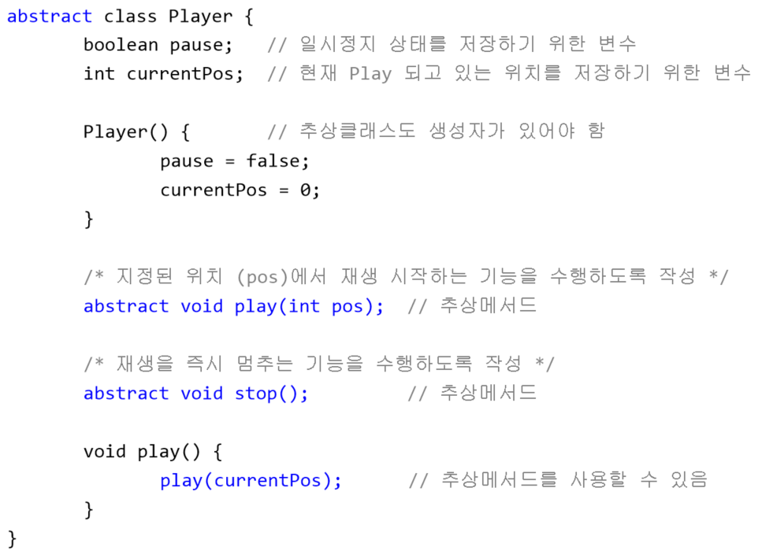
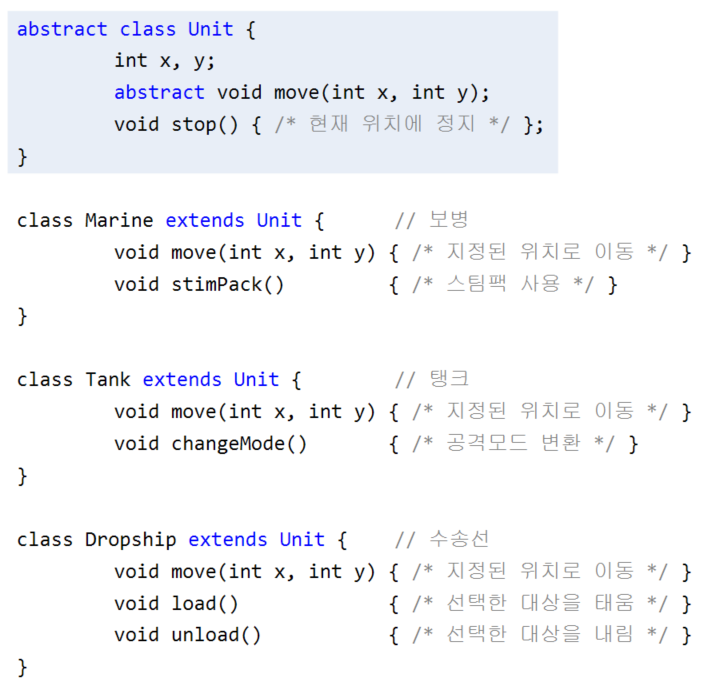
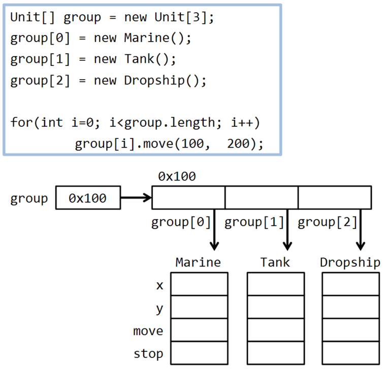
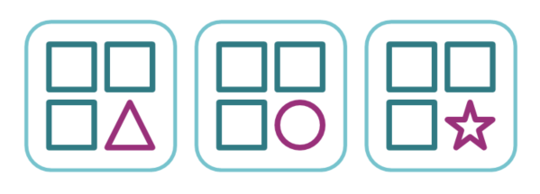
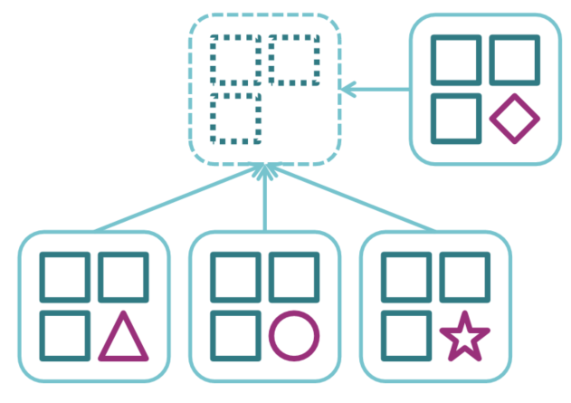
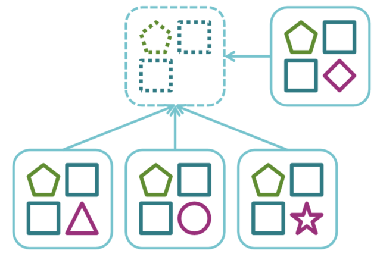
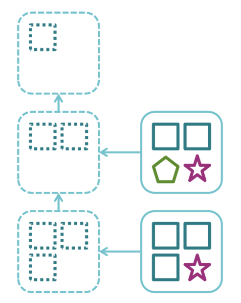
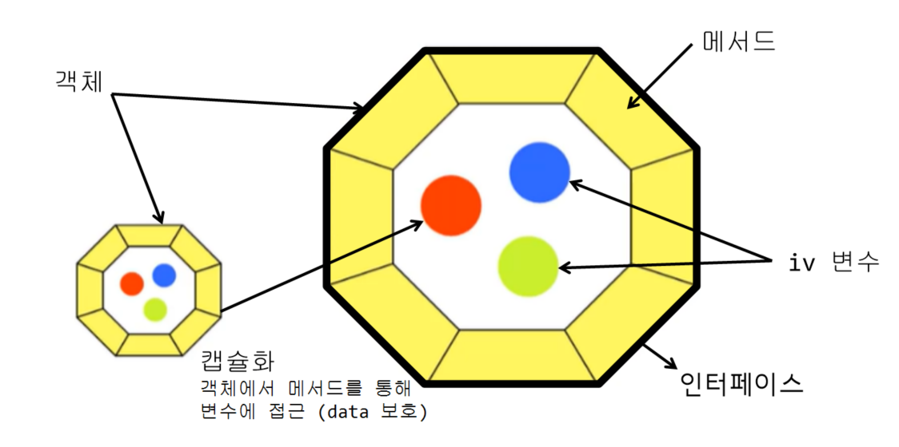
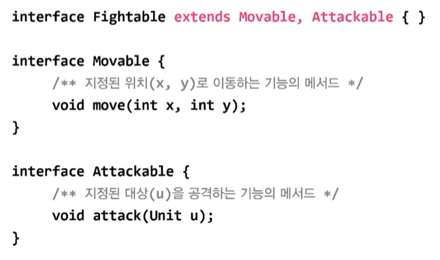

# **Object-oriented Programming 2**
  
<br>

[[자바의 정석 - 기초편] ch7-31,32 추상 클래스, 추상 메서드](https://www.youtube.com/watch?v=9VgkoVFZvyk&list=PLW2UjW795-f5JPTsYHGAawAck9cQRw5TD&index=36)
    
## 31. 추상 클래스 (abstract class)
> 미완성 설계도, 미완성(추상) 메서드를 갖고 있는 클래스

```
abstract class Player {         // 추상클래스 (미완성클래스)
  abstract void play(int pos);  // 추상메서드 (몸통{}이 없는 미완성 메서드)
  abstract void stop();         // 추상메서드
}
```

- 다른 클래스 작성에 도움을 주기 위한 것. 인스턴스 생성 불가
  
    ```
    Player p = new Player();  // error
                              // 추상 클래스의 인스턴스 생성 불가
    ```
- 상속을 통해 추상 메서드를 완성해야 인스턴스 생성가능
  
    ```
    class AudioPlayer extends Player {
      void play(int pos) { /* 내용 생략 */ }  // 추상메서드 구현
      void stop() { /* 내용 생략 */ }         // 추상메서드 구현
    }

    AudioPlayer ap = new AudioPlayer();       // ok
    ```

## 32. 추상 메서드 (abstract method)
> 미완성 메서드. **구현부(```{}```)가 없는 메서드**

```
/* 주석을 통해 어떤 기능을 수행할 목적으로 작성했는지 설명 */
abstract 리턴타입 메서드이름();
```

- 꼭 필요하지만 자손마다 다르게 구현될 것으로 예상되는 경우
    ```
    abstract class Player {         // 추상 클래스
      abstract void play(int pos);  // 추상 메서드
      abstract void stop();         // 추상 메서드
    }

    class AudioPlayer extends Player {
      void play(int pos) { /* 내용 생략 */ }  // 추상메서드 구현
      void stop() { /* 내용 생략 */ }         // 추상메서드 구현
    }

    abstract class AbstractPlayer extends Player {
      void play(int pos) { /* 내용 생략 */ }  // 추상메서드 구현
    }
    ```
- 추상 메서드 호출 가능(호출할 때는 선언부만 필요)

    <center>
      
    </center>

  - 메서드는 선언부만 알면 호출 가능하므로 추상메서드도 호출 가능
  - 상속을 통해서 자손이 완성되면 자손 객체가 생성되어 호출 가능
  - 인스턴스 메서드는 객체생성 후 호출 가능


<br>
<hr>
<br>

[[자바의 정석 - 기초편] ch7-33,34 추상클래스의작성1](https://www.youtube.com/watch?v=SBdXXWIB3To&list=PLW2UjW795-f5JPTsYHGAawAck9cQRw5TD&index=37)  
[[자바의 정석 - 기초편] ch7-33,34 추상클래스의작성2](https://www.youtube.com/watch?v=s0gRBHqa0yg&list=PLW2UjW795-f5JPTsYHGAawAck9cQRw5TD&index=38)


## 33. 추상클래스의 작성
> 여러 클래스에 공통적으로 사용될 수 있는 추상클래스를 바로 작성하거나   
> 기존 클래스의 공통 부분을 뽑아서 추상클래스를 만듦
- 코드의 중복이 제거됨
  
    ```
    class Marine {  // 보병
      int x, y;     // 현재 위치
      void move(int x, int y) { /* 지정된 위치로 이동 */ }
      void stop()             { /* 현재 위치에 정지 */ }
      void stimPack()         { /* 스팀팩 사용 */ }
    } 

    class Tank {  // 탱크
      int x, y;   // 현재 위치
      void move(int x, int y) { /* 지정된 위치로 이동 */ }
      void stop()             { /* 현재 위치에 정지 */ }
      void changeMode()       { /* 공격모드 변환 */ }
    } 

    class Dropship {  // 수송선
      int x, y;       // 현재 위치
      void move(int x, int y) { /* 지정된 위치로 이동 */ }
      void stop()             { /* 현재 위치에 정지 */ }
      void load()             { /* 선택한 대상을 태움 */ }
      void unload()           { /* 선택한 대상을 내림 */ }
    } 
    ```

    <center>
      
      
    </center>

## 34. 추상클래스의 작성 예제
- Ex7_10
    ```
    public class Ex7_10 {
      public static void main(String[] args) {
        Unit[] group = { new Marine(), new Tank(), new Dropship() };

        for (int i = 0; i < group.length; i++)
          group[i].move(100, 200);
      }
    }

    abstract class Unit {
      int x, y;
      abstract void move(int x, int y);
      void stop() { /* 현재 위치에 정지 */ }
    }

    class Marine extends Unit { // 보병
      void move(int x, int y) {
        System.out.println("Marine[x=" + x + ",y=" + y + "]");
      }
      void stimPack() { /* 스팀팩을 사용한다. */ }
    }

    class Tank extends Unit { // 탱크
      void move(int x, int y) {
        System.out.println("Tank[x=" + x + ",y=" + y + "]");
      }
      void changeMode() { /* 공격모드를 변환한다. */ }
    }

    class Dropship extends Unit { // 수송선
      void move(int x, int y) {
        System.out.println("Dropship[x=" + x + ",y=" + y + "]");
      }
      void load()   { /* 선택된 대상을 태운다. */ }
      void unload() { /* 선택된 대상을 내린다. */ }
    }
    ```
  - Ex7_10 Result
    ```

    ```

- example
  - 공통된 부분이 있는 설계도

      <center>
        
      </center>
  
  - 객체지향개념에서 공통된 부분을 조상으로 둠 (미완성 설계도)
    -  **중복이 제거**됨
    -  설계도를 **쉽게 작성**할 수 있음

      <center>
        
      </center>

  - 추상화된 코드는 구체화된 코드보다 유연, **관리(변경)가 용이**해짐

      <center>
        
      </center>    

  - 추상 클래스를 단계별로 만들면 상속 받으면서 구체화 됨 (추상화 <--> 구체화)

      <center>
        
      </center>   


<br>
<hr>
<br>

[[자바의 정석 - 기초편] ch7-35~37 인터페이스의 선언, 상속, 구현](https://www.youtube.com/watch?v=eS2EXUSRolk&list=PLW2UjW795-f5JPTsYHGAawAck9cQRw5TD&index=39)

## 35. 인터페이스 (interface)
> **추상 메서드**의 집합
- 구현된 값이 전혀 없는 설계도. 껍데기 (모든 멤버가 ```public```)

    <center>
      
    </center>  

  - 추상 클래스는 일반 클래스에 추상 메서드를 가지고 있는것 (생성자, iv같은 멤버변수가 존재)
  
  ```
  interface 인터페이스이름 {
      public static final 타입 상수이름 = 값;
      public abstract 메서드이름(매개변수목록);
  }
  ```
    - 모든 멤버변수는 ```public static final```, 생략 가능
    - 모든 메서드는 ```public abstract```, 생략 가능  
      (단, ```static```메서드와 디폴트 메서드는 JDK1.8부터 예외)  


## 36. 인터페이스의 상속
> 인터페이스의 조상은 인터페이스만 가능 (```Object```가 최고 조상 아님)
  
- 다중 상속 가능 (추상메서드는 충돌해도 문제 없음)

    <center>
      
    </center>

## 37. 인터페이스의 구현
> 인터페이스에 정의된 추상 메서드를 완성하는 것

```
class 클래스이름 implements 인터페이스이름 {
    // 인터페이스에 정의된 추상메서드를 모두 구현해야 함
}
```

- example : Fighter클래스가 Fightable 인터페이스를 구현
    ```
    class Fighter implements Fightable {
      public void move(int x, int y) { /* 내용 생략 */ }
      public void attack(Unit u)     { /* 내용 생략 */ }
    }
    ```
- 일부만 구현하는 경우, 클래스 앞에 abstract를 붙여야 함
    ```
    abstract class Fighter implements Fightable {
      public void move(int x, int y) { /* 내용 생략 */ }
    }
    ```

  

<br>
<hr>
<br>

[[자바의 정석 - 기초편] ch7-38인터페이스와 다형성](https://www.youtube.com/watch?v=EnBLkMYt1XQ&list=PLW2UjW795-f5JPTsYHGAawAck9cQRw5TD&index=40)

## 38. 인터페이스를 이용한 다형성
> 인터페이스도 구현 클래스의 부모

- 인터페이스 타입 매개변수는 **인터페이스 구현한 클래스의 객체만 가능**
- 인터페이스 메서드의 리턴타입으로 지정할 수 있음

<br>
<hr>
<br>

[]()  
[]()


## 39. 인터페이스의 장점
> 두 대상(객체) 간의 '연결, 대화, 소통'을 돕는 '중간 역할'
- 예를 들어서 어떤 기계가 있음 사람이 기계를 직접 조작하려면 쉽지 않아서 껍데기를 씌움
  - 인터페이스 = 껍데기
  - 사람은 껍데기를 통해서 기계를 조작함 기계와 소통하기 쉬워짐
  - Graphic User Interface
  - 하드웨어가 바뀌어도 인터페이스가 안바뀌면 사용이 쉬움, 변경에 유리
- 선언(설계)과 구현을 분리시킬 수 있게 함
- 인터페이스 덕분에 B가 변경되어도 A는 안바꿀 수 있게 됨(느슨한 결합)
- 개발시간을 단축할 수 있음
- 변경에 유리한 유연한 설계 가능
- 표준화 가능 (JDBC)
- 서로 관계없는 클래스들을 관계를 맺어줄 수 있음


<br>
<hr>
<br>

[]()


## 40. 디폴트 메서드와 static메서드
> 인터페이스에서 디폴트 메서드, static 메서드 추가 가능 (JDK1.8부터)
- 인터페이스에 새로운 메서드(추상메서드)를 추가하기 어려움
  - 해결책 : 디폴트 메서드(default method)
- 디폴트 메서드는 인스턴스 메서드(인터페이스 원칙 위반)
- 디폴트 메서드가 기존의 메서드와 충돌할 댸의 해결책
  1. 여러 인터페이스의 디폴트 메서드간의 충돌
     - 인터페이스 구현한 클래스에서 디폴트 메서드를 오버라이딩 해야함
  2. 디폴트 메서드와 조상 클래스의 메서드 간의 충돌
     - 조상 클래스의 메서드가 상속, 디폴트 메서드 무시
## 41. 디폴트 메서드와 static메서드 예제
- Ex7_11
    ```
    class Ex7_11 {
      public static void main(String[] args) {
        Child3 c = new Child3();
        c.method1();
        c.method2();
        MyInterface.staticMethod(); 
        MyInterface2.staticMethod();
      }
    }

    class Child3 extends Parent3 implements MyInterface, MyInterface2 {
      public void method1() {	
        System.out.println("method1() in Child3"); // żŔšöśóŔĚľů
      }			
    }

    class Parent3 {
      public void method2() {	
        System.out.println("method2() in Parent3");
      }
    }

    interface MyInterface {
      default void method1() { 
        System.out.println("method1() in MyInterface");
      }

      default void method2() { 
        System.out.println("method2() in MyInterface");
      }

      static void staticMethod() { 
        System.out.println("staticMethod() in MyInterface");
      }
    }

    interface MyInterface2 {
      default void method1() { 
        System.out.println("method1() in MyInterface2");
      }

      static void staticMethod() { 
        System.out.println("staticMethod() in MyInterface2");
      }
    }
    ```
  - Ex7_11 Result
    ```

    ```


<br>
<hr>
<br>

Java의 정석 기초편 | 남궁성 | 도우출판