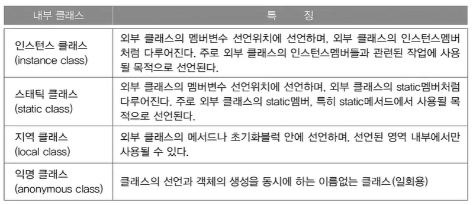

# **Object-oriented Programming 2**
  
<br>

[]()

## 42. 내부 클래스 (inner class)
> 클래스 안의 클래스
- 내부 클래스의 장점
  - 내부 클래스에서 외부 클래스의 멤버들을 쉽게 접근 가능
  - 코드의 복잡성을 줄일 수 있음(캡슐화)


## 43. 내부 클래스의 종류와 특징
- 내부 클래스의 종류와 유효범위(scope)는 변수와 동일
<center>
    
</center>

## 44. 내부 클래스의 선언


<br>
<hr>
<br>

[]()


## 45. 내부 클래스의 제어자와 접근성
> 내부 클래스의 제어자는 변수에 사용 가능한 제어자와 동일


## 46. 내부 클래스의 제어자와 접근성 예제1
- Ex7_12
    ```
    class Ex7_12 { 
        class InstanceInner { 
            int iv = 100; 
    //		static int cv = 100;            // 에러! static변수를 선언할 수 없다. 
            final static int CONST = 100;   // final static은 상수이므로 허용
        } 

    static class StaticInner { 
            int iv = 200; 
            static int cv = 200;    // static클래스만 static멤버를 정의할 수 있다. 
        } 

        void myMethod() { 
            class LocalInner { 
                int iv = 300; 
    //			static int cv = 300;             // 에러! static변수를 선언할 수 없다. 
                final static int CONST = 300;    // final static은 상수이므로 허용 
            } 
        } 

        public static void main(String args[]) { 
            System.out.println(InstanceInner.CONST); 
            System.out.println(StaticInner.cv); 
        } 
    }
    ```
  - Ex7_12 Result
    ```

    ```
## 47. 내부 클래스의 제어자와 접근성 예제2
- Ex7_13
    ```
    class Ex7_13 {
        class InstanceInner {}
        static class StaticInner {}

        // 인스턴스멤버 간에는 서로 직접 접근이 가능하다.
        InstanceInner iv = new InstanceInner();
        // static 멤버 간에는 서로 직접 접근이 가능하다.
        static StaticInner cv = new StaticInner();

        static void staticMethod() {
        // static멤버는 인스턴스멤버에 직접 접근할 수 없다.
    //		InstanceInner obj1 = new InstanceInner();	
            StaticInner obj2 = new StaticInner();

        // 굳이 접근하려면 아래와 같이 객체를 생성해야 한다.
        // 인스턴스클래스는 외부 클래스를 먼저 생성해야만 생성할 수 있다.
            Ex7_13 outer = new Ex7_13();
            InstanceInner obj1 = outer.new InstanceInner();
        }

        void instanceMethod() {
        // 인스턴스메서드에서는 인스턴스멤버와 static멤버 모두 접근 가능하다.
            InstanceInner obj1 = new InstanceInner();
            StaticInner obj2 = new StaticInner();
            // 메서드 내에 지역적으로 선언된 내부 클래스는 외부에서 접근할 수 없다.
    //		LocalInner lv = new LocalInner();
        }

        void myMethod() {
            class LocalInner {}
            LocalInner lv = new LocalInner();
        }
    }
    ```
  - Ex7_13 Result
    ```

    ```
## 48. 내부 클래스의 제어자와 접근성 예제3
- Ex7_14
    ```
    ```
  - Ex7_14 Result
    ```

    ```
## 49. 내부 클래스의 제어자와 접근성 예제4
- Ex7_15
    ```
    class Outer2 {
        class InstanceInner {
            int iv = 100;
        }

        static class StaticInner {
            int iv = 200;
            static int cv = 300;
        }

        void myMethod() {
            class LocalInner {
                int iv = 400;
            }
        }
    }

    class Ex7_15 {
        public static void main(String[] args) {
            // 인스턴스클래스의 인스턴스를 생성하려면
            // 외부 클래스의 인스턴스를 먼저 생성해야 한다.
            Outer2 oc = new Outer2();
            Outer2.InstanceInner ii = oc.new InstanceInner();

            System.out.println("ii.iv : "+ ii.iv);
            System.out.println("Outer2.StaticInner.cv : "+Outer2.StaticInner.cv);
                                        
        // 스태틱 내부 클래스의 인스턴스는 외부 클래스를 먼저 생성하지 않아도 된다.
            Outer2.StaticInner si = new Outer2.StaticInner();
            System.out.println("si.iv : "+ si.iv);
        }
    }
    ```
  - Ex7_15 Result
    ```

    ```
## 50. 내부 클래스의 제어자와 접근성 예제5
- Ex7_16
    ```
    class Outer3 {
        int value = 10;	// Outer3.this.value

        class Inner {
            int value = 20;   // this.value

            void method1() {
                int value = 30;
                System.out.println("            value :" + value);
                System.out.println("       this.value :" + this.value);
                System.out.println("Outer3.this.value :" + Outer3.this.value);
            }
        } // InnerŬ·¡½ºÀÇ ³¡
    } // Outer3Ŭ·¡½ºÀÇ ³¡

    class Ex7_16 {
        public static void main(String args[]) {
            Outer3 outer = new Outer3();
            Outer3.Inner inner = outer.new Inner();
            inner.method1();
        }
    }
    ```
  - Ex7_16 Result
    ```

    ```


<br>
<hr>
<br>

[]()


## 51. 익명 클래스 (anonymous class)
> 이름이 없는 일회용 클래스. 정의와 생성을 동시에
```
new 조상클래스이름() {
    // 멤버 선언
}
```
```
new 구현인터페이스이름() {
    // 멤버 선언
}
```
- Ex7_17
    ```
    class Ex7_17 {
        Object iv = new Object(){ void method(){} };         // 익명 클래스
        static Object cv = new Object(){ void method(){} };  // 익명 클래스

        void myMethod() {
            Object lv = new Object(){ void method(){} };      // 익명 클래스
        }
    }
    ```
  - Ex7_17 Result
    ```

    ```
  
## 52. 익명 클래스 (anonymous class) 예제

- Ex7_18
    ```
    import java.awt.*;
    import java.awt.event.*;

    class Ex7_18 {
        public static void main(String[] args) {
            Button b = new Button("Start");
            b.addActionListener(new EventHandler());
        }
    }

    class EventHandler implements ActionListener {
        public void actionPerformed(ActionEvent e) {
            System.out.println("ActionEvent occurred!!!");
        }
    }
    ```
  - Ex7_18 Result
    ```

    ```

- Ex7_19
    ```
    import java.awt.*;
    import java.awt.event.*;

    class Ex7_19 {
        public static void main(String[] args) {
            Button b = new Button("Start");
            b.addActionListener(new ActionListener() {
                    public void actionPerformed(ActionEvent e) {
                        System.out.println("ActionEvent occurred!!!");
                    }
                } // À͸í Ŭ·¡½ºÀÇ ³¡
            );
        } // mainÀÇ ³¡
    } 
    ```
  - Ex7_19 Result
    ```

    ```

    

<br>
<hr>
<br>

Java의 정석 기초편 | 남궁성 | 도우출판