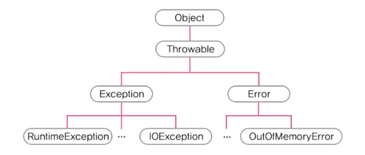
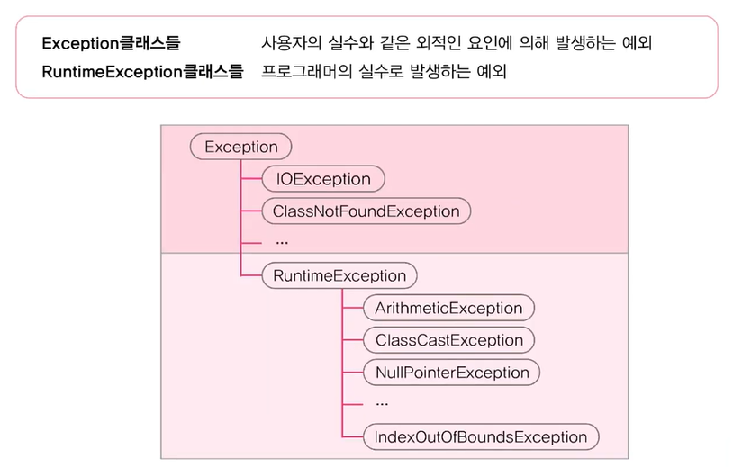

# **Exception Handling**
  
<br>
    
## 01. 프로그램 오류
- 컴파일 에러(compile-time error) : 컴파일 할 때 발생하는 에러
  - java 컴파일러 
    - 구문체크, 번역, 최적화
    - 생략된 코드 추가
- 런타임 에러(runtime error) : 실행할 때 발생하는 에러
  - error : 프로그램 코드에 의해서 수습될 수 없는 심각한 에러
        ex) OOM(Out Of Memory)
  - exception : 프로그램 코드에 의해서 수습될 수 있는 다소 미약한 에러
  - 에러는 어쩔 수 없지만 예외는 처리하자
  - 예외처리의 정의와 목적
    - 정의 : 프로그램 실행시 발생할 수 있는 예외의 발생에 대비한 코드를 작성하는 것
    - 목적 : 프로그램의 비정상 종료를 막고, 정상적인 실행상태를 유지하는 것
- 논리적 에러(logical error) : 작성 의도와 다르게 동작
  - 프로그램 종료되지 않음
  
## 02. 예외 클래스의 계층구조
- 상속계층도
    <center> 
      
    </center>
- Excetion
  - Exception의 자손
  - RuntimeExc3e
## 03. Exception과 RuntimeException
<center> 
    
</center>
- IO : 입축력 예외(input, output)
- ClassNotFound : ```*.class```
- 산술계산 예외
- 형변환
- 널포인터
- 배열범위 벗어남
  
<br>
<hr>
<br>


## 04. 예외 처리하기 - try-catch문
- 프로그램 오류 : 컴파일에러, 런타임에러, 논리적에러
  - 런타임에러 : 에러(심각), 예외(미약 : exception / runtimeexception)
> 예외 처리(Exception Handing)  
> 정의 : 프로그램 실행 시 발생할 수 있는 예외의 발생에 대비한 코드를 작성하는 것  
> 목적 : 프로그램 비정상 종료를 막고 정상적인 실행상태를 유지하는 것

    ```
    try{
        // 예외가 발생할 가능성이 있는 문장
    } catch (Exception1 e1) {
        // Exception1이 발생했을 경우, 이를 처리하기 위한 문장
    } catch (Exception2 e2) {
        // Exception2이 발생했을 경우, 이를 처리하기 위한 문장
    } catch (ExceptionN eN) {
        // ExceptionN이 발생했을 경우, 이를 처리하기 위한 문장
    }
    ```
  - if문과 달리 try블럭이나 catch블럭 내애 포함된 문장이 하나 뿐이어도 ```{}``` 생략 불가 

## 05. try-catch문에서의 흐름
- try 블럭 내에서 예외가 발생한 경우
    1. 발생한 예외와 일치하는 catch블럭이 있는지 확인
    2. 일치하는 catch블럭을 찾게 되면, 그 catch블럭 내의 문장들을 수행하고, 전체 try-catch문을 빠져나가서 그 다음 문장을 계속해서 수행. 만일 일치하는 catch블럭을 찾지 못하면, 예외가 처리되지 못함
 - try 블럭 내에서 예외가 발생하지 않은 경우
    1. catch블럭을 거치지 않고 전체 try-catch문을 빠져나가서 수행을 계속함

- 예제 8_1
- 예제 8_2
## 06. 예외의 발생과 catch블럭
- 예외가 발생하면 이를 처리할 catch블럭을 찾아 내려감
- 일치하는 catch블럭이 없으면 예외는 처리 안됨
- Exception이 선언된 catch블럭은 모든 예외 처리(마지막 catch블럭)
- 예제 8_4

<br>
<hr>
<br>


## 07. printStackTrace()와 getMessage()
> printStackTrace() : 예외발생 당시의 호출스택(Call Stack)에 있었던 메서드의 정보와 예외 메세지를 화면에 출력  
> getMessage() : 발생한 예외클래스의 인스턴스에 저장된 메세지를 얻을 수 있음  
  
    ```
    try{
        ...
        System.out.println(0/0);  // 예외 발생
                                  // 예외 객체 생성(ArithmeticeException)
                                  // 발생한 예외에 대한 정보를 가지고 있음
        ...
    } catch (ArithmeticeException ae) {  // 참조변수 ae의 유효범위(Scope) : catch 블럭
        ae.printStackTrace();
        System.out.println(ae.getMessage())
    } catch (Exception e) {
        ...
    }
    ```
- 예제 8_5
## 08. 멀티 catch블럭
- 내용이 같은 catch블럭을 하나로 합친것(JDK1.7부터)
    ```
    try {
        ...
    } catch (ExceptionA e) {
        e.printStackTrack();
    } catch (ExceptionB e2) {
        e2.printStackTrack();
    }
    ```
    ```
    try {
        ...
    } catch (ExceptionA | ExceptionB e) { // 공통된 부분만 참조변수 사용 가능
        .printStackTrack();
    } 
    ```
    ```
    try {
        ...
    //} catch (ExceptionA | ExceptionB e) { // 부모 자식 관계는 안됨
    } catch (ParentException e) { 
        .printStackTrack();
    } 
    ```
<br>
<hr>
<br>


## 09. 예외 발생시키기
> 1. 연산자 new를 이용해서 발생시키려는 예외 클래스의 객체를 만든 다음  
>   ```Exception e = new Exception("고의로 발생")```  
> 2. 키워드 throw를 이용해서 예외를 발생시킴
>   ```throw e;```

- 예제 8_6
## 10. Checked예외, unchecked예외
- checked예외 : 컴파일러가 예외 처리 여부를 체크(예외 처리 필수) - Exception(try-catch 필수)
- unchecked예외 : 컴파일러가 예외 처리 여부를 체그 안함(예외 처리 선택) - RuntimeException
- 예제 8_7
- 예제 8_8

- checked 예외 : 예외처리 필수
- unchecked 예외 : 예외처리 선택
<br>
<hr>
<br>

Java의 정석 기초편 | 남궁성 | 도우출판