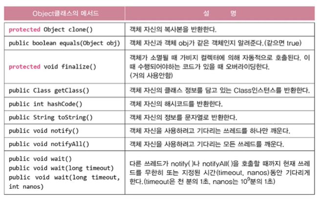
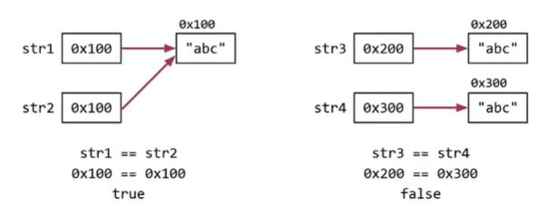
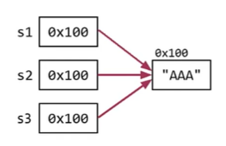
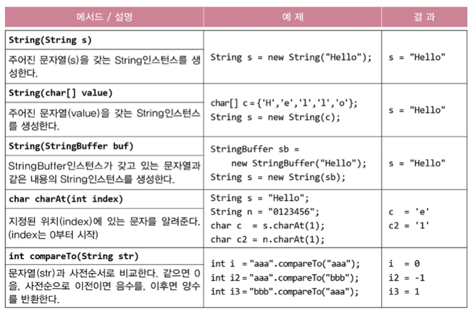
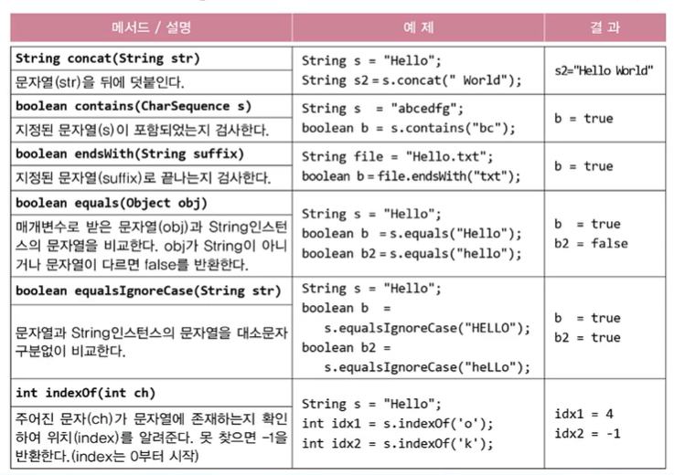
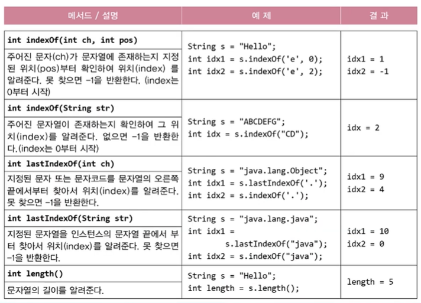
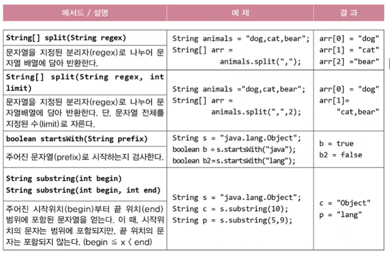
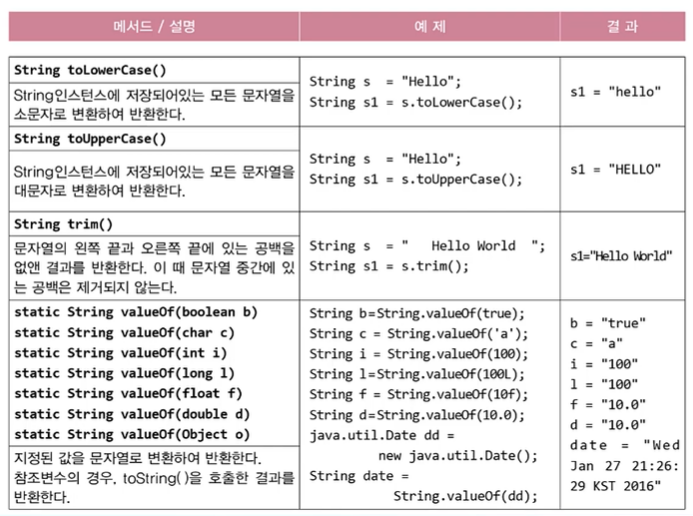
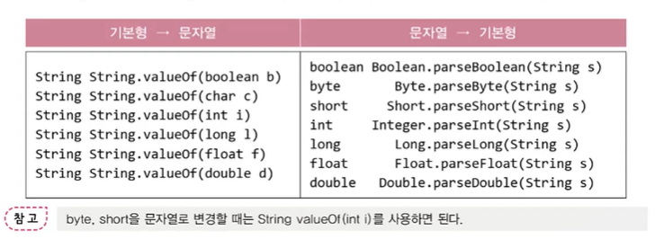

# **java.lang package & util classes**
  
<br>


## 01. Object클래스
> 모든 캘래스의 최고 조상, 오직 11개의 메서드만을 가지고 있음

<center>
    
</center>

- ```notify()```, ```wait()``` 등은 쓰레드 관련된 메서드
- ```Class{}``` : 클래스의 정보를 담기 위한 클래스, 객체 생성과 객체 정보를 알 수 있음
- ```protected``` : 오버라이딩하며 ```public```으로 변경
  

## 02. Object클래스의 메서드 - ```equals()```
> 객체 자신(```this```)와 주어진 객체(obj)를 비교  
> 같으면 true, 다르면 false

- Object클래스의 ```equals()```는 객체의 주소를 비교 (참조변수 값 비교)
    ```
    public boolean equals(Object obj) {
        return (this == obj);  // 주소비교, 주소가 같을 때만 true
    }
    ```

- 예제 9-1

## 03. ```equals()```의 오버라이딩
> 인스턴스 변수의 값을 비교하도록 ```equals()```를 오버라이딩

- 예제 9-2
  

<br>
<hr>
<br>


## 04. Object클래스의 메서드 - ```hashCode()```
> 객체의 해시코드(hash code)를 반환하는 메서드

- Object클래스의 ```hashCode()```는 객체의 주소를 int로 변환해서 반환
    ```
    public class Object {
        ...
        public native int hashCode();
    }
    ```
    - 네이티브 메서드 : OS의 메서드(C언어)

- ```equals()```를 오버라이딩하면 ```hashCode()```도 오버라이딩
  - 둘 다 객체 주소를 가지고 작업
  - **```equals()``` 결과가 true인 두 객체의 해시코드는 같아야 하기 때문** 
  
    ```
    String str1 = new String("abc");
    String str2 = new String("abc");

    System.out.println(str1.equals(str2));  // true
    System.out.println(str1.hashCode());    // 96354
    System.out.println(str2.hashCode());    // 96354
    ```
- 예제 9-3
- ```System.identityHashCode```(Object obj)는 Object클래스의 ```hashCode()```와 동일
  ```
  System.out.println(System.identityHashCode(str1));  // 3526198
  System.out.println(System.identityHashCode(str2));  // 7699183
  ```
## 05. Object클래스의 메서드 - ```toString()```
> ```toString()``` : 객체를 문자열로 변환하기 위한 메서드

```
public String toString() { // Object 클래스의 toString()
    return getClass().getName() + "@" + Integer.toHexString(hashCode());
    // getClass() : 설계도 객체
    // getName() : 클래스 이름
    // "@" : 위치
    // Integer.toHexString : 16진수
    // hashCode() : 객체주소(로 만든 값)
}
```
- 예제 9-4
  
## 06. ```toString()```의 오버라이딩

- 예제 9-5

<br>
<hr>
<br>

## 07. String 클래스
> String 클래스 = 데이터(char[]) + 메서드(문자열 관련)

```
public final class String implements java.io.Serializable, Comparable {
    private char[] value;
    ...
}
```

- 내용을 변경할 수 없는 불변(immutable)클래스
- 덧셈 연산자(```+```)를 이용한 문자열 결합은 성능이 떨어짐
  - 문자열의 결합이나 변경이 잦다면, 내용을 변경가능한 ```StringBuffer```를 사용

## 08. 문자열(String)의 비교
- ```String str = "abc";```와 ```String str = new String("abc");```의 비교
    ```
    String str1 = "abc";  // 문자열 리터럴 "abc"의 주소가 str1에 저장
    String str2 = "abc";  // 문자열 리터럴 "abc"의 주소가 str2에 저장
    String str3 = new String("abc");  // 새로운 String 인스턴스 생성
    String str4 = new String("abc");  // 새로운 String 인스턴스 생성
    ```

    <center>
      
    </center>

    - 문자열의 같고 다름을 비교할 때는 ```equals()```이용 (내용 비교)
    - 대입연산자(```==```)는 주소 비교

- 예제 9-6

## 09. 문자열 리터럴(String리터럴)
> 문자열 리터럴은 프로그램 실행시 자동으로 생성 (constant pool에 저장)

- 예제 9-7

- 같은 내용의 문자열 리터럴(상수)은 하나만 만들어짐 
    <center>
      
    </center>

  - String 객체는 내용변경 불가이므로 여러 참조변수가 하나의 객체를 공유해도 문제없음

## 10. 빈 문자열(empty string)
> 내용이 없는 문자열. 크기가 0인 char형 배열을 저장하는 문자열
> ```
> String str = "";  // str을 빈 문자열로 초기화
> ```

- 크기가 0인 배열을 생성하는 것은 어느 타입이나 가능
    ```
    char[] chArr = new char[0];  // 길이가 0인 char배열
    int[] iArr = {};             // 길이가 0인 int배열
    ```

- 문자(char)와 문자열(String)의 초기화
    ```
    String s = "";  // 빈 문자열로 초기화
    char c = ' ';   // 공백으로 초기화
    ```

<br>
<hr>
<br>

## 11. String클래스의 생성자와 메서드

<center>
    
</center>

- ```String(char[] value)``` : char[] → String
  - ```toCharArray()``` : String → char[]
- ```String(StringBuffer buf)``` : StringBuffer → String
  - ```StringBuffer``` : 내용 변경 가능
- ```char charAt(int index)``` : 문자 1개 반환
- ```int compareTo(String str)``` : Dictionary order


<center>
    
    
    
    
</center>


<br>
<hr>
<br>

## 12. ```join()```과 StringJoiner
> ```join()```은 여러 문자열 사이에 구분자를 넣어서 구분
```
String animals = "dog, cat, bear";
String[] arr = animals.split(",");  // 문자열을 ','를 구분자로 나눠서 배열에 저장
String str = String.join("-", arr); // 배열의 문자열을 '-'로 구분해서 결합
System.out.println(str);            // dog-cat-bear 
```

- 예제 9-9
  
## 13. 문자열과 기본형 간의 변환
- 숫자를 문자열로 바꾸는 방법
    ```
    int i = 100;
    String str1 = i + "";             // 100 → "100"
    String str2 = String.valueOf(i);  // 100 → "100" (속도가 더 빠름)
    ```
- 문자열를 숫자로 바꾸는 방법
    ```
    int i = Integer.parseInt("100");      // "100" → 100
    int i2 = Integer.valueOf("100");      // "100" → 100
    Integer i2 = Integer.valueOf("100");  // 원래 반환타입이 Integer
    ```
<center>
    
</center>

- 메서드들을 ```valueOf```로 통일

## 14. 문자열과 기본형 간의 변환 예제
- 예제 9-10


<br>
<hr>
<br>

Java의 정석 기초편 | 남궁성 | 도우출판