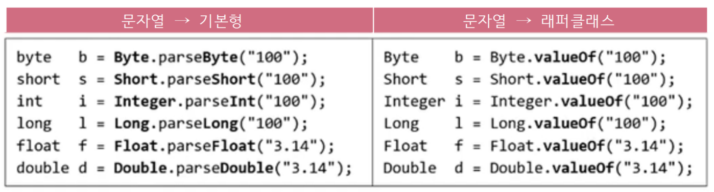

# **java.lang package & util classes**
  
<br>


## 15. StringBuffer클래스
> String처럼 문자형 배열(char[])을 내부적으로 가지고 있음
> ```
> public final class StringBuffer implements java.io.Serializable {
>   private char[] value;
> }
> ```

- 그러나, String과 달리 내용을 변경할 수 있음 (mutable)

    <center>
      
      
    </center>

## 16. StringBuffer의 생성자

- 배열은 길이 변경 불가, 공간이 부족하면 새로운 배열 생성
  
    <center>
      
    </center>

    - 새로운 배열 생성 → 내용 복사 → 참조 변경
- StringBuffer는 저장할 문자열의 길이를 고려해서 적절한 크기로 생성해야 함
  
    <center>
      
    </center>

## 17. StringBuffer의 변경
> StringBuffer는 String과 달리 내용 변경이 가능

```
StringBuffer sb = new StringBuffer("abc");
sb.append("123");  // sb의 내용 뒤에 "123"을 추가
```

<center>
    
</center>

- StringBuffer가 가진 메서드 (메서드의 반환타입 : StringBuffer)
  - ```append()```, ```delete()```, ```insert()```, ...
- ```append()```는 지정된 StringBuffer에 추가 후, StringBuffer의 참조를 반환
    
    <center>
      
    </center>

## 18. StringBuffer의 비교
> StringBuffer는 **```equals()```가 오버라이딩 되어있지 않음** (주소비교 : this == obj)
> ```
> StringBuffer sb  = new StringBuffer("abc");
> StringBuffer sb2 = new StringBuffer("abc");
>
> System.out.println(sb==sb2);         // false
> System.out.println(sb.equals(sb2));  // false
> ```

- StringBuffer을 String으로 변환 후, ```equals()```로 비교
    ```
    String s = sb.toString();  // sb를 String으로 변환
    String s2 = sb2.toString();

    System.out.println(s.equals(s2));  // true 
    ```

- 예제 9-11

<br>
<hr>
<br>

## 19. StringBuffer의 생성자와 메서드

<center>
    
    
    
    
</center>

## 20. StringBuffer의 생성자와 메서드 예제
- 예제 9-12

<br>
<hr>
<br>

## 21. StringBuilder
> StringBuffer는 멀티 쓰레드에 안전(thread-safe)하도록 동기화 되어 있음
- 쓰레드
  - 싱글 쓰레드 : 한 번에 1개 작업
  - 멀티 쓰레드 : 한 번에 n개 작업 (데이터 공유)  

- 동기화 : 데이터 사용중, 공유를 막는 것
- 멀티 쓰레드 프로그램이 아닌 경우, **동기화는 불필요한 성능저하**
  - 이럴 땐 StringBuffer 대신, StringBuilder를 사용하면 성능 향상
    
    <center>
      
    </center>
  
  - 지금까지 작성해온 프로그램은 모두 싱글 쓰레드  

## 22. Math클래스
> 수학 관련 static 메서드의 집합
> ```
> public static final double E = 2.7182818284590452354;    // 자연로그 밑
> public static final double PI = 3.14159265358979323846;  // 원주율
> ```

- ```round()```로 원하는 소수점 아래 세 번째 자리에서 반올림

    <center>
      
    </center>

## 23. Math의 메서드
<center>
    
    
</center>

## 24. Math의 메서드 예제
- 예제 9-13

<br>
<hr>
<br>

## 25. 래퍼(wrapper) 클래스
> 8개의 기본형을 객체로 다뤄야 할 때 사용하는 클래스
> ```
> public final class Integer extends Number implements Comparable {
>   ...
>   private int value;
>   ...
> }
> ```

<center>
    
</center>

- 객체지향 언어에서는 모든것이 객체여야 함 (기본형은 객체 x : 성능의 이유)

## 26. 래퍼(wrapper) 클래스 예제

- 예제 9-14

## 27. Number클래스
> 모든 숫자 클래스의 조상

<center>
    
    
</center>

<br>
<hr>
<br>

## 28. 문자열을 숫자로 변환하기
- 문자열을 숫자로 변환하는 다양한 방법

    ```
    int     i  = new Integer("100").intValue();  // floatValue(), longValue(), ...
    int     i2 = Integer.pareInt("100");         // 주로 이 방법 많이 사용
    Integer i3 = Integer.valueOf("100");          
    ```

    <center>
      
    </center>

    - 문자열 → 래퍼클래스 : ```Byte b = new Byte("100");```와 동일
    - 래퍼클래스 → 문자열 : ```String str = b.toString();```


- n진법의 문자열을 숫자로 변환하는 방법
    ```
    int i4 = Integer.parseInt("100", 2)   // 100(2)  → 4
    int i5 = Integer.parseInt("100", 8)   // 100(8)  → 64
    int i6 = Integer.parseInt("100", 16)  // 100(16) → 256
    int i7 = Integer.parseInt("FF", 16)   // FF(16)  → 255
    // int i8 = Integer.parseInt("FF")    // NumberFormatException
    ```

## 29. 문자열을 숫자로 변환하기 예제

- 예제 9-15

## 30. 오토박싱 & 언박싱
> 오토박싱 : Autoboxing, 기본형 값(int)을 래퍼 클래스의 객체(Integer)로 자동 변환 해주는 것  
> 언박싱 : Unboxing, 래퍼 클래스의 객체를 기본형 값으로 자동 변환 해주는 걳

- JDK1.5 이전에는 기본형과 참조형 간의 연산이 불가능
    ```
    int i = 5;
    Integer iobj = new Integer(7);

    int sum = i + iobj;  // error
                         // 기본형과 참조형 간의 덧셈 불가
    ```

    <center>
      
    </center>

- 기본형의 값을 객체로 자동변환하는 것을 오토박싱, 그 반대는 언박싱
    ```
    ArrayList<Integer> list = new ArrayList<Integer>();
    list.add(10);            // 오토박싱, 10 → new Integer(10)

    int value = list.get(0)  // 언박싱, new Integer(10) → 10
    ```
## 31. 오토박싱 & 언박싱 예제

- 예제 9-16

<br>
<hr>
<br>

Java의 정석 기초편 | 남궁성 | 도우출판