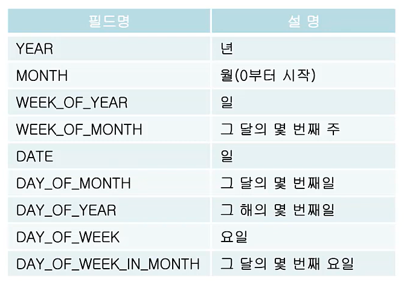
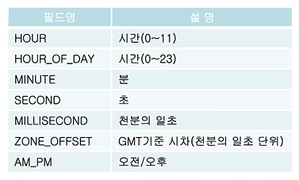
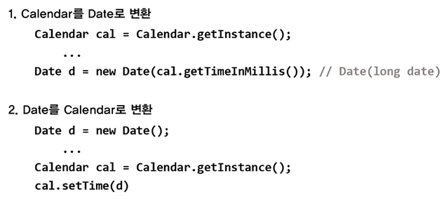
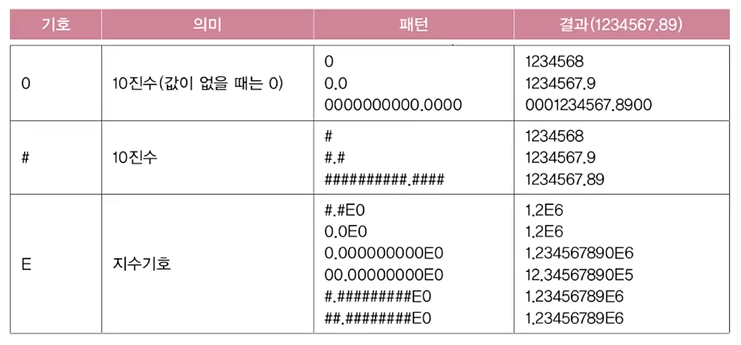
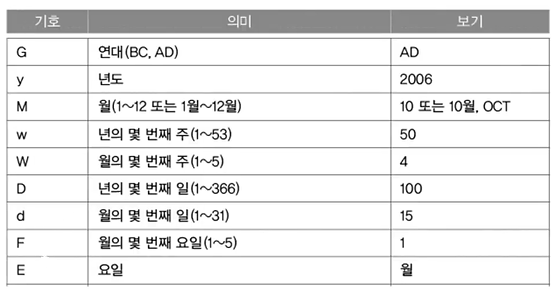
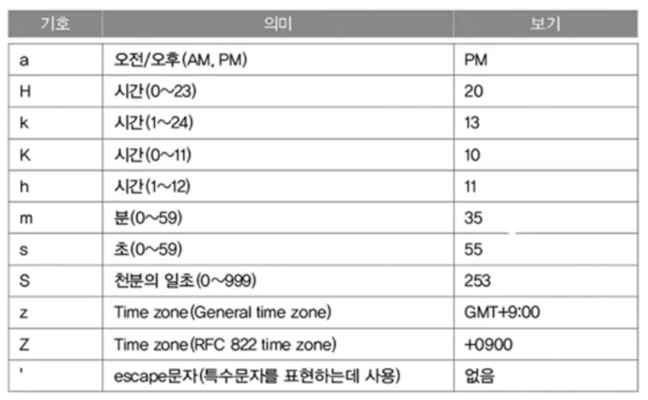

# **date, time and formmating**
  
<br>

## 01. 날짜와 시간

- ```java.util.Date``` 
  - 날짜와 시간을 다룰 목적으로 만들어진 클래스 (JDK1.0)
  - Date의 메서드는 거의 deprecated(앞으로 사용 x) 되었지만, 여전히 쓰이고 있음
- ```java.util.Calendar```
  - Date클래스를 개선한 새로운 클래스 (JDK1.1), 여전히 단점이 존재
- ```java.time```패키지 (자바의 정석 3판, 기초판에서는 x)
  - Date와 Calendar의 단점을 개선한 새로운 클래스들을 제공 (JDK1.8)
  - Date와 Calendar의 단점 : 날짜 + 시간
  - 날짜(LocalDate)와 시간(LocalTime)을 나눠서 다룰 수 있음   
    (날짜 + 시간 : LocalDateTime)

## 02. Calendar클래스
> 추상화 클래스이므로 ```getInstance()```를 통해 구현된 객체를 얻어야 함
> ```
> Calendar cal = new Calendar();  // error
>                                 // 추상화 클래스는 인스턴스를 생성 x
> Calendar cal = Calendar.getInstance();
> // getInstance()메서드는 Calendar클래스를 구현한 클래스의 인스턴스를 반환
> ```

- 특정 캘린더로 정하면 다른 캘린더를 사용할 때 수정해야 함
  
    ```
    class MyApplication {
        public static void main(String args[]) {
            Calendar = cal = new GregorianCalendar(); // 경우에 따라 변경
        }
    }
    ```
## 03. Calendar 예제 1
- ```get()```으로 날짜와 시간 필드 가져오기 : ```int get(int field)```
  
    ```
    Calendar cal = Calendar.getInstance();  // 현재 날짜와 시간으로 셋팅
    int thisYear = cal.get(Calendar.YEAR);  // 올해가 몇년인지
    int lastDayOfMonth = cal.getActualMaximum(Calendar.DATE);  // 이 달의 마지막 날 
    ```
- Calendar에 정의된 필드
  
    <center>
      
      
    </center>

    - (typo) WEEK_OF_YEAR : 그 해의 몇 번째 주

- 예제 10-1

<br>
<hr>
<br>


## 04. Calendar 예제 2

- ```set()```으로 날짜와 시간 지정하기
  
    ```
    void set(int field, int value)
    void set(int year, int month, int date)
    void set(int year, int month, int date, int hourOfDay, int minute)
    void set(int year, int month, int date, int hourOfDay, int minute, int second)
    ```
  - 날짜 지정하는 방법
    
      ```
      Calendar date1 = Calendar.getInstance();  // 2017.08.15
      // data1.set(Calendar.YEAR, 2017);
      // data1.set(Calendar.MONTH, 7);          // 월(MONTH)이 0부터 시작
                                                // 배열을 이용하기 때문
      // data1.set(Calendar.DATE, 15);
      ```
  
  - 시간 지정하는 방법
    
      ```
      Calendar time1 = Calendar.getInstance();
      // time1을 10시 20분 30초로 설정
      time1.set(Calendar.HOUR_OF_DAY, 10);
      time1.set(Calendar.MINUTE, 20);
      time1.set(Calendar.SECOND, 30);
    ```

- 예제 10-2

## 05. Calendar 예제 3

- ```clear()```는 Calendar 객체의 모든 필드를 초기화
    ```
    Calendar dt = Calendar.getInstance();  // 현재시간

    System.out.println(new Date(dt.getTimeInMillis()));
    // Tue Aug 29 07:13:03 KST 2017
    
    dt.clear();
    System.out.println(new Date(dt.getTimeInMillis()));
    // Thu Jan 01 00:00:00 KST 1970  (EPOCH TIME)
    ```

    - ```clear(int field)```는 Calendar 객체의 특정 필드를 초기화
  
        ```
        Calendar dt = Calendar.getInstance();  // 현재시간

        System.out.println(new Date(dt.getTimeInMillis()));
        // Tue Aug 29 07:13:03 KST 2017
        
        dt.clear(Calendar.SECOND);       // 초 초기화
        dt.clear(Calendar.MINUTE);       // 분 초기화
        dt.clear(Calendar.HOUR_OF_DAY);  // 시간 초기화
        dt.clear(Calendar.HOUR);         // 시간 초기화

        System.out.println(new Date(dt.getTimeInMillis()));
        // Thu Jan 01 00:00:00 KST 1970  (EPOCH TIME)
        ```

- 예제 10-3
  

<br>
<hr>
<br>


## 06. Calendar 예제 4

- ```add()```는 특정 필드의 값을 증가 또는 감소 (다른 필드에 영향 줌)
    ```
    Calendar date = Calendar.getInstance();
    date.clear();          // 모든 필드 초기화
    date.set(2020, 7, 31)  // 2020.08.31로 설정

    date.add(Calendar.DATE, 1);    // 날짜(DATE)에서 1 더함 → 09.01
    date.add(Calendar.MONTH, -8);  // 월(MONTH)에서 8을 뺌  → 01.01
    ```

- ```roll()``` 은 특정 필드의 값을 증가 또는 감소 (다른 필드에 영향 x)
    ```
    date.set(2020, 7, 31)  // 2020.08.31로 설정

    date.roll(Calendar.DATE, 1);    // 날짜(DATE)에서 1 더함 → 08.01
    date.roll(Calendar.MONTH, -8);  // 월(MONTH)에서 8을 뺌  → 2020.12.31
    ```

- 예제 10-4

## 07. Calendar 예제 5

- 예제 10-5

## 08. Date와 Calendar간의 변환

- Date의 메서드는 대부분 deprecated되었지만 여전히 사용 

<center>
    
</center>

<br>
<hr>
<br>


## 09. 형식화 클래스
>```java.text``` 패키지의 ```DecimalFormat```, ```SimpleDateFormat```

- 숫자와 날짜를 원하는 형식으로 쉽게 출력 가능 (숫자, 날짜 → 형식 문자열)
    ```
    double number = 1234567.89;
    DecimalFormat df = new DecimalFormat("#.#E0");
    String result = df.format(number);  // result = "1.2E6"
                                        // 10진수 → 지수
    ```
- 형식 문자열에서 숫자와 날짜를 뽑아내는 기능 (형식 문자열 → 숫자, 날짜)
    ```
    DecimalFormat df = new DecimalFormat("#,###.##");
    Number num = df.parse("1,234,567.89");
    double d = num.doubleValue();  // 1234567.89
                                   // 문자 → 숫자
    ```

    - ```Integer.parseInt()```는 ```,```가 포함된 문자열을 숫자로 변환 x 

## 10. DecimalFormat
> 숫자를 형식화할 때 사용 (숫자 → 형식 문자열)  
> 특정 형식의 문자열을 숫자를 변환할 때 사용 (형식 문자열 → 숫자, 날짜)

<center>
    
</center>

## 11. DecimalFormat 예제 1

- 예제 10-6
  
## 12. DecimalFormat 예제 2

- 예제 10-7
  
<br>
<hr>
<br>


## 13. SimpleDateFormat
- 날짜와 시간을 다양한 형식으로 출력할 수 있게 해줌

    ```
    Date today = new Date();
    SimpleDateFormat df = new SimpleDateFormat("yyyy-MM-dd");

    // 오늘 날짜를 yyyy-MM-dd 형태로 변환하여 반환
    String result = df.format(today);
    ```

<center>
    
</center>

- 특정 형식으로 되어있는 문자열에서 날짜와 시간을 뽑아낼 수 있음

    ```
    DateFormat df  = new SimpleDateFormat("yyyy년 MM월 dd일");
    DateFormat df2 = new SimpleDateFormat("yyyy/MM/dd");

    Date d - df.parse("2015년 11월 2일");  // 문자열 → Date
    String result = df2.format(d);
    ```

<center>
    
</center>

## 14. SimpleDateFormat 예제 1

- 예제 10-8
  
## 15. SimpleDateFormat 예제 2

- 예제 10-9
  
## 16. SimpleDateFormat 예제 3

- 예제 10-10
  


<br>
<hr>
<br>

Java의 정석 기초편 | 남궁성 | 도우출판