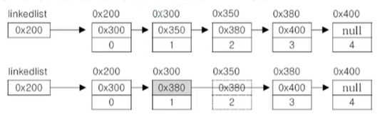

# **collections framework**
  
<br>


## 01. 컬렉션 프레임웍
> 컬렉션 프레임웍 (collection framework)
> 컬랙션(다수의 객체)을 다루기 위한 표준화된 프로그래밍 방식  
> 컬렉션을 쉽고 편리하게 다룰 수 있는 다양한 클래스를 제공  
> ```java.util``` 패키지에 포함, JDK1.2부터 제공
- 컬렉션(collection) : 여러 객체(데이터)를 모아 놓은 것을 의미  
- 프레임웍(framework) : 표준화, 정형화된 체계적인 프로그래밍 방식
  - 프레임웍은 단순히 기능뿐만 아니라 프로그래밍 방식을 정형화하여 프로그램의 개발 생산성을 높이고 유지보수를 용이하게 함

- 컬렉션 클래스(collection class)
  - 다수의 데이터를 저장할 수 있는 클래스 (예 : Vector, ArrayList, HashSet)

## 02. 컬렉션 프레임웍의 핵심 인터페이스


<center>
    
    
</center>

  - 컬렉션 프레임웍의 핵심 인터페이스간의 상속계층도
    - Collection : List와 Set의 공통부분을 뽑아 낸 것

<br>
<hr>
<br>

## 03. Collection인터페이스

<center>
    
</center>

## 04. List인터페이스
> List : 저장순서 o , 중복 o  

- List의 상속계층도

    <center>
      
    </center>

- List인터페이스 메서드

    <center>
      
    </center>
    
  - 컬렉션 인터페이스 메서드 제외

## 05. Set인터페이스
> Set  : 순서 x , 중복 x  

- Set의 상속계층도

    <center>
      
    </center>

- Set 인터페이스의 메서드 : Collection 인터페이스와 동일

    <center>
      
    </center>

- 집합과 관련된 메서드(Collection에 변화가 있으면 true, 아니면 false 반환)
    <center>
      
    </center>

## 06. Map인터페이스
> Map  : 순서 x , 키 중복 x, 값 중복 o

- Map의 상속계층도

    <center>
      
    </center>

    - LinkedHashMap : 순서가 있음
    - Hashtable은 동기화 o, HashMap은 동기화 x

- Set 인터페이스의 메서드 : Collection 인터페이스와 동일

    <center>
      
    </center>

<br>
<hr>
<br>

## 07. ArrayList
> 기존의 Vector를 개선한 것으로 구현 원리와 기능적으로 동일  
> Vector는 자체적으로 동기화 처리되어 있음 (ArrayList 동기화 x)

- List인터페이스를 구현하므로, **저장순서가 유지**되고 **중복을 허용**함
- 데이터의 저장공간으로 배열 사용 (배열기반) 
- Vector 기반의 소스코드
  
    ```
    public class Vector extends AbstractList implements List, RandomList, Cloneable, java.io.Serializable {
        ...
        protected Object[] elementData;  // 객체를 담기 위한 배열
                                         // 다형성
                                         // 모든 종류의 객체 저장 가능
        ...
    }
    ```


## 08. ArrayList의 메서드
<center>
    
</center>

## 09. ArrayList 예제

- 예제 11-1
  
## 10. ArrayList의 추가와 삭제

- ArrayList에 저장된 세 번째 데이터(data[2])를 삭제하는 과정
  
    <center>
      
    </center>

    - ```list.remove(2);```를 호출
    - 삭제할 데이터 아래의 데이터를 한 칸씩 위로 복사해서 삭제할 데이터를 덮어씀 (마지막 데이터를 삭제하는 경우, 배열의 복사는 필요 없음)
    
        ```
        System.arraycopy(data, 3, data, 2, 2)
        // data[3]에서 data[2]로 2개의 데이터를 복사하라는 의미
        ```
    
    - 데이터가 모두 한 칸씩 위로 이동하였으므로 마지막 데이터는 null로 변경
  
        ```
        data[size-1] = null;
        ```
    
    - 데이터가 삭제되어 데이터의 개수(size)가 줄었으므로 size의 값을 1 감소시킴
        
        ```
        size--;
        ```
    
    <center>
      
      
    </center>


## 11. Java API소스보기
> ```/jdk 설치 경로/src.zip```
- IntelliJ : 클릭해서 커서를 올려두고 ```f4```

<br>
<hr>
<br>

## 12. LinkedList
> 배열의 단점을 보완
> 
- 배열의 장단점
    - 장점 : 배열은 구조가 간단하고 데이터를 읽는데 걸리는 시간(접근시간, access time)이 짦음
    
    <center>
      
    </center>

    - 단점
      - 크기를 변경 할 수 없음.  
          크기를 변경해야 하는 경우 새로운 배열을 생성 후 데이터를 복사해야 함  
          크기 변경을 피하기 위해 충분히 큰 배열을 생성하면, 메모리가 낭비됨
      - 비순차적인 데이터의 추가 또는 삭제에 시간이 많이 걸림.
          데이터를 추가하거나 삭제하기 위해, 다른 데이터를 옮겨야 함
          순차적인 데이터 추가(끝에 추가)와 삭제(끝부터 삭제)는 빠름


## 13. LinkedList의 추가와 삭제

- 배열과 달리 링크드리스트는 불연속적으로 존재하는 데이터를 연결(link)
  - 데이터의 삭제 : 단 한 번의 참조변경만으로 가능

    <center>
      
    </center>

    ```
    class Node {
        Node next;   // 다음 요소의 주소를 저장
        Object obj;  // 데이터를 저장
    }
    ```

  - 데이터의 추가 : 한 번의 Node 객체 생성과 두 번의 참조 변경만으로 가능

    <center>
      
    </center>

- linked list : 연결리스트, 데이터 접근성이 나쁨
  
    <center>
      
    </center>

    ```
    class Node {
        Node next; 
        Object obj; 
    }
    ```

- doubly linked list : 이중 연결리스트, 접근성 향상
  
    <center>
      
    </center>

    ```
    class Node {
        Node next;      // 다음 요소
        Node previous;  // 이전 요소
        Object obj; 
    }
    ```

- doubly circular linked list : 이중 원형 연결리스트
  
    <center>
      
    </center>

## 14. ArrayList와 LinkedList의 비교

<center>
  
</center>

|컬렉션|읽기(접근시간)|추가/삭제|비고|
|:---:|:---:|:---:|:---:|
|ArrayList|빠르다|느리다|순차적인 추가 삭제는 더 빠름, 비효율적인 메모리 사용|
|LinkedList|느리다|빠르다|데이터가 많을수록 접근성이 떨어짐|

```
인덱스가 n인 데이터의 주소 = 배열의 주소 + n * 데이터 타입의 크기
```

- 자료구조 (data structure)
  - 배열 기반(연속)과 연결 기반(불연속)으로 나뉘어져 있음

<br>
<hr>
<br>

Java의 정석 기초편 | 남궁성 | 도우출판