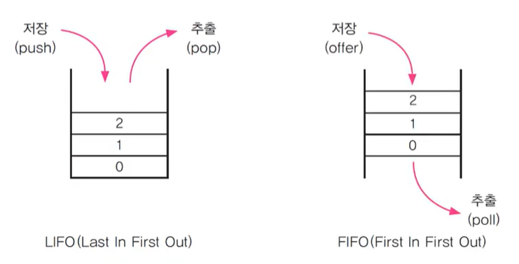
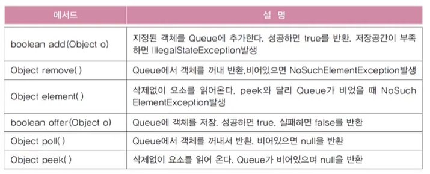
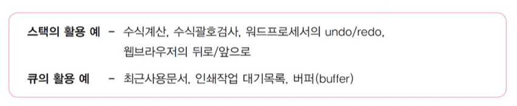
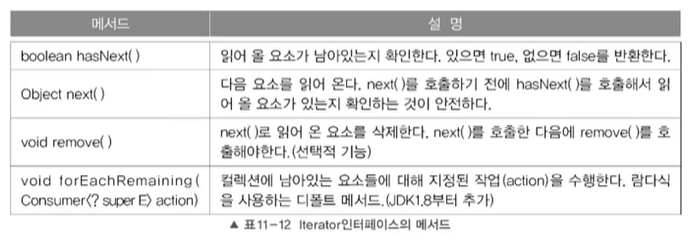
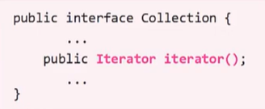
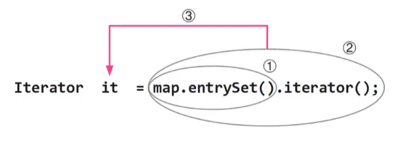

# **collections framework**
  
<br>


## 15. Stack과 Queue
> 스택(Stack) : LIFO구조, 마지막에 저장된 것을 제일 먼저 꺼내게 됨  
> 큐(Queue) : FIFO구조, 제일 먼저 저장한 것을 제일 먼저 꺼내게 됨

<center>
  
</center>

- 스택을 구현하려면 배열이 효율적
- 큐를 구현하려면 링크드리스트가 효율적 (삭제 시 자리이동 x)


## 16. Stack과 Queue의 메서드

- Stack 메서드
    <center>
      
    </center>

- Queue 메서드
    <center>
      
    </center>

    - 예외 발생 x : ```offer()```, ```poll()```, ```peek()```
    - 인터페이스이므로 객체 생성 x

## 17. Stack과 Queue 예제

- 예제 11-2
  
## 18. 인터페이스를 구현한 클래스 찾기

<center>
  
</center>

- Queue의 기능을 가지고 있는 객체를 생성하려면?
  - Queue를 직접 구현
  - Queue를 구현한 클래스를 사용
    - Java API에서 Queue 인터페이스를 찾음
    - All Known Implementing Classes : Queue를 구현한 클래스 목록
<br>
<hr>
<br>


## 19. Stack과 Queue의 활용

<center>
  
</center>

## 20. Stack과 Queue의 활용 예제 1

- 예제 11-3

## 21. Stack과 Queue의 활용 예제 2

- 예제 11-4


<br>
<hr>
<br>


## 22. Iterator, ListIterator, Enumeration
> Iterator :  컬렉션에 저장된 데이터를 접근하는데 사용되는 인터페이스  
> ListIterator : Iterator에 양방향 조회기능 추가(List를 구현한 경우만 사용가능)  
> Enumeration : Iterator의 구버전

- Iterator인터페이스의 메서드
  
    <center>
      
    </center>

    - ```hasNext()```(확인), ```next()```(읽기)가 핵심

- Enumeration인터페이스 메서드
  
    <center>
      
    </center>

- Iterator는 컬렉션(List, Set, Map : 구조가 다름)에 저장된 요소들을 읽어오는 방법을 표준화한 것
  - 컬렉션에 ```iterator()```를 호출해서 Iterator를 구현한 객체를 얻어서 사용, 1회용
  
    <center>
      
    </center>

  - Collection인터페이스에 정의되어 있는 것이어서 Collection의 자손인 List와 Set을 모두 가지고 있는 메서드
  
    <center>
      
    </center>

## 23. Iterator, ListIterator, Enumeration 예제

- 예제 11-5

## 24. Map과 Iterator
> Map에는 ```iterator()```가 없음
> ```
> public interface Collection {
>   ...
>   public Iterator iterator();
>   ...
> }
> ```
> ```KeySet()```, ```entrySet()```, ```values()```를 호출


```
Map map = new HashMap();
...
Iterator it = map.entrySet().iterator(); // Set eSet = map.entrySet();
                                         // Iterator it = eSet.iterator();
```
<center>
  
</center>
<br>
<hr>
<br>


## 25. Array의 메서드(1) - 복사
## 26. Array의 메서드(2) - 채우기, 정렬, 검색
## 27. Array의 메서드(3) - 비교와 출력
## 28. Array의 메서드(4) - 변환
## 29. Array의 메서드 예제


<br>
<hr>
<br>

Java의 정석 기초편 | 남궁성 | 도우출판