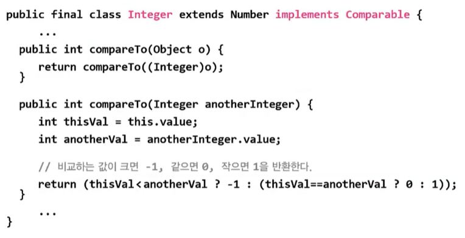

# **collections framework**
  
<br>


## 15. Stack과 Queue
> 스택(Stack) : LIFO구조, 마지막에 저장된 것을 제일 먼저 꺼내게 됨  
> 큐(Queue) : FIFO구조, 제일 먼저 저장한 것을 제일 먼저 꺼내게 됨

<center>
  
</center>

- 스택을 구현하려면 배열이 효율적
- 큐를 구현하려면 링크드리스트가 효율적 (삭제 시 자리이동 x)


## 16. Stack과 Queue의 메서드

- Stack 메서드
    <center>
      
    </center>

- Queue 메서드
    <center>
      
    </center>

    - 예외 발생 x : ```offer()```, ```poll()```, ```peek()```
    - 인터페이스이므로 객체 생성 x

## 17. Stack과 Queue 예제

- 예제 11-2
  
## 18. 인터페이스를 구현한 클래스 찾기

<center>
  
</center>

- Queue의 기능을 가지고 있는 객체를 생성하려면?
  - Queue를 직접 구현
  - Queue를 구현한 클래스를 사용
    - Java API에서 Queue 인터페이스를 찾음
    - All Known Implementing Classes : Queue를 구현한 클래스 목록
<br>
<hr>
<br>


## 19. Stack과 Queue의 활용

<center>
  
</center>

## 20. Stack과 Queue의 활용 예제 1

- 예제 11-3

## 21. Stack과 Queue의 활용 예제 2

- 예제 11-4


<br>
<hr>
<br>


## 22. Iterator, ListIterator, Enumeration
> Iterator :  컬렉션에 저장된 데이터를 접근하는데 사용되는 인터페이스  
> ListIterator : Iterator에 양방향 조회기능 추가(List를 구현한 경우만 사용가능)  
> Enumeration : Iterator의 구버전

- Iterator인터페이스의 메서드
  
    <center>
      
    </center>

    - ```hasNext()```(확인), ```next()```(읽기)가 핵심

- Enumeration인터페이스 메서드
  
    <center>
      
    </center>

- Iterator는 컬렉션(List, Set, Map : 구조가 다름)에 저장된 요소들을 읽어오는 방법을 표준화한 것
  - 컬렉션에 ```iterator()```를 호출해서 Iterator를 구현한 객체를 얻어서 사용, 1회용
  
    <center>
      
    </center>

  - Collection인터페이스에 정의되어 있는 것이어서 Collection의 자손인 List와 Set을 모두 가지고 있는 메서드
  
    <center>
      
    </center>

## 23. Iterator, ListIterator, Enumeration 예제

- 예제 11-5

## 24. Map과 Iterator
> Map에는 ```iterator()```가 없음
> ```
> public interface Collection {
>   ...
>   public Iterator iterator();
>   ...
> }
> ```
> ```KeySet()```, ```entrySet()```, ```values()```를 호출


```
Map map = new HashMap();
...
Iterator it = map.entrySet().iterator(); // Set eSet = map.entrySet();
                                         // Iterator it = eSet.iterator();
```
<center>
  
</center>
<br>
<hr>
<br>


## 25. Array의 메서드(1) - 복사
> 배열을 다루기 편리한 메서드(static) 제공

- 배열의 출력 : ```toString()```
  
    ```
    static String toString(boolean[] a)
    static String toString(byte[] a)
    static String toString(char[] a)
    static String toString(short[] a)
    static String toString(int[] a)
    static String toString(long[] a)
    static String toString(float[] a)
    static String toString(double[] a)
    static String toString(object[] a)
    ```

- 배열의 복사 : ```copyOf()```, ```copyOfRange()```
  
    ```
    int[] arr = {0, 1, 2, 3, 4};
    int[] arr2 = Arrays.copyOf(arr, arr.length); // arr2 = [0, 1, 2, 3, 4]
    int[] arr3 = Arrays.copyOf(arr, 3);          // arr3 = [0, 1, 2]
    int[] arr4 = Arrays.copyOf(arr, 7);          // arr4 = [0, 1, 2, 3, 4, 0, 0]
    int[] arr5 = Arrays.copyOfRange(arr, 2, 4);  // arr5 = [2, 3]
    int[] arr6 = Arrays.copyOfRange(arr, 0, 7);  // arr6 = [0, 1, 2, 3, 4, 0, 0]
    ```
    - 새로운 배열을 생성해서 반환


## 26. Array의 메서드(2) - 채우기, 정렬, 검색


- 배열 채우기 : ```fill()```, ```setAll()```
  
    ```
    int[] arr = new int[5];
    Arrays.fill(arr, 9);                                  // arr = [9, 9, 9, 9, 9]
    Arrays.setAll(arr, (i) -> (int)(Math.random()*5)+1);  // arr = [1, 5, 2, 1, 1]
                                                          // 람다식
    ```

- 배열의 정렬과 검색 : ```sort()```, ```binarySearch()```
  
    ```
    int[] arr = {3, 2, 0, 1, 4};
    int idx = Arrays.binarySearch(arr, 2);     // idx=-5 : 잘못된 결과
                                               // 이진탐색은 정렬돤 배열만 가능

    Arrays.sort(arr);
    System.out.println(Arrays.toString(arr));  // [0, 1, 2, 3, 4]
    int idx = Arrays.binarySearch(arr, 2);     // idx=2  : 올바른 겨로가
    ```

- 순차 검색(탐색)과 이진 검색(binary search)


## 27. Array의 메서드(3) - 비교와 출력

- 다차원 배열의 출력 : ```deepToString()```
  
    ```
    int[] arr = {0, 1, 2, 3, 4};
    int[][] arr2D = {{11, 12}, {21, 22}};

    System.out.println(Arrays.toString(arr));        // [0, 1, 2, 3, 4]
    System.out.println(Arrays.deepToString(arr2D));  // [[11, 12], [21, 22]]
    ```

- 다차원 배열의 비교 : ```deepEquals()```
  
    ```
    String[][] str2D  = new String[][]{{"aaa", "bbb"}, {"AAA", "BBB"}};
    String[][] str2D2 = new String[][]{{"aaa", "bbb"}, {"AAA", "BBB"}};

    System.out.println(Arrays.equals(str2D, str2D2));      // false
    System.out.println(Arrays.deepEquals(str2D, str2D2));  // true
    ```

## 28. Array의 메서드(4) - 변환

- 배열을 List로 변환 : ```asList(Object... a)```
  
    ```
    List list = Arrays.asList(new Integer[]{1, 2, 3, 4, 5});  // list = [1, 2, 3, 4, 5]
    List list = Arrays.asList(1, 2, 3, 4, 5);                 // list = [1, 2, 3, 4, 5]
    list.add(6);  // UnsupportedOperationException

    List list = new ArrayList(Arrays.asList(1, 2, 3, 4, 5));
    ```

    - ```asList(배열, 가변매개변수)```

- [람다와 스트림](Chapter14_0114.md)관련 : ```parallelXXX()```, ```spliterator()```, ```stream```

## 29. Array의 메서드 예제

- 예제 11-6


<br>
<hr>
<br>


## 30. Comparator와 Comparable
> 객체 정렬에 필요한 메서드(정렬기준 제공)를 정의한 인터페이스
> Comparable : 기본 정렬기준을 구현하는데 사용
> Comparator : 기본 정렬기준 외에 다른 기준으로 정렬하고자 할 때 사용

```
public interface Comparator {
  int compare(Object o1, Object o2);  // o1과 o2를 비교
                                      // 0 : o1 = o2
                                      // + : o1 > o2
                                      // - : o1 < o2
  boolean equals(Object obj);         // equals를 오버라이딩
}

public interface Comparable {
  int compareTo(Object o);            // 객체 자신(this)와 o를 비교
}
```

- 정렬 ```Sort()```는 두 대상을 비교해 자리를 바꾸는 것
- ```compare()```, ```compareTo()```는 두 객체의 비교 결과를 반환하도록 작성
    ```
    public final class Integer extends Number implements Comparable {
      ...
      public int compareTo(Integer anotherInteger) {
        int v1 = this.value;
        int v2 = anotherInteger.value;
        // 같으면 0, 오른쪽 값이 크면 -1, 작으면 1 반환
        return (v1 < v2 ? -1 : (v1 == v2? 0 : 1));  // 삼항연산자
      }
    }
    ```

## 31. Comparator와 Comparable 예제
- 예제 11-7

## 32. Integer와 Comparable

- Integer클래스의 일부
    
    <center>
      
      
    </center>

    - Integer, Float, String 은 비교 가능하므로 Comparable(기본정렬기능)을 가지고 있음
    - 삼항연산자가 2~3% 더 빠름

## 33. Integer와 Comparable 예제
- 예제 11-8


<br>
<hr>
<br>

Java의 정석 기초편 | 남궁성 | 도우출판