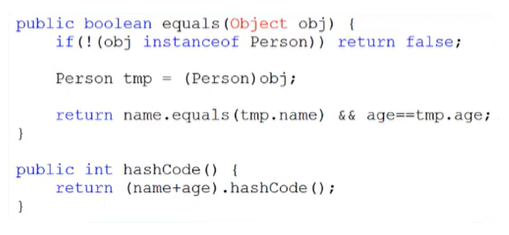
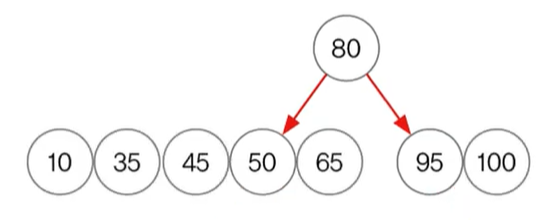

# **collections framework**
  
<br>

## 34. HashSet
> Set인터페이스를 구현한 가장 대표적인 컬렉션 클래스  
> 순서 x, 중복 x

- HashSet 
  - Set인터페이스를 구현한 가장 대표적인 컬렉션 클래스
  - 순서를 유지하려면, LinkedHashSet클래스를 사용
- [TreeSet](#39-treeset)
  - **범위 검색**과 **정렬**에 유리한 컬렉션 클래스
  - HashSet보다 데이터 추가, 삭제에 시간이 더 걸림
  
- 주요 메서드
    <center>
     
    </center>

## 35. HashSet 예제1

- 예제 11-9

## 36. HashSet 예제2

- 예제 11-10

<br>
<hr>
<br>

## 37. HashSet 예제3

- HashSet은 객체를 저장하기 전에 기존에 같은 객체가 있는지 확인
  - 같은 객체가 없으면 저장, 있으면 저장 x

- boolean add(Object o)는 저장할 객체의 ```equals()```와 ```hashCode()```를 호출
    
    ```
    class Person {
        String name;
        int age;

        Person(String name, int age) {
            this.name = name;
            this.age = age;
        }

        public String toString() {
            return name + ":" + age;
        }
    }
    ```

    - 아래와 같이 오버라이딩
        
        <center>
          
        </center>

- 예제 11-11

## 38. HashSet 예제4

- 예제 11-12


<br>
<hr>
<br>

## 39. TreeSet
> 이진 탐색 트리(binary search tree)로 구현, 범위 탐색과 정렬에 유리

- 이진 트리는 모든 노드가 최대 2개의 하위 노드를 갖음  
  각 요소(node)가 나무(tree)형태로 연결(LinkedList의 변형)

    <center>
      
    </center>

    ```
    class TreeNode {
        TreeNode left;   // 왼쪽 자식 노드
        Object element;  // 저장할 객체
        TreeNode right;  // 오른쪽 자식 노드
    }
    ```

- Set인터페이스를 구현
  - 중복된 데이터의 저장을 허용 x
  - 정렬된 위치에 저장하므로 저장순서 유지 x

## 40. 이진 탐색 트리(binary search tree)
- 부모보다 작은 값은 왼쪽, 큰 값은 오른쪽에 저장 (이진 트리의 한 종류)
    
    <center>
      
      
    </center>

- 데이터가 많아질수록 추가, 삭제에 시간이 더 걸림 (비교 횟수 증가)
    
    <center>
      
    </center>

- 검색(범위검색)과 정렬에 유리
- 중복된 값 저장 x


## 41. 이진 탐색 트리의 저장과정

- TreeSet의 데이터 저장과정 : ```boolean add(Object o)```
  - ```Object o``` : 저장할 객체
  - ```add()``` : 중복이 안되므로 ```equals()```, ```hashcode()``` 호출

  - TreeSet에 7,4,9,5,1의 순서로 데이터를 저장하면, 아래의 순서로 진행됨

      <center>
        
      </center>

<br>
<hr>
<br>

## 42. TreeSet의 메서드
  
<center>
    
</center>

## 43. TreeSet 예제1
- 예제 11-13
## 44. TreeSet 예제2
- 예제 11-14
## 45. TreeSet 예제3
- 예제 11-15

- 범위 검색 : ```subSet()```, ```headSet()```,```tailSet()```
  
    <center>
      
    </center>

- 트리 순회 (tree traversal)
  - 이진 트리의 모든 노드를 한번씩 읽는 것 (알아두면 좋음)

    <center>
      
    </center>

  - 전위순회 (preorder)
  - 후위순회 (postorder)
  - 중위순회 (inorder) : 오름차순으로 정렬
    
    <center>
      
      
      
    </center>

  - 레벨순회

<br>
<hr>
<br>

## 46. HashMap과 Hashtable
> 순서 x, 중복 (키 x, 값 o)
- Map인터페이스를 구현, 데이터를 키와 값의 쌍으로 저장
  
    <center>
      
    </center>

- HashMap(동기화x)은 Hashtable(동기화o)의 신버전
- HashMap
  - Map인터페이스를 구현한 대표적인 컬렉션 클래스
  - 순서를 유지하려면 LinkedHashMap클래스를 사용
- TreeMap
  - 범위 검색과 정렬에 유리한 컬렉션 클래스
  - HashMap보다 데이터 추가, 삭제에 시간이 더 걸림


## 47. HashMap의 키(key)와 값(value)
> 해싱(hashing)기법으로 데이털르 저장, 데이터가 많아도 검색이 빠름

- Map인터페이스를 구현, 데이터를 키와 값의 쌍으로 저장
  - 키(key) : 컬렉션 내의 키(key) 중에서 유일
  - 값(value) : 키(key)와 달리 데이터의 중복을 허용
    
    ```
    HashMap map = new HashMap();
    map.put("myId", "1234");
    map.put("asdf", "1111");
    map.put("asdf", "1234");

    // key : value
    // myId : 1234 
    // asdf : 1234
    ```

- hashing
  - 환자 정보 관리
  - 해시함수로 해시테이블에 데이터를 저장, 검색  
  - 해시테이블은 배열과 링크드리스트가 조합된 형태  
    
    <center>
      
    </center>

    - 배열의 접근성과 링크드리스트의 변경이 유리함을 섞음
  - 해시테이블에 저장된 데이터를 가져오는 과정
    
    <center>
      
    </center>

    - 키로 해시함수를 호출, 해시코드(배열의 index)를 얻음
    - 해시코드(해시함수의 반환값)에 대응하는 링크드리스트의 배열에서 찾음
    - 링크드리스트에서 키와 일치하는 데이터를 찾음
    - 단, 해시함수는 같은 키에 대해 항상 같은 해시코드를 반환.  
      서로 다른 키일지라도 같은 값의 해시코드를 반환할 수도 있음
<br>
<hr>
<br>

## 48. HashMap의 메서드

<center>
  
</center>

## 49. HashMap 예제1
- 예제 11-16
## 50. HashMap 예제2
- 예제 11-17
## 51. HashMap 예제3
- 예제 11-18
  
<br>
<hr>
<br>

## 52. Collection의 메서드 - 동기화
> 컬렉션을 위한 메서드(static)를 제공
> 1. 컬렉션 채우기, 복사, 정렬, 검색 : ```fill()```, ```copy()```, ```sort()```, ```binarySearch()``` 등..
> 2. 컬렉션의 동기화 : ```synchronizedXXX()```

<center>
  
</center>

## 53. Collection의 메서드 - 변경불가, 싱글톤

## 54. Collection의 메서드 - 단일 컬렉션

## 55. Collections 예제

## 56. 컬렉션 클래스 정리 & 요약


<br>
<hr>
<br>

Java의 정석 기초편 | 남궁성 | 도우출판