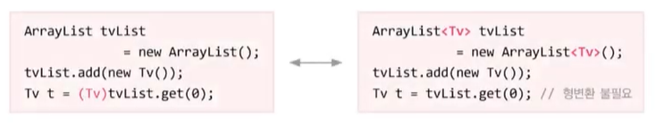
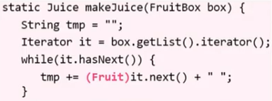
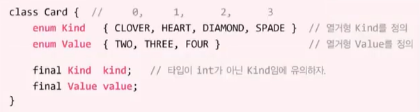

# **collections framework**
  
<br>

## 01. 지네릭스 (Generics)
> 컴파일시 타입을 체크해주는 기능(complie-time type check) - JDK1.5
> ```
> // Tv 객체만 저장할 수 있는 ArrayList 생성
> ArrayList<Tv> tvList = new ArrayList<Tv>();
> tvList.add(new Tv());     // ok
> tvList.add(new Audio());  // 컴파일 에러
>                           // Tv 외에 다른 타입은 저장 불가
> ```

- 객체의 타입 안정성을 높이고 형변환의 번거로움을 줄여줌
    
    <center>
      
    </center>

- 지네릭스의 장점  
    1. 타입 안정성 제공
    2. 타입체크와 형변환을 생략할 수 있으므로 코드가 간결해짐

- 예외의 상속계층도
  
    <center>
      
    </center>

    - ```ClassCastException```(런타임에러) → ```CompileTime```(컴파일에러)

<br>
<hr>
<br>

## 02. 타입 변수
> 클래스를 작성할 때, Object타입 대신 타입변수(E)를 선언해서 사용

<center>
  
  
</center>

## 03. 타입 변수에 대입하기
> 객체를 생성시, 타입변수(E) 대신 실제 타입(Tv)을 지정(대입)

```
// 타입변수 E 대신에 실제 타입 Tv 대입
ArrayList<Tv> tvList = new ArrayList<Tv>();
```

<center>
  
  
</center>

- 타입 변수 대신 실제 타입이 지정되면, 형변환 생략가능

  <center>
    
  </center>
<br>
<hr>
<br>

## 04. 지네릭스의 용어

- ```Box<T>``` : 지네릭 클래스. 'T의 Box'또는 'T Box'라고 읽음

- ```T``` : 타입 변수 또는 타입 매개변수 (T는 타입 문자)

- ```Box``` : 원시 타입 (raw type)


  <center>
    
    
  </center>

## 05. 지네릭 타입과 다형성
- 참조변수와 생성자의 대입된 타입은 일치해야 함

  ```
  ArrayList<Tv>      list = new ArrayList<Tv>();  
  ArrayList<Product> list = new ArrayList<Tv>();  // Error
  ```

- 지네릭 클래스간의 다형성은 성립 (여전히 대입된 타입은 일치해야 함)

  ```
  List<Tv> list = new ArrayList<Tv>();  
  List<Tv> list = new LinkedList<Tv>();
  ```

- 매개변수의 다형성도 성립
  
  ```
  ArrayList<Product>list = newArrayList<Product>();
  list.add(new Product());
  list.add(new Tv());   // 자손도 ok
  list.add(new Audio);  // 자손도 ok
  ```

  ```
  boolean add(E e) {...} → boolean add(Product e) {...}
  ```

  ```
  E get(int index) {...} → Product get(int index) {...}
  ```

  ```
  Product p = list.get(0);  // get의 반환타입 : Product
  Tv t = (Tv)list.get(1);   // 반환타입이 다르므로 형변환
  ```

## 06. 지네릭 타입과 다형성 예제
- 예제 12-1

<br>
<hr>
<br>

## 07. Iterator <E>
> 클래스를 작성할 때, Object 타입 대신 T와 같은 타입 변수 사용

```
public interface Iterator {
  boolean hasNext();
  object next();
  void remove();
}

→

public interface Iterator<E> {
  boolean hasNext();
  E next();
  void remove();
}
```

<center>
  
</center>

- 예제 12-2

## 08. HashMap<K,V>
> 여러 개의 타입 변수가 필요한 경우, 콤마(```,```)를 구분자로 선언

<center>
  
  
  
</center>

- 형변환 불필요

<br>
<hr>
<br>

## 09. 제한된 지네릭 클래스

- ```extends```로 대입할 수 있는 타입을 제한
  ```
  class FruitBox<I extends Fruit> {  // Fruit의 자손만 타입으로 지정가능
    ArrayList<T> list = new ArrayList<T>;
    ...
  }

  FruitBox<Apple> appleBox = new FruitBox<Apple>();  // ok
  FruitBox<Toy>   toyBox   = new FruitBox<Toy>();    // Error
                                                     // Toy는 Fruit의 자손이 아님
  ```

- 인터페이스인 경우에도 ```extends```를 사용
  ```
  interface Eatable {}
  class FruitBox<T extends Eatable> {...}
  ```

## 10. 제한된 지네릭 클래스 예제

- 예제 12-3
  
## 11. 지네릭스의 제약
- 타입 변수에 대입은 인스턴스 별로 다르게 가능
  ```
  Box<Apple> appleBox = new Box<Apple>(); // Apple객체만 저장 가능
  Box<Grape> grapeBox = new Box<Grape>(); // Grape객체만 저장 가능
  ```

- static 멤버에 타입변수 사용 불가
  ```
  class Box<T> {
    static T item;                        // Error
    static int compare(T t1, T t2) {...}  // Error
  }
  ```

- 배열 생성할 때 타입 변수 사용불가. 타입변수로 배열 선언은 가능
  ```
  class Box<T> {
    T[] itemArr;  // T타입의 배열을 위한 참조변수
      ...
    T[] toArray() {
      T[] tmpArr = new T[itemArr.length];  // Error
                                           // 지네릭 배열 생성불가
    }
  }
  ```
  - 객체와 배열 생성 불가
<br>
<hr>
<br>


## 12. 와일드 카드 <?>
- 하나의 참조 변수로 대입된 타입이 다른 객체를 잠조 가능
  ```
  ArrayList<? extends Product> list = new ArrayList<Tv>();
  ArrayList<? extends Product> list = new ArrayList<Audio>();
  ArrayList<Product> list = new ArrayList<Tv>();  // Error
                                                  // 대입된 타입 불일치
  ```

<center>
  
</center>

- 메서드의 매게변수에 와일드 카드를 사용
  ```
  static Juice makeJuice(FruitBox<? extends Fruit> box) {
    String tmp = "";
    for(Fruit f : box.getList()) tmp += f + " ";
    return new Juice(tmp);
  }
  ```
  ```
  System.out.println(Juicer.makeJuice(new FruitBox<Fruit>()));
  System.out.println(Juicer.makeJuice(new FruitBox<Apple>()));
  ```

## 13. 와일드 카드 예제

- 예제 12-4

## 14. 지네릭 메서드

- 지네릭 타입이 선언된 메서드(타입 변수는 메서드 내에서만 유효)
  ```
  static <T> void sort(List<T> list, Comparator<? super T> c)
  ```

- 클래스의 타입 매개변수```<T>``` 와 메서드의 타입 매개변수 ```<T>```는 별개
  ```
  class FruitBox<T> {
    ...
    static <T> void sort(List<T> list, Comparator<? super T> c) {
      ...
    }
  }
  ```

- 메서드를 호출할 때마다 타입을 대입해야 함(대부분 생략 가능)
  
  <center>
    
    
  </center>  

    - 지네릭 메서드 대신 와일드카드 메서드로 사용가능

      <center>
        
      </center>

      - 와일드 카드는 하나의 참조변수로 서루 다른 타입이 대입된 여러 지네릭 객체를 다루기 위한 것
      - 지네릭 메서드는 메서드를 호출할 때마다 다른 지네릭 타입을 대입할 수 있게 한 것
- 메서드를 호출할 때 타입을 생략하지 않을 때는 클래스 이름 생략 불가
  ```
  System.out.println(<Fruit>makeJuice(fruitBox));  // Error
  System.out.println(this.<Fruit>makeJuice(fruitBox));
  System.out.println(Juicer.<Fruit>makeJuice(fruitBox));
  ```
<br>
<hr>
<br>

## 15. 지네릭 타입의 형변환

- 지네릭 타입과 원시 타입 간의 형변환은 바람직하지 않음 (경고 발생)

  ```
  Box<Object> objBox = null;
  Box box = (Box)objBox;       // 지네릭 타입 → 윈시 타입 : 경고발생
  objBox  = (Box<Object>)box;  // 원시 타입 → 지네릭 타입 : 경고발생
  ```
  <center>
    
  </center>  

- 예제 12-3

- 와일드 카드가 사용된 지네릭 타입으로는 형변환 가능
  ```
  Box<Object> objBox         = (Box<Object>)new Box<String>();  // Error. 형변환 불가능
  Box<? extends Object> wBox = (Box<? extends Object>)new Box<String>();
  Box<? extends Object> wBox = new Box<String>();  // 위 문장과 동일

  // 매개변수로 FruitBox<Fruit>, FruitBox<Apple>, FruitBox<Grape> 등이 가능
  static Juice makeJuice(FruitBox<? extends Fruits> box) {...}
  FruitBox<? extends Fruit> box = new FruitBox<Fruit>();
  FruitBox<? extends Fruit> box = new FruitBox<Apple>();
  
  ```
  <center>
    
  </center> 

## 16. 지네릭 타입의 제거

- 컴파일러는 지네릭 타입을 제거하고, 필요한 곳에 형변환을 넣음  
  1. 지네릭 타입의 경계(bound)를 제거 (**하위호환성**)
      
      <center>
        
      </center>

  2. 지네릭 타입을 제거한 후에 타입이 일치하지 않으면, 형변환 추가

      <center>
        
      </center>

  3. 와일드 카드가 포함된 경우, 적절한 타입으로의 형변환이 추가됨
   
      <center>
        
        
      </center>

<br>
<hr>
<br>


## 17. 열거형(enum)
> 여러 상수를 선언해야 할 때, 편리하게 선언할 수 있는 방법

- 관련된 상수들을 같이 묶어 놓은 것, Java는 타입에 안전한 열거형을 제공
  
  <center>
    
    
  </center>

  ```
  if(Card.CLOVER==Card.Two)  // true지만 false여야 의미상 맞음
  ```

- 열거형을 이용해서 상수를 정의한 경우는 값을 비교하기 전에 타입을 먼저 비교하므로 값이 같더라도 타입이 다르면 컴파일 에러가 발생
    
  ```
  if(Card.kind.CLOVER==Card.value.Two)  // Error
  ```

  - Java의 열거형은 값과 타입 모두 확인함

## 18. 열거형의 정의와 사용

- 열거형을 정의하는 방법
  
  ```
  enum 열거형이름 { 상수명1, 상수명2, ... }
  ```
  ```
  enum Direction { EAST, SOUTH, WEST, NORTH }
  ```

- 열거형 타입의 변수를 선언하고 사용하는 방법
  ```
  class Unit {
    int x, y;       // 유닛의 위치
    Direction dir;  // 열거형 인스턴스 변수를 선언

    void init() {
      dir = Direction.EAST;  // 유닛의 방향을 EAST로 초기화
    }
  }
  ```

- 열거형 상수의 비교에 ```==```와 [```compareTo()```](Chapter11_1533.md) 사용가능
  ```
  if(dir==Direction.EAST) {
    x++;
  } else if (dir > Direction.WEST) {  // Error. 열거형 상수에 비교연산자 사용 불가
    ...
  } else if (dir.compareTo(Direction.WEST) > 0){
    ...
  }
  ```

## 19. 열겨형의 조상 - ```java.lang.Enum```

- 모든 열거형은 Enum의 자손이며, 아래의 메서드를 상속받음
  
  <center>
    
  </center>

- ```values()```, ```valueOf()```는 컴파일러가 자동으로 추가
  ```
  static E[] values()
  static E valueOf(String name)

  Direction[] dArr = Direction.values();

  for(Direction d : dArr)  // for(Direction d : Direction.values())
    System.out.printf("%s=%d%n", d.name(), d.original());
  ```
  ```
  Direction d = Direction.valueOf("WEST");
  ```

## 20. 열거형 예제

- 예제 12-5

<br>
<hr>
<br>

## 21. 열거형에 멤버 추가하기

- 불연속적인 열거형 상수의 경우, 원하는 값을 괄호```()```안에 적음
  ```
  enum Direction { EAST(1), SOUTH(5), WEST(-1), NORTH(10) }
  ```

- 괄호를 사용하려면, 인스턴스 변수와 생성자를 새로 추가해줘야 함

  <center>
    
  </center>

- 열거형 생성자는 묵시적으로 private이므로, 외부에서 객체 생성 불가
  ```
  Direction d = new Direction(1);  // Error
                                   // 열거형의 생성자는 외부에서 호출 불가
  ```
## 22. 열거형에 멤버 추가하기 예제

- 12-5

<br>
<hr>
<br>

Java의 정석 기초편 | 남궁성 | 도우출판