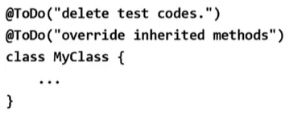

# **generics, enumeration, annotation**
  
<br>

## 23. 애너테이션이란?
> 주석처럼 프로그래밍 언어에 영향을 미치지 않으며, 유용한 정보를 제공

<center>
    
</center>

## 24. 표준 애너테이션
> Java에서 제공하는 애너테이션

<center>
    
</center>


<br>
<hr>
<br>

## 25. @Override
> 오버라이딩을 올바르게 했는지 컴파일러가 체크하게 함

- 오버라이딩 할 때 메서드 이름을 잘못적는 실수를 하는 경우가 많음
    ```
    class Parent {
        void parentMethod() {}
    }
    class Child extends Parent {
        void parentmethod() {}  // 오버라이딩하려 했으나 실수로 이름을 잘못적음
    }
    ```

- 오버라이딩 할 때, 메서드 선언부 앞에 ```@Override```

  <center>
      
  </center>

- 예제 12-7
  
## 26. @Deprecated
> 앞으로 사용하지 않을 것을 권장하는 필드나 메서드에 붙임

- ```@Deprecated```의 사용 예 : Date 클래스의 ```getDate()```
  
  <center>
      
      
  </center>

-  ```@Deprecated```가 붙은 대상이 사용된 코드를 컴파일하면 나타나는 메세지
    <center>
      
      
    </center>


## 27. @FunctionalInterface
> 함수형 인터페이스에 붙이면, 컴파일러가 올바르게 작성했는제 치크

- 함수형 인터페이스에는 하나의 추상메서드만 가져야 한다는 제약이 있음

  <center>
      
  </center>

## 28. @SuppressWarnings
> 컴파일러의 경고메세지가 나타나지 않게 억제함

- 괄호```()``` 안에 억제하고자 하는 경고의 종류를 문자열로 지정

  <center>
      
  </center>

- 둘 이상의 경고를 동시에 억제하려면 다음과 같이 함

  <center>
      
  </center>

- 'Xlint' 옵션으로 컴파일하면, 경고메세지를 확인할 수 있음.  
  괄호```[]```안이 경고의 종류. 아래의 경우 rawtypes
  
  <center>
      
  </center>

<br>
<hr>
<br>

## 29. 메타 애너테이션
> 애너테이션을 위한 에너태이션

- 애너테이션에 붙이는 애너테이션으로, 애너테이션을 정의할 때 애너테이션의 적용대상이나 유지기간 등을 지정하는데 사용

  <center>
      
  </center>

## 30. @Target
> 애너테이션을 정의할 때, 적용대상 지정에 사용

  <center>
      
      
      
  </center>

## 31. @Retention
> 애너테이션이 유지(retention)되는 기간을 지정하는데 사용
  <center>
      
  </center>

- 컴파일러에 의해 사용되는 애너테이션의 유지 정책은 SOURCE
  
  <center>
      
  </center>  

- 실행시에 사용 가능한 애너테이션의 정책은 RUNTIME

  <center>
      
  </center>

## 32. @Documented, @Inherited
> javadoc으로 작성한 문서에 포함시키면 ```@Documented```를 붙임

  <center>
      
  </center>  

> 애너테이션을 자손 클래스에 상속하고자 할 때, ```@Inherited```를 붙임
  
  <center>
      
  </center>  

## 33. @Repeatable
> 반복해서 붙일 수 있는 애너테이션을 정의할 때 사용

  <center>
      
  </center>  

- ```@Repeatable```이 붙은 애너테이션은 반복해서 붙일 수 있음
  
  <center>
      
  </center>  

- ```@Repeatable```인 ```@ToDo```를 하나로 묶을 컨테이너 애너테이션도 정의해야 함
  <center>
      
  </center>  

<br>
<hr>
<br>

## 34. 애너테이션 타입 정의하기
> ```
> @interface 애너테이션이름 {
>   타입 요소이름();  // 애너테이션의 요소를 선언
>   ...
> }
> ```

- 애너테이션의 메서드는 추상 메서드이며, 애너테이션을 적용할 때 지정 (순서 x)

  <center>
      
      
  </center> 

## 35. 애너테이션의 요소

- 적용시 값을 지정하지 않으면, 사용될 수 있는 기본값 지정 가능 (null 제외)

  <center>
      
  </center> 

- 요소가 하나이고 이름이 value일 때는 요소의 이름 생략 가능

  <center>
      
  </center> 

- 요소의 타입이 배열인 경우, 괄호```{}```를 사용해야 함

  <center>
      
      
  </center> 

## 36. 모든 애너테이션의 조상
> Annotation은 모든 애너테이션의 조상이지만 상속은 불가
  <center>
      
  </center> 

- Annotation은 인터페이스
 
  <center>
      
  </center> 


## 37. 마커 애너테이션
> 요소가 하나도 정의되지 않은 애너테이션

  <center>
      
  </center> 


## 38. 애너테이션 요소의 규칙

- 애너테이션의 요소를 선언할 때 아래의 규칙을 반드시 지켜야 함
  - 요소의 타입은 기본형, String, enum, 애너테이션, Class만 허용됨
  - ```()``` 안에 매개변수를 선언할 수 없음
  - 예외를 선언할 수 없음
  - 요소를 타입 매개변수로 정의할 수 없음

## 39. 애너테이션의 활용 예제

- 예제 12-8


<br>
<hr>
<br>

Java의 정석 기초편 | 남궁성 | 도우출판